# CAT 项目整体架构设计

## 1. 项目概述

CAT 是一个安全、高效且易于扩展的自托管计算机辅助翻译（CAT）Web 应用程序，功能类似于 Crowdin。项目采用插件化架构设计，支持多种翻译建议引擎、认证方式和文件格式处理。

### 核心特性

- 自托管部署，数据安全可控
- 插件化架构，功能易于扩展
- 多语言翻译协作支持
- 支持多种翻译建议引擎
- 支持多种文件格式处理

## 2. 技术架构

### 2.1 整体架构图

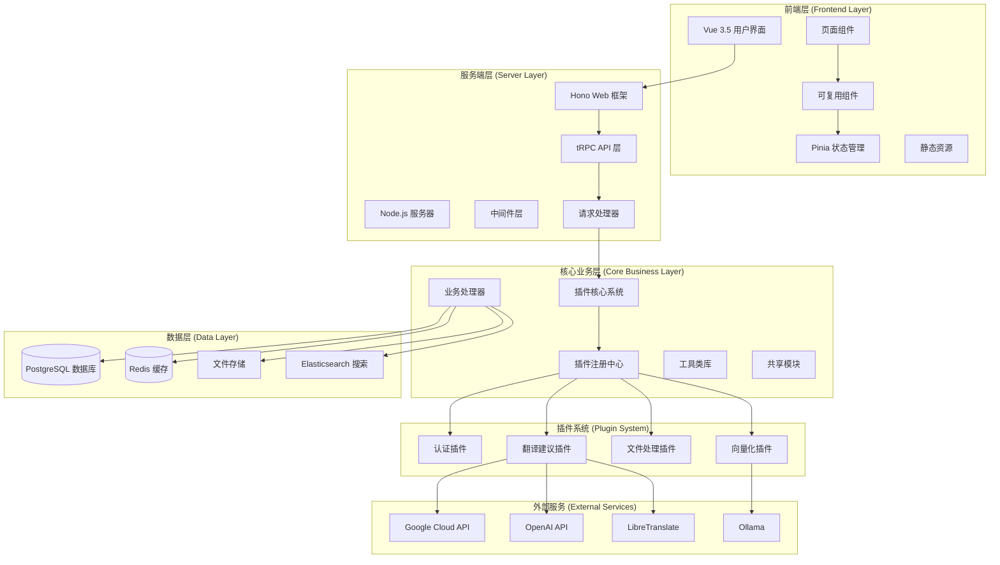

### 2.2 分层架构设计

| 层级       | 职责                   | 技术栈                    |
| ---------- | ---------------------- | ------------------------- |
| 前端表现层 | 用户界面、交互逻辑     | Vue 3.5, Vike, UnoCSS     |
| API 接口层 | HTTP 接口、路由管理    | Hono, tRPC                |
| 业务逻辑层 | 核心业务逻辑、插件管理 | TypeScript, Plugin Core   |
| 插件扩展层 | 功能插件、服务集成     | 插件系统                  |
| 数据持久层 | 数据存储、缓存管理     | Prisma, PostgreSQL, Redis |

## 3. 核心模块架构

### 3.1 主应用模块 (apps/app)

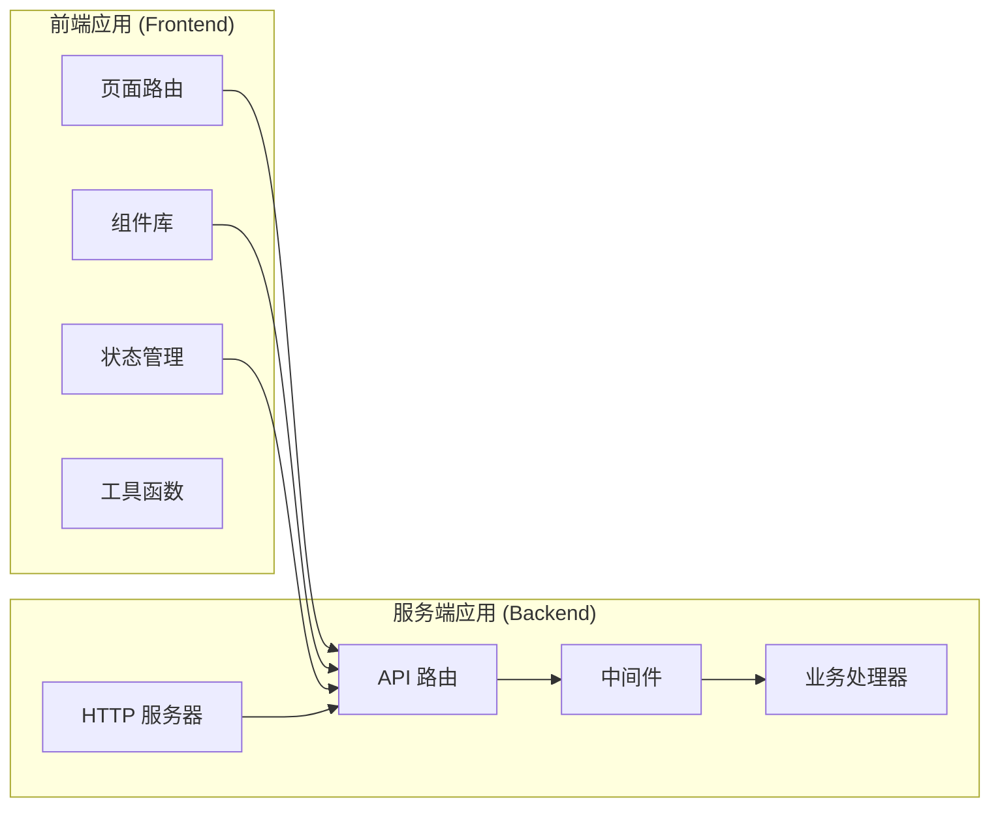

### 3.2 插件系统架构

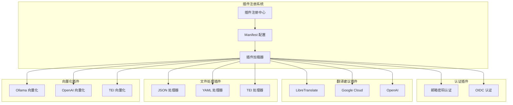

### 3.3 数据库架构

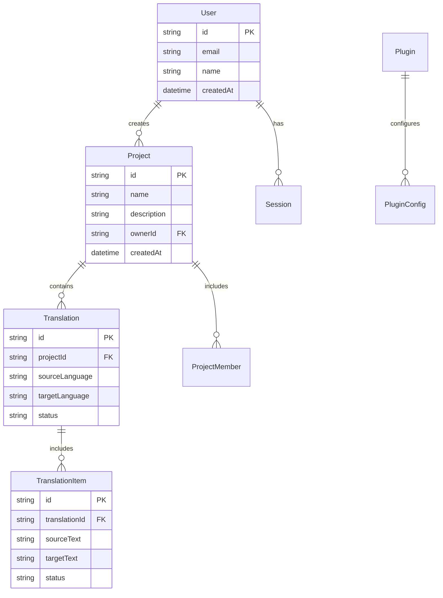

## 4. 插件系统设计

### 4.1 插件类型分类

| 插件类型   | 标签                      | 功能描述         | 示例插件                                         |
| ---------- | ------------------------- | ---------------- | ------------------------------------------------ |
| 认证提供者 | auth-provider             | 用户身份验证     | email-password-auth-provider, oidc-auth-provider |
| 翻译建议器 | translation-advisor       | 提供翻译建议     | libretranslate-advisor, google-cloud-advisor     |
| 文件处理器 | translatable-file-handler | 处理翻译文件格式 | json-file-handler, yaml-file-handler             |
| 向量化器   | vectorizer                | 文本向量化处理   | ollama-vectorizer, openai-vectorizer             |
| 术语服务   | term-service              | 术语管理服务     | es-term-service                                  |

### 4.2 插件生命周期

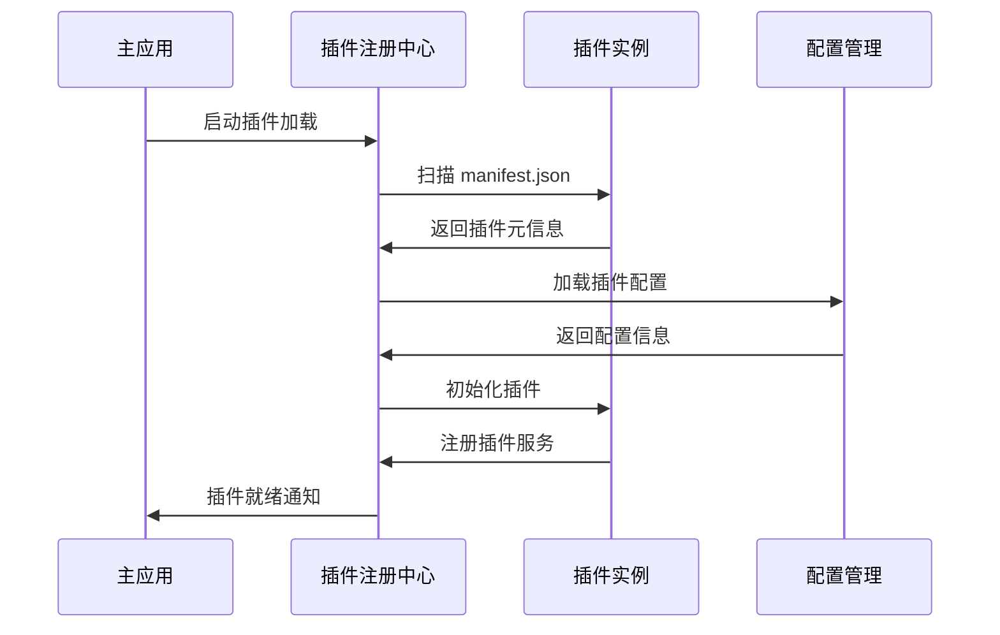

### 4.3 插件配置管理

```json
{
  "id": "libretranslate-advisor",
  "entry": "dist/index.mjs",
  "iconURL": "https://unocss.dev/logo.svg",
  "tags": ["translation-advisor"],
  "configs": [
    {
      "key": "api",
      "overridable": true,
      "schema": {
        "type": "object",
        "properties": {
          "url": {
            "type": "string",
            "format": "url",
            "default": "http://libreTranslate:5000/"
          },
          "key": {
            "type": "string",
            "x-secret": true
          }
        }
      }
    }
  ]
}
```

## 5. 数据流架构

### 5.1 翻译工作流

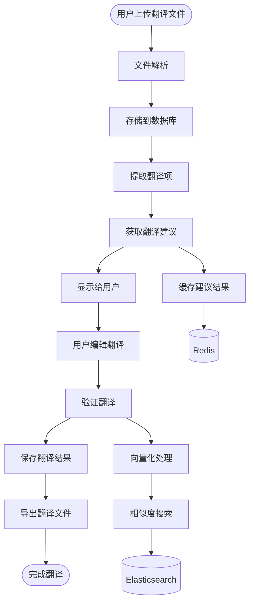

### 5.2 用户认证流程

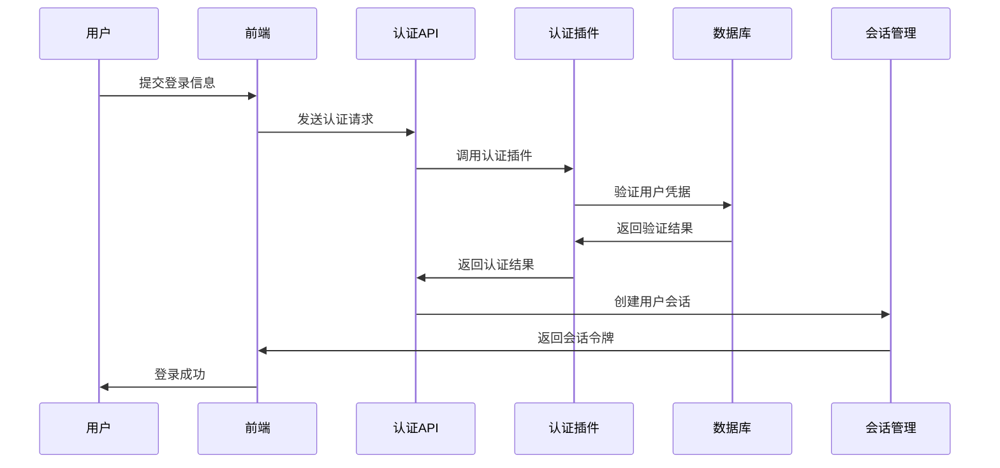

## 6. 部署架构

### 6.1 容器化部署

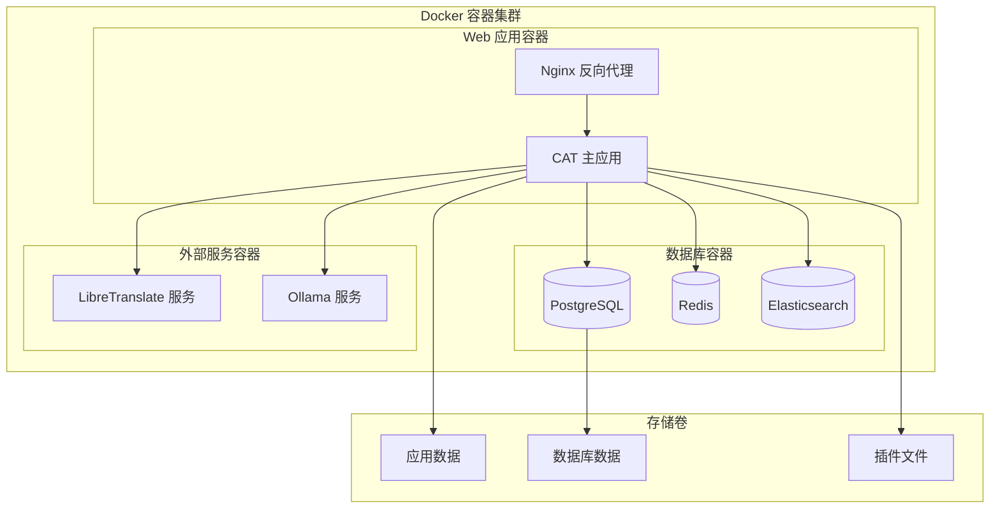

### 6.2 环境配置

| 环境     | 用途         | 配置特点                     |
| -------- | ------------ | ---------------------------- |
| 开发环境 | 本地开发调试 | 热重载、详细日志、测试数据   |
| 测试环境 | 功能测试验证 | E2E 测试、模拟数据、性能监控 |
| 生产环境 | 正式服务部署 | 高可用、负载均衡、安全配置   |

## 7. 性能优化策略

### 7.1 缓存策略

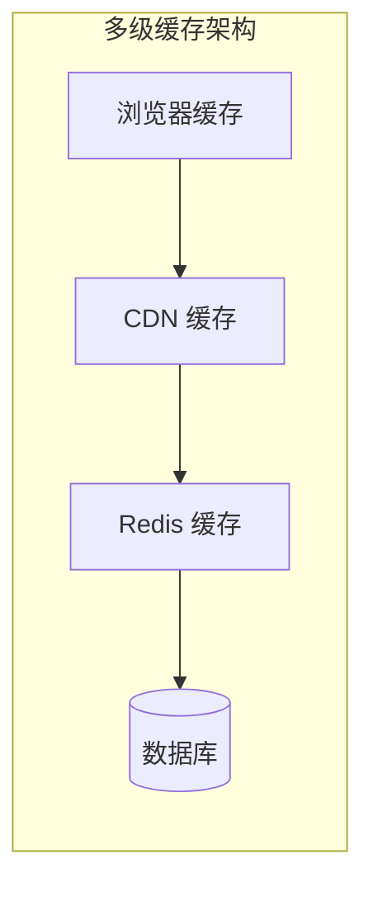

### 7.2 数据库优化

| 优化策略 | 实现方式          | 性能提升           |
| -------- | ----------------- | ------------------ |
| 索引优化 | 关键字段建立索引  | 查询速度提升 80%   |
| 连接池   | Prisma 连接池管理 | 并发处理能力提升   |
| 读写分离 | 主从数据库配置    | 读取性能提升 50%   |
| 查询优化 | N+1 查询优化      | 减少数据库请求次数 |

## 8. 安全架构

### 8.1 安全防护体系

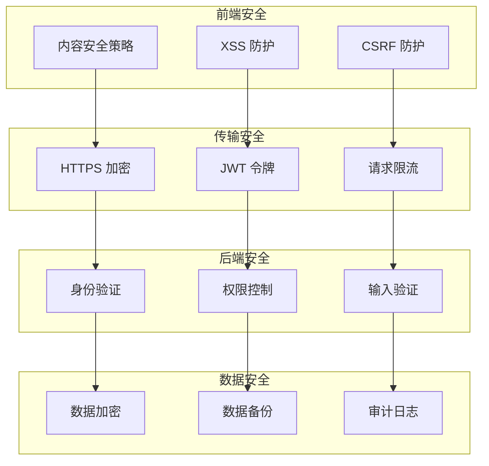

### 8.2 权限控制模型

| 角色       | 权限范围 | 功能权限                     |
| ---------- | -------- | ---------------------------- |
| 超级管理员 | 全系统   | 系统配置、用户管理、插件管理 |
| 项目管理员 | 单个项目 | 项目配置、成员管理、翻译审核 |
| 翻译员     | 分配任务 | 翻译编辑、查看建议、提交翻译 |
| 审核员     | 分配任务 | 翻译审核、质量控制、状态更新 |

## 9. 监控与运维

### 9.1 监控体系

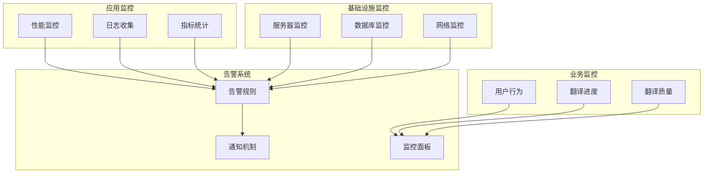

### 9.2 运维自动化

| 运维任务 | 自动化方式 | 执行频率     |
| -------- | ---------- | ------------ |
| 代码部署 | CI/CD 管道 | 代码提交触发 |
| 数据备份 | 定时脚本   | 每日执行     |
| 性能监控 | 监控告警   | 实时监控     |
| 日志清理 | 定时任务   | 每周执行     |
| 安全扫描 | 自动化工具 | 每月执行     |

## 10. 扩展性设计

### 10.1 水平扩展策略

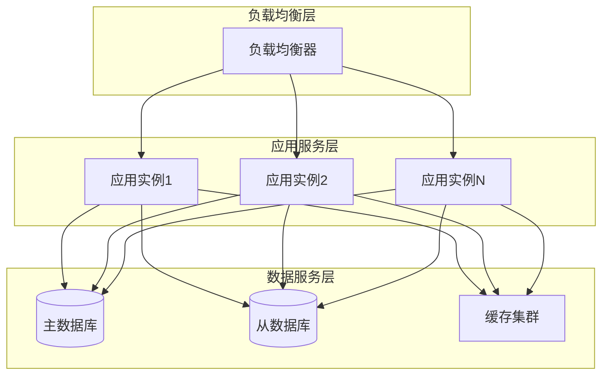

### 10.2 插件扩展机制

| 扩展点   | 接口类型              | 扩展能力         |
| -------- | --------------------- | ---------------- |
| 认证方式 | IAuthProvider         | 新增认证协议支持 |
| 翻译引擎 | ITranslationAdvisor   | 集成新的翻译服务 |
| 文件格式 | IFileHandler          | 支持新的文件类型 |
| 存储方式 | IStorageProvider      | 支持新的存储后端 |
| 通知方式 | INotificationProvider | 新增通知渠道     |
