# CAT 项目完整数据库 ER 图

## 完整数据库实体关系图

```mermaid
erDiagram
    %% 用户和认证
    User ||--o{ Account : has
    User ||--o{ UserRole : assigned
    User ||--o{ Project : creates
    User ||--o{ Document : creates
    User ||--o{ Translation : creates
    User ||--o{ TranslationVote : votes
    User ||--o{ TranslationApprovement : approves
    User ||--o{ Memory : creates
    User ||--o{ MemoryItem : creates
    User ||--o{ Glossary : creates
    User ||--o{ Term : creates
    User ||--o{ Exam : creates
    User ||--o{ Answer : submits
    User ||--o{ PluginConfigInstance : configures
    User ||--o{ Language : "reads/writes"
    User ||--o{ Project : "member of"
    User ||--o{ File : "avatar"

    %% 角色权限系统
    Role ||--o{ UserRole : includes
    Role ||--o{ RolePermission : has
    Role ||--o{ Role : "parent/child"
    Permission ||--o{ RolePermission : granted

    %% 项目管理
    Project ||--o{ Document : contains
    Project ||--o{ Memory : uses
    Project ||--o{ Glossary : uses
    Project ||--|| Language : "source language"
    Project ||--o{ Language : "target languages"

    %% 文档和翻译元素
    Document ||--o{ DocumentVersion : versions
    Document ||--o{ TranslatableElement : contains
    Document ||--o{ Task : processes
    Document ||--o{ Exam : tests
    Document ||--o{ File : attached
    DocumentVersion ||--o{ TranslatableElement : "version of"
    TranslatableElement ||--o{ Translation : translated
    TranslatableElement ||--o{ MemoryItem : "source of"
    TranslatableElement ||--o{ Answer : answered
    TranslatableElement ||--|| Vector : embedded
    TranslatableElement ||--o{ TranslatableElement : "diff history"

    %% 翻译系统
    Translation ||--o{ TranslationVote : receives
    Translation ||--o{ TranslationApprovement : approved
    Translation ||--o{ MemoryItem : "translation of"
    Translation ||--|| Language : "target language"
    Translation ||--|| Vector : embedded

    %% 记忆库系统
    Memory ||--o{ MemoryItem : contains
    MemoryItem ||--|| Vector : "source embedding"
    MemoryItem ||--|| Vector : "translation embedding"
    MemoryItem ||--|| Language : "source language"
    MemoryItem ||--|| Language : "translation language"

    %% 术语库系统
    Glossary ||--o{ Term : contains
    Term ||--|| Language : "term language"
    Term ||--o{ TermRelation : "relation from"
    Term ||--o{ TermRelation : "relation to"

    %% 文件存储
    File ||--|| StorageType : "stored as"

    %% 插件系统
    Plugin ||--o{ PluginVersion : versions
    Plugin ||--o{ PluginPermission : requires
    Plugin ||--o{ PluginConfig : configures
    Plugin ||--o{ PluginTag : tagged
    Plugin ||--o{ PluginComponent : components
    PluginConfig ||--o{ PluginConfigInstance : instances

    %% 考试系统
    Exam ||--o{ Answer : "answered by"
    Answer ||--|| Vector : embedded

    %% 任务系统
    Task ||--o{ Document : processes

    %% 核心实体定义
    User {
        string id PK
        string name UK
        string email UK
        boolean emailVerified
        datetime createdAt
        datetime updatedAt
    }

    Account {
        string type
        string provider PK
        string providedAccountId PK
        json meta
        string userId FK
        datetime createdAt
        datetime updatedAt
    }

    Role {
        int id PK
        string name UK
        string description
        int parentId FK
        datetime createdAt
        datetime updatedAt
    }

    Permission {
        int id PK
        string resource
        string action
        string description
        datetime createdAt
        datetime updatedAt
    }

    RolePermission {
        int id PK
        int roleId FK
        int permissionId FK
        boolean isAllowed
        json conditions
        datetime createdAt
        datetime updatedAt
    }

    UserRole {
        int id PK
        string userId FK
        int roleId FK
        json scope
        boolean isEnabled
        datetime expiresAt
        datetime createdAt
        datetime updatedAt
    }

    Project {
        string id PK
        string name
        string description
        string creatorId FK
        string sourceLanguageId FK
        datetime createdAt
        datetime updatedAt
    }

    Document {
        string id PK
        string projectId FK
        string creatorId FK
        datetime createdAt
        datetime updatedAt
    }

    DocumentVersion {
        int id PK
        string documentId FK
        boolean isActive
        datetime createdAt
        datetime updatedAt
    }

    TranslatableElement {
        int id PK
        string documentId FK
        int documentVersionId FK
        int embeddingId FK
        string value
        int sortIndex
        json meta
        int version
        boolean isActive
        int previousVersionId FK
        datetime createdAt
        datetime updatedAt
    }

    Translation {
        int id PK
        string translatorId FK
        int translatableElementId FK
        string languageId FK
        int embeddingId FK
        string value
        json meta
        datetime createdAt
        datetime updatedAt
    }

    TranslationVote {
        int id PK
        string voterId FK
        int translationId FK
        int value
        datetime createdAt
        datetime updatedAt
    }

    TranslationApprovement {
        int id PK
        int translationId FK
        string creatorId FK
        boolean isActive
        datetime createdAt
        datetime updatedAt
    }

    Memory {
        string id PK
        string name
        string description
        string creatorId FK
        datetime createdAt
        datetime updatedAt
    }

    MemoryItem {
        int id PK
        string memoryId FK
        string creatorId FK
        string source
        string translation
        int sourceEmbeddingId FK
        int translationEmbeddingId FK
        int sourceElementId FK
        int translationId FK
        string sourceLanguageId FK
        string translationLanguageId FK
        datetime createdAt
        datetime updatedAt
    }

    Glossary {
        string id PK
        string name
        string description
        string creatorId FK
        datetime createdAt
        datetime updatedAt
    }

    Term {
        int id PK
        string glossaryId FK
        string creatorId FK
        string languageId FK
        string value
        string context
        datetime createdAt
        datetime updatedAt
    }

    TermRelation {
        int termId PK,FK
        int translationId PK,FK
    }

    Language {
        string id PK
        string name
    }

    File {
        int id PK
        string originName
        string storedPath
        int storageTypeId FK
        string documentId FK
        string userId FK
        datetime createdAt
        datetime updatedAt
    }

    StorageType {
        int id PK
        string name UK
    }

    Plugin {
        string id PK
        json origin
        string name
        string overview
        boolean enabled
        boolean isExternal
        string entry
        string iconURL
        datetime createdAt
        datetime updatedAt
    }

    PluginVersion {
        int id PK
        string pluginId FK
        string version
        datetime createdAt
        datetime updatedAt
    }

    PluginPermission {
        int id PK
        string pluginId FK
        string permission
        string description
        datetime createdAt
        datetime updatedAt
    }

    PluginConfig {
        int id PK
        string pluginId FK
        string key
        json schema
        boolean overridable
        datetime createdAt
        datetime updatedAt
    }

    PluginConfigInstance {
        int id PK
        int configId FK
        string creatorId FK
        enum scopeType
        string scopeId
        json scopeMeta
        json value
        datetime createdAt
        datetime updatedAt
    }

    PluginTag {
        int id PK
        string name UK
        datetime createdAt
        datetime updatedAt
    }

    PluginComponent {
        string id PK
        string pluginId PK,FK
        string entry
        string mountOn
    }

    Exam {
        string id PK
        string name
        string description
        string documentId FK
        string creatorId FK
        datetime createdAt
        datetime updatedAt
    }

    Answer {
        int id PK
        string examId FK
        string userId FK
        int elementId FK
        int embeddingId FK
        string value
        datetime createdAt
        datetime updatedAt
    }

    Task {
        string id PK
        string status
        string type
        json meta
        datetime createdAt
        datetime updatedAt
    }

    Setting {
        int id PK
        string key UK
        json value
        datetime createdAt
        datetime updatedAt
    }

    Vector {
        int id PK
        vector_1024 vector
    }
```

## 数据库架构说明

### 核心模块

1. **用户认证系统**
   - User: 用户基本信息
   - Account: 第三方认证账户
   - Role/Permission/UserRole: 基于角色的权限控制系统

2. **项目管理系统**
   - Project: 翻译项目
   - Document: 项目文档
   - DocumentVersion: 文档版本控制

3. **翻译系统**
   - TranslatableElement: 可翻译元素
   - Translation: 翻译内容
   - TranslationVote: 翻译投票
   - TranslationApprovement: 翻译审批

4. **记忆库系统**
   - Memory: 翻译记忆库
   - MemoryItem: 记忆库条目
   - Vector: 向量嵌入（用于语义匹配）

5. **术语库系统**
   - Glossary: 术语库
   - Term: 术语条目
   - TermRelation: 术语关系

6. **插件系统**
   - Plugin: 插件定义
   - PluginConfig: 插件配置
   - PluginConfigInstance: 插件配置实例

7. **文件存储系统**
   - File: 文件信息
   - StorageType: 存储类型

8. **考试系统**
   - Exam: 考试定义
   - Answer: 考试答案

9. **任务系统**
   - Task: 异步任务

10. **系统配置**
    - Setting: 系统设置
    - Language: 语言定义

### 关键特性

- **多语言支持**: 通过Language实体支持多种源语言和目标语言
- **版本控制**: DocumentVersion和TranslatableElement支持文档和翻译的版本管理
- **向量搜索**: Vector实体支持基于语义的翻译记忆匹配
- **插件化架构**: 完整的插件系统支持功能扩展
- **权限控制**: 基于角色的细粒度权限管理
- **审批流程**: 翻译投票和审批机制保证翻译质量
