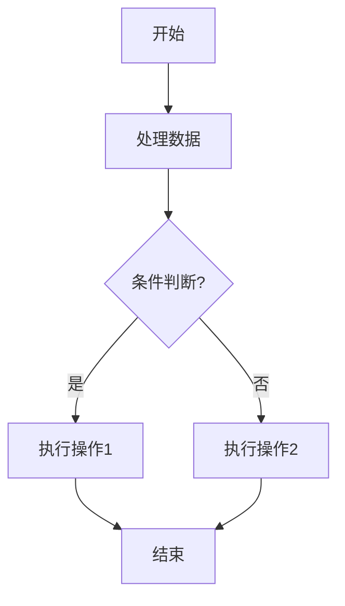

# 功能扩展构想

本节整理当前代码库的空位、潜力与可演进方向，方便规划后续迭代。每一项均基于现有实现现状，给出推荐的扩展点与落地建议。

## 工作流与协作

- **项目成员与权限体系**：`apps/app/src/app/pages/project/@projectId/members` 仅保留空页面，可结合数据库新增 `ProjectMember`、`Role` 关联，支持译者/审核/项目经理等角色，并在 tRPC 层增加访问控制。可同步提供邀请机制与审计日志。
- **实时协作模式**：目前编辑器通过 Pinia 管理本地状态，未来可引入协同引擎（如 Yjs + websocket）以避免多译者冲突，同时在翻译更新时推送实时通知而非依赖手动刷新。
- **任务看板**：BullMQ 任务仅在数据表中展示列表。建议新增队列监控页或嵌入 Bull Board，支持重试、取消以及耗时统计，便于运维和追踪自动翻译/导出状态。

## 翻译体验

- **进度统计完善**：`DocumentTranslationProgress` 尚未接入数据，可实现 `translation.count` 与 `element.count` 的后端聚合，并提供审批完成率、未翻译总量等指标。
- **QA 规则扩展**：现有 Clipper 仅对占位符、数字、换行做匹配校验。可开放插件接口注册更多 QA 规则（HTML Tag、变量、正则等），并在提交时给出阻塞/警告级别。
- **上下文增强**：在编辑器增加字符串出处、版本比较（基于 `documentVersion`）、原文差异高亮，帮助译者理解更新背景。
- **批量操作**：支持多元素批量替换、批量批准、批量回退，以提升大规模翻译处理效率。

## 插件生态

- **插件分发与签名**：目前插件放置于 `apps/app/plugins` 目录，可引入插件仓库索引、签名验证与在线更新机制，确保安全性与可维护性。
- **更多内建插件**：
  1. 文件处理：XLIFF、Excel、PO、ResX 等常见格式。
  2. 建议器：DeepL、Azure Translator、Baidu 等主流 MT 服务，结合费用权益管理。
  3. 向量化：可选 OpenAI Embedding、Nomic 等模型，支持维度自动探测。
  4. 术语服务：除 Elasticsearch 外，加入 Postgres pgvector、Redis Stack 等备选实现。
- **插件配置继承**：完善 `PluginRegistry` 的 scope 继承策略，支持 GLOBAL → PROJECT → USER 的级联读取与覆盖，减少重复配置。

## 后端与基础设施

- **多租户支持**：当前 `ScopeType` 包含 GLOBAL/PROJECT/USER，可进一步抽象租户维度，在数据库和 Redis key 设计上区分 tenantId，以便 SaaS 化。
- **审计与日志追踪**：整合结构化日志与 tracing，将关键操作（创建项目、导出译文、审批翻译）写入审计表，并暴露给管理后台查询。
- **监控与告警**：为 BullMQ 队列、数据库连接、Redis 订阅建立 Prometheus 指标与告警策略，及时发现性能瓶颈。
- **文件生命周期管理**：S3 存储目前仅提供生成 URL，可增加自动清理策略（过期导出包、失效临时文件）与版本备份。

## 数据与 AI 能力

- **翻译质量评估**：在自动翻译后运行评估模型（BLEU、COMET、LLM-based）给出分值，辅助审核者筛选译文。
- **记忆库批量导入/导出**：提供 CSV/XLIFF 批处理工具，便于与外部 CAT 兼容。
- **术语建议可视化**：展示术语高亮结果与替换前后对比，提供术语置信度或使用频次统计。
- **多语向量一致性**：允许在项目层配置不同向量化模型，并在 `memory.search` 时自动适配维度，提升跨语言匹配准确度。

## 运维与产品化

- **CLI 工具集**：封装常用操作（同步插件、检查配置、导入默认数据、触发迁移）为命令行，提高部署效率。
- **升级与兼容策略**：定义数据库迁移规则、插件版本兼容检查、配置 Schema 变更策略，减少升级成本。
- **备份/恢复流程**：提供备份脚本覆盖数据库、Redis、S3 文件，并支持一键恢复。
- **文档体系**：将用户指南与开发者文档接入 VitePress 导航，加入示范流程、截图和 FAQ，提升学习曲线。

以上构想可按优先级逐步落地，可结合现有架构拆分为短迭代任务，持续提升 CAT 平台的易用性与扩展能力。
