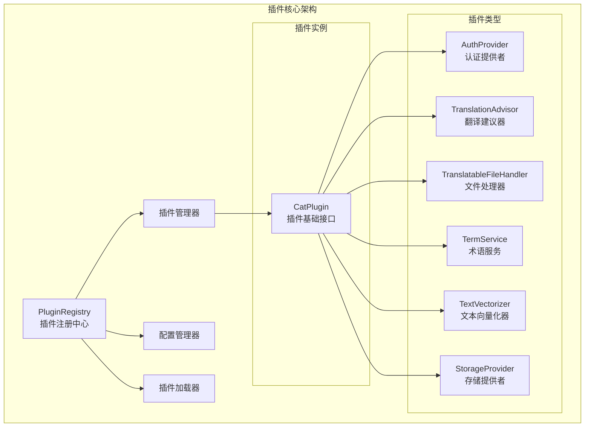
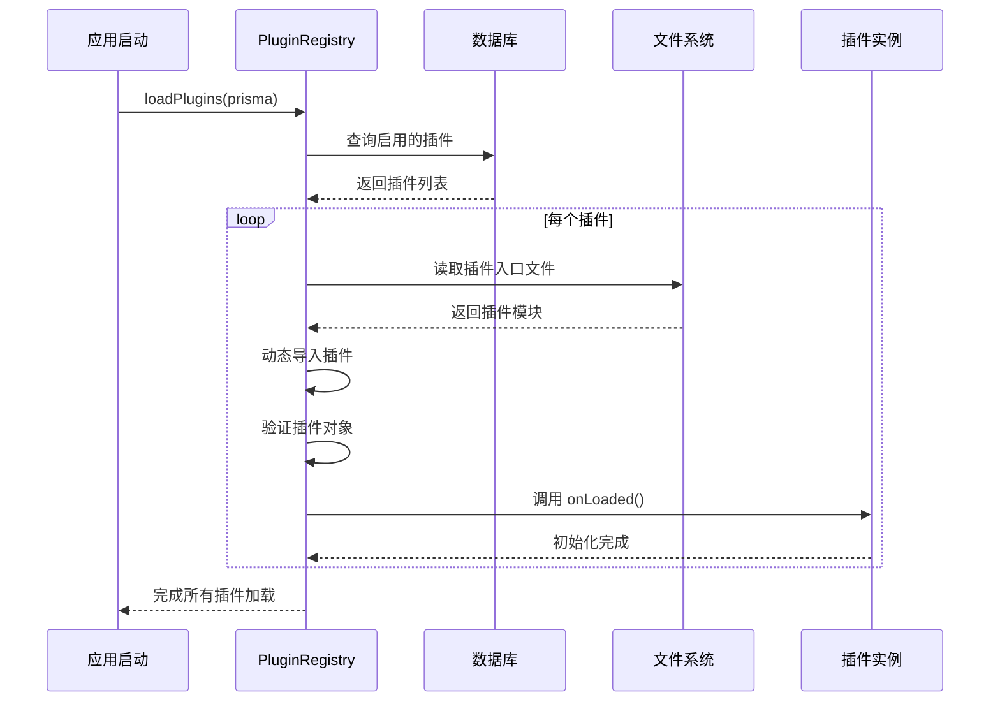
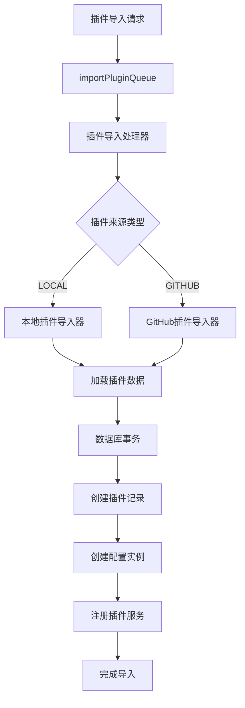
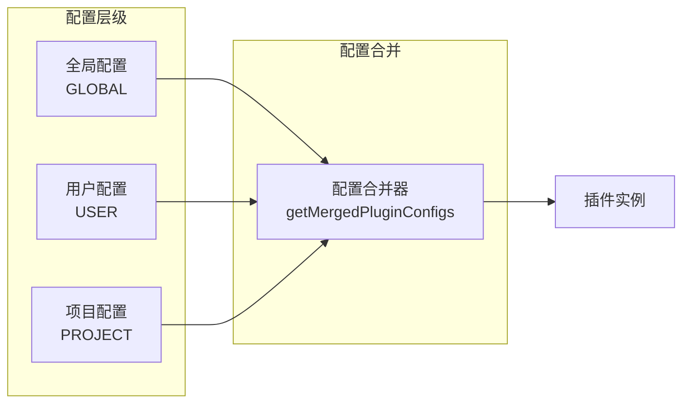
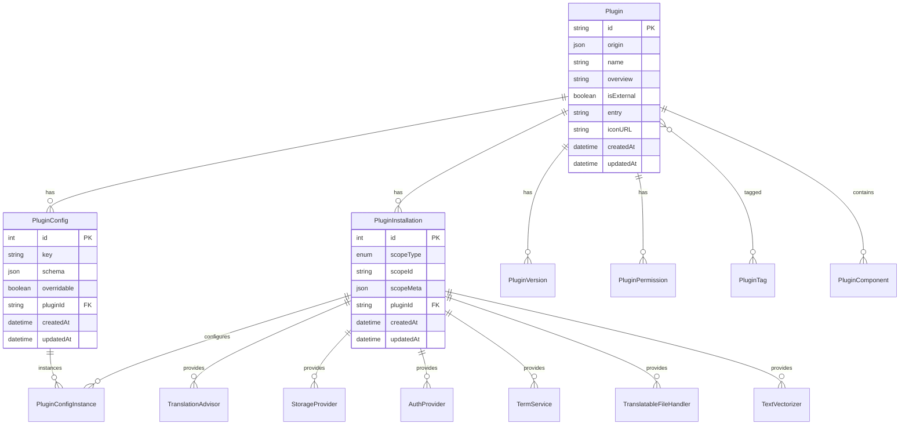
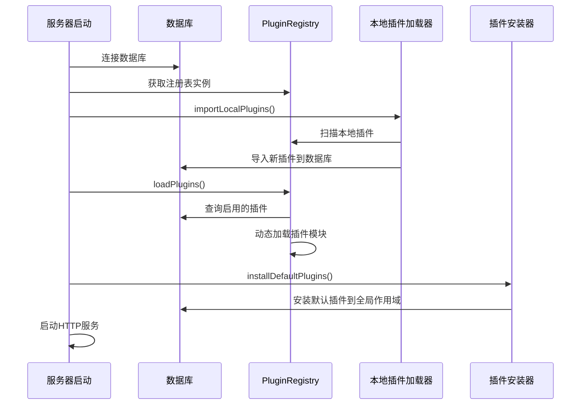
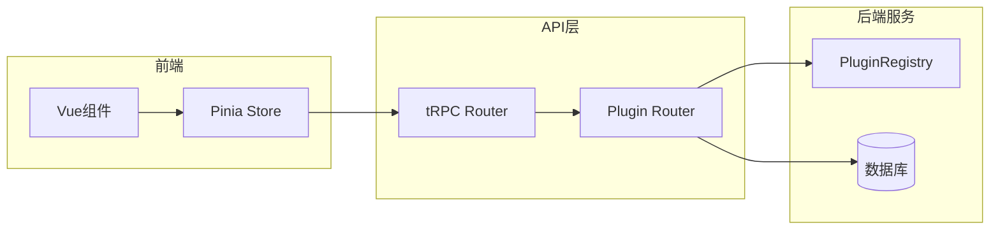
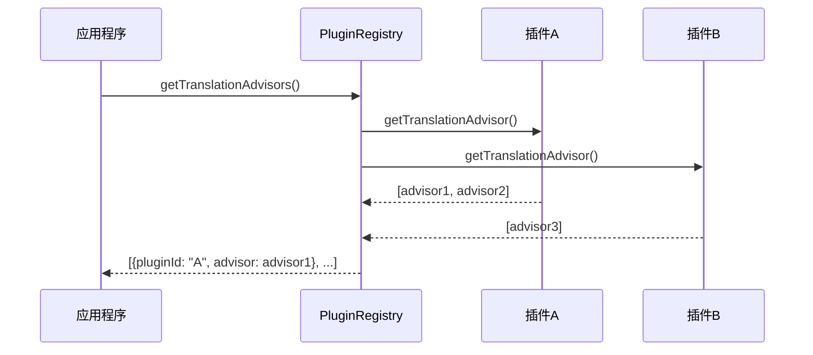
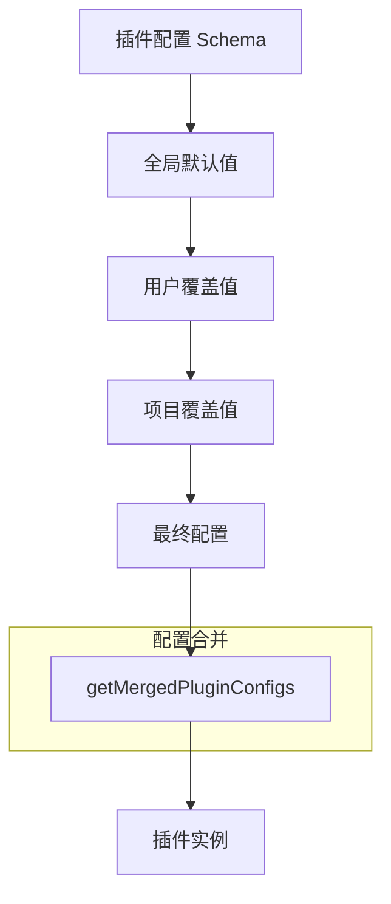

# CAT 插件系统架构分析报告

## 概述

CAT（Computer Assisted Translation）项目采用了一个高度模块化和可扩展的插件系统架构。该插件系统支持多种类型的功能扩展，包括认证提供者、翻译建议器、文件处理器、术语服务、文本向量化器和存储提供者等。插件系统基于 TypeScript 构建，采用了现代化的设计模式，实现了插件的动态加载、配置管理、生命周期控制和服务发现等核心功能。

## 核心架构

### 1. 插件核心组件层次结构



### 2. 插件注册表（PluginRegistry）

插件注册表是整个插件系统的核心管理组件，采用单例模式确保全局唯一性。它负责：

- 插件的发现和加载
- 插件实例的管理和存储
- 插件配置的合并和分发
- 插件服务的获取和调用

**核心特性：**

- 使用 `Map<string, CatPlugin>` 存储插件实例
- 支持从数据库动态加载插件
- 提供类型安全的服务获取方法
- 支持插件的热重载机制

### 3. 插件接口规范

每个插件类型都定义了特定的接口规范：

#### AuthProvider（认证提供者）

```typescript
interface AuthProvider {
  getId(): string;
  getType(): string;
  getName(): string;
  getIcon(): string;
  handleAuth(gotFromClient: any, helpers: HTTPHelpers): Promise<AuthResult>;
  isAvaliable(): Promise<boolean>;
}
```

#### TranslationAdvisor（翻译建议器）

```typescript
interface TranslationAdvisor {
  getId(): string;
  getName(): string;
  canSuggest(
    element: TranslatableElement,
    languageFromId: string,
    languageToId: string,
  ): boolean;
  getSuggestions(
    element: TranslatableElement,
    termedValue: string,
    termRelations: Required<TermRelation>[],
    languageFromId: string,
    languageToId: string,
  ): Promise<TranslationSuggestion[]>;
}
```

#### TranslatableFileHandler（文件处理器）

```typescript
interface TranslatableFileHandler {
  getId(): string;
  canExtractElement(file: File): boolean;
  extractElement(file: File, fileContent: Buffer): TranslatableElementData[];
  canGetReplacedFileContent(file: File): boolean;
  getReplacedFileContent(
    file: File,
    fileContent: Buffer,
    elements: Pick<TranslatableElement, "meta" | "value">[],
  ): Promise<Buffer>;
}
```

## 插件生命周期管理

### 1. 插件加载流程



### 2. 插件导入和安装流程



### 3. 插件配置管理

插件系统支持多层级的配置管理：



**配置优先级：** PROJECT > USER > GLOBAL

## 数据库设计

### 1. 插件相关数据模型



### 2. 作用域管理

插件支持三种安装作用域：

- **GLOBAL**: 全局作用域，对所有用户和项目可用
- **USER**: 用户作用域，仅对特定用户可用
- **PROJECT**: 项目作用域，仅对特定项目可用

## 应用程序集成

### 1. 服务器启动流程



### 2. tRPC API 集成

插件系统通过 tRPC 提供类型安全的 API 接口：



**主要 API 端点：**

- `plugin.listAll`: 获取所有插件列表
- `plugin.query`: 查询特定插件详情
- `plugin.delete`: 删除插件
- `plugin.importFromGitHub`: 从 GitHub 导入插件
- `plugin.upsertConfigInstance`: 更新插件配置实例

### 3. 前端状态管理

## 插件实现示例

### 1. 认证提供者插件

```typescript
// email-password-auth-provider/src/index.ts
import type { CatPlugin } from "@cat/plugin-core";
import { Provider } from "./provider";

class Plugin implements CatPlugin {
  async onLoaded() {}

  getAuthProviders() {
    return [new Provider()];
  }
}

export default new Plugin();
```

### 2. 文件处理器插件

```typescript
// json-file-handler/src/index.ts
import type { CatPlugin } from "@cat/plugin-core";
import { JSONTranslatableFileHandler } from "./handler";

class Plugin implements CatPlugin {
  async onLoaded() {}

  getTranslatableFileHandlers() {
    return [new JSONTranslatableFileHandler()];
  }
}

export default new Plugin();
```

### 3. 翻译建议器插件

```typescript
// libretranslate-advisor/src/index.ts
import type { CatPlugin, PluginLoadOptions } from "@cat/plugin-core";
import { LibreTranslateTranslationAdvisor } from "./advisor";

class Plugin implements CatPlugin {
  private options: PluginLoadOptions | null = null;

  async onLoaded(options: PluginLoadOptions) {
    this.options = options;
  }

  getTranslationAdvisors(options?: PluginGetterOptions) {
    return [new LibreTranslateTranslationAdvisor(this.getConfigs(options))];
  }
}

export default new Plugin();
```

## 插件发现与部署

### 1. 本地插件加载

系统通过脚本自动复制内置插件到应用程序的 `plugins` 目录：

```javascript
// scripts/load-internal-plugins.js
const FOLDER_INCLUDES = [
  "ollama-vectorizer",
  "libretranslate-advisor",
  "json-file-handler",
  "yaml-file-handler",
  "oidc-auth-provider",
  "email-password-auth-provider",
  "es-term-service",
  "s3-storage-provider",
];
```

### 2. 插件目录结构

```
plugins/
├── plugin-id/
│   ├── manifest.json      # 插件元数据
│   ├── package.json       # 包信息
│   ├── README.md         # 插件说明
│   └── dist/
│       └── index.mjs     # 编译后的插件入口
```

### 3. 插件元数据（manifest.json）

```json
{
  "id": "email-password-auth-provider",
  "entry": "dist/index.mjs",
  "iconURL": "https://example.com/icon.svg",
  "tags": ["auth-provider"]
}
```

## 服务调用机制

### 1. 服务获取流程



### 2. 服务使用示例

```typescript
// 获取存储提供者服务
export const useStorage = async (
  prisma: OverallPrismaClient,
  storageServiceId: string,
  scopeType: ScopeType,
  scopeId: string,
) => {
  const storage = (await PluginRegistry.get().getStorageProviders(prisma))
    .filter(({ provider }) => provider.getId() === storageServiceId)
    .at(0);

  if (!storage) throw new Error(`Storage provider not found`);

  return storage;
};
```

## 配置管理系统

### 1. 配置层级结构



### 2. 配置实例管理

每个插件配置都支持在不同作用域创建实例：

```typescript
// 配置实例创建
await prisma.pluginConfigInstance.create({
  data: {
    configId: pluginConfig.id,
    pluginInstallationId: installation.id,
    value: getDefaultFromSchema(schema) ?? {},
  },
});
```

## 性能优化和最佳实践

### 1. 插件加载优化

- **并行加载**: 使用 `Promise.all` 并行加载多个插件
- **懒加载**: 插件仅在需要时才进行实例化
- **缓存机制**: 插件实例在注册表中缓存，避免重复创建

### 2. 错误处理

```typescript
// 插件加载错误处理
try {
  const pluginObj = PluginObjectSchema.parse(imported.default ?? imported);
  await this.loadPlugin(prisma, id, pluginObj);
} catch (importErr) {
  logger.error("PLUGIN", { msg: `Failed to load plugin '${id}'` }, importErr);
  continue; // 继续加载其他插件
}
```

### 3. 类型安全

系统使用 TypeScript 和 Zod 确保类型安全：

```typescript
// 插件对象验证
const PluginObjectSchema = z.custom<CatPlugin>();
const pluginObj = PluginObjectSchema.parse(imported.default ?? imported);
```

## 扩展性设计

### 1. 插件类型扩展

要添加新的插件类型，只需：

1. 在 `plugin-core` 中定义新的接口
2. 在数据库中添加对应的服务表
3. 在 `PluginRegistry` 中添加相应的 getter 方法
4. 在 `CatPlugin` 接口中添加可选的 getter 方法

### 2. 服务发现机制

```typescript
// 通用服务获取方法
private async getPluginServices<T, K extends string>(
  prisma: OverallPrismaClient,
  getSingleService: (prisma: OverallPrismaClient, pluginId: string, options?: GetterOptions) => Promise<T[]>,
  serviceKey: K,
  options?: GetterOptions,
): Promise<Array<{ pluginId: string } & Record<K, T>>> {
  // 并行获取所有插件的服务
}
```

## 总结

CAT 的插件系统采用了现代化的软件架构设计原则，实现了高度的模块化、可扩展性和类型安全性。通过统一的插件接口规范、灵活的配置管理系统、完善的生命周期控制和强大的服务发现机制，为系统的功能扩展提供了坚实的基础。

该插件系统的主要优势包括：

1. **高度模块化**: 每个功能领域都有独立的插件接口
2. **类型安全**: 基于 TypeScript 的强类型系统
3. **配置灵活**: 支持多层级配置覆盖
4. **易于扩展**: 清晰的插件开发规范
5. **生产就绪**: 完善的错误处理和性能优化

这个插件系统为 CAT 项目提供了强大的可扩展性，使其能够适应不同的翻译工作流程和集成需求。
