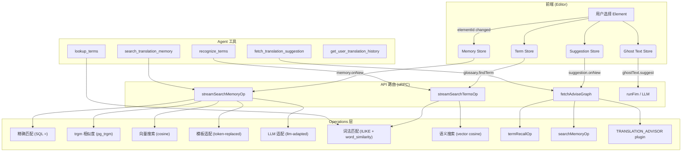

# 术语与翻译记忆召回架构

## 概述

CAT 的编辑器采用**多通道渐进式召回**策略，在用户选择 Element 时自动从词汇表和翻译记忆库中检索相关内容，辅助翻译工作。所有召回通道均为流式输出，先快后慢，结果实时呈现。



---

## 召回通道总览

| 通道              | 目标                | 操作                                                   | 速度         | 插件依赖                        |
| ----------------- | ------------------- | ------------------------------------------------------ | ------------ | ------------------------------- |
| **术语·词法**     | Glossary Term       | `listLexicalTermSuggestions` (ILIKE + word_similarity) | ~10–50 ms    | 无                              |
| **术语·语义**     | Glossary Term       | `semanticSearchTermsOp` (向量余弦)                     | ~200–1000 ms | TEXT_VECTORIZER, VECTOR_STORAGE |
| **记忆·精确**     | Translation Memory  | `listExactMemorySuggestions` (SQL `=`)                 | ~10 ms       | 无                              |
| **记忆·trgm**     | Translation Memory  | `listTrgmMemorySuggestions` (pg_trgm similarity)       | ~50–200 ms   | 无                              |
| **记忆·向量**     | Translation Memory  | `searchChunkOp` (向量余弦)                             | ~200–1000 ms | VECTOR_STORAGE                  |
| **记忆·模板适配** | TM adaptation       | `memory-template.ts` (token 占位符替换)                | ~5 ms        | TOKENIZER                       |
| **记忆·LLM 适配** | TM adaptation       | `adaptMemoryOp` (LLM polishing)                        | ~1–5 s       | LLM_PROVIDER                    |
| **翻译建议**      | Machine Translation | `fetchAdviseOp` → TRANSLATION_ADVISOR                  | ~1–5 s       | TRANSLATION_ADVISOR             |

---

## 术语召回

### 词法匹配通道

基于 PostgreSQL `pg_trgm` 扩展的 ILIKE + `word_similarity` 函数，在词汇表中快速检索与输入文本匹配的术语。

- **操作**：`listLexicalTermSuggestions`
- **性能**：~10–50 ms，结果最先返回
- **无插件依赖**

### 语义搜索通道

将查询文本向量化后，在词汇表中的已向量化 `termConcept` 中进行余弦相似度搜索。

- **操作**：`semanticSearchTermsOp`
- **前提**：每个 `termConcept` 需通过 `revectorizeConceptOp` 建立向量索引
- **插件依赖**：`TEXT_VECTORIZER`、`VECTOR_STORAGE`

### 混合流式搜索

`streamSearchTermsOp` 同时启动两种搜索策略，通过 `AsyncMessageQueue` 流式推送结果，并按 `(term text, conceptId)` 全局去重（先到先得）。

```typescript
const stream = streamSearchTermsOp({
  glossaryIds,
  text,
  sourceLanguageId,
  translationLanguageId,
  minConfidence: 0.6,
});

for await (const term of stream) {
  // TermMatch: { term, translation, definition, conceptId, glossaryId, confidence }
}
```

---

## 翻译记忆召回

### 精确匹配通道

使用 SQL `=` 条件，查找与源文本完全一致的已翻译段落。

- **操作**：`listExactMemorySuggestions`
- **速度**：最快，~10 ms

### trgm 相似度通道

使用 PostgreSQL `pg_trgm` 的 `similarity()` 函数，查找文本相似度超过阈值的历史翻译。

- **操作**：`listTrgmMemorySuggestions`
- **默认阈值**：`minSimilarity = 0.72`

### 向量语义搜索通道

利用 `VECTOR_STORAGE` 插件存储的向量，通过余弦相似度搜索语义相关的历史翻译。

- **操作**：`searchChunkOp`
- **插件依赖**：`VECTOR_STORAGE`

### 模板适配 (Token Replaced)

对 trgm 匹配结果中的占位符（如数字、专有名词），使用 `TOKENIZER` 插件进行确定性替换，生成 `adaptedTranslation`。

- **适配方法**：`adaptationMethod = "template"`
- **插件依赖**：`TOKENIZER`（可选，无则跳过）

### LLM 适配

使用 `LLM_PROVIDER` 对非精确匹配结果进行语义润色，生成自然语言适配的翻译建议。

- **适配方法**：`adaptationMethod = "llm"`
- **插件依赖**：`LLM_PROVIDER`

---

## Agent 工具

### `lookup_terms`

基于 ILIKE + word_similarity 词法匹配，适合精确查找特定术语。

```json
{
  "glossaryIds": ["uuid-1", "uuid-2"],
  "text": "source text to look up",
  "sourceLanguageId": "en",
  "translationLanguageId": "zh-CN"
}
```

### `recognize_terms`

扫描整句或段落，使用混合召回（词法 + 语义）发现所有相关术语，并附加 concept 上下文（subjects、definitions）。适合场景：Agent 需要识别一整段话中涉及哪些术语。

```json
{
  "glossaryIds": ["uuid-1"],
  "text": "The transformer model processes the input sequence.",
  "sourceLanguageId": "en",
  "translationLanguageId": "zh-CN",
  "minConfidence": 0.5
}
```

返回值包含 `concept.subjects`，可用于判断术语所属领域。

### `search_translation_memory`

搜索翻译记忆库。支持两种调用模式：

**高层模式（推荐）**：提供 `elementId`，自动解析源文本、chunk IDs 和记忆库 ID：

```json
{
  "elementId": 42,
  "sourceLanguageId": "en",
  "translationLanguageId": "zh-CN"
}
```

**手动模式**：提供原始文本和记忆库 ID：

```json
{
  "text": "The quick brown fox",
  "memoryIds": ["mem-uuid-1"],
  "sourceLanguageId": "en",
  "translationLanguageId": "zh-CN"
}
```

内部使用三通道搜索：精确匹配 → trgm 相似度 → 向量语义搜索。

### `fetch_translation_suggestion`

调用 TRANSLATION_ADVISOR 插件生成机器翻译建议，同时参考术语和记忆上下文。

### `get_user_translation_history`

获取当前用户的历史翻译，用于个性化建议。

---

## 类型定义

### `TermMatch`

所有术语召回通道的直接输出类型（定义于 `@cat/shared/schema/term-recall`）：

```typescript
interface TermMatch {
  term: string;
  translation: string;
  definition: string | null;
  conceptId: number;
  glossaryId: string;
  confidence: number; // 0–1
}
```

### `EnrichedTermMatch`

附加了 concept 上下文的富类型，由 API 路由层或 Agent 工具在需要时附加：

```typescript
interface EnrichedTermMatch extends TermMatch {
  concept: {
    subjects: Array<{
      name: string;
      defaultDefinition: string | null;
    }>;
    definition?: string | null;
  };
}
```

### `MemorySuggestion`

所有翻译记忆召回通道的输出类型（定义于 `@cat/shared/schema/misc`）：

```typescript
interface MemorySuggestion {
  id: number;
  translationChunkSetId: number | null;
  source: string;
  translation: string;
  memoryId: string;
  creatorId: string | null;
  confidence: number;
  adaptedTranslation: string | null;
  adaptationMethod: "template" | "llm" | null;
  createdAt: Date;
  updatedAt: Date;
}
```

---

## 扩展指南

### 添加新的术语召回通道

1. 在 `packages/domain/src/queries/glossary/` 创建新查询，返回 `TermMatch[]`
2. 在 `streamSearchTermsOp` 中集成新通道（使用 `AsyncMessageQueue.push`）
3. 确保按 `(term text, conceptId)` 复合键去重

### 添加新的记忆召回通道

1. 在 `packages/domain/src/queries/memory/` 创建新查询，返回 `RawMemorySuggestion[]`
2. 在 `streamSearchMemoryOp` 中集成新通道
3. 按 `(source, memoryId)` 复合键去重

### 添加新的 Agent 工具

1. 在 `packages/agent/src/tools/builtin/` 创建新工具文件
2. 使用 `defineTool()` 定义工具，确保 Zod schema 有充分的 `.meta({ description })` 注释
3. 在 `packages/agent/src/tools/builtin/index.ts` 的 `builtinTools` 数组中注册
4. 根据需要更新 Agent 模板的 system prompt
