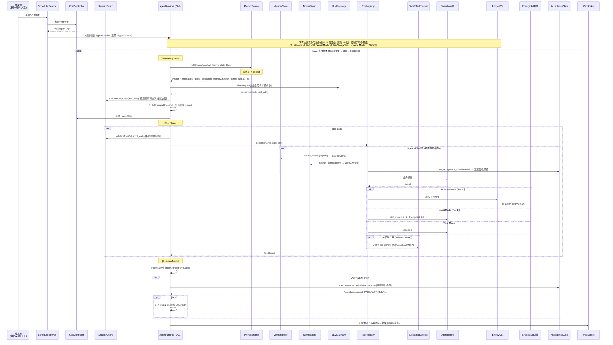

## 2. 总体架构

### 2.1 分层架构总览

```mermaid
graph TB
    subgraph UI["可视化 & 人类交互层"]
        ChatUI["Chat UI<br/>对话面板"]
        IssuePR["Issue/PR<br/>任务管理视图"]
        NormsBoard["NormsBoard<br/>规范板视图"]
        Timeline["Timeline<br/>时间线视图"]
        TimelinePlayer["SessionTimelinePlayer<br/>全链路时间线播放器"]
        Mailbox["Mailbox<br/>邮件视图"]
        DebugLog["Debug/Log<br/>调试面板"]
        ChangeSetUI["ChangeSet Review<br/>变更审核面板"]
        MemoryUI["Memory<br/>记忆管理视图"]
        CostUI["Cost Dashboard<br/>成本控制面板"]
        KnowledgeHealthUI["KnowledgeHealth<br/>知识健康仪表盘"]
        HITLHub["HITLHub<br/>人类在环统一面板"]
    end

    subgraph WS["WebSocket 实时通信层"]
        WSEvents["事件推送<br/>(agent 状态 · 工具执行 · 消息流 · Issue/PR 变更 · 成本警告 · 规范变更 · 验收结果 · 健康预警 · HITL 请求)"]
    end

    subgraph Orchestration["Agent 编排层"]
        Runtime["AgentRuntime<br/>通用 DAG 执行引擎<br/>(reasoning→tool→decision 循环<br/>支持批量 tool_calls 微工作流)"]
        TeamCoord["TeamCoordinator<br/>多 agent 编排器<br/>(Issue/PR+邮件+委派+动态组队)"]
        Scheduler["SchedulerService<br/>事件/定时/手动触发器<br/>(EventBus + Cron + DeadlockDetector)"]
        CostCtrl["CostController<br/>预算守卫 · 降级策略"]
        SecurityGuard["SecurityGuard<br/>提示词注入检测 · 权限边界强化"]
        AcceptanceGate["AcceptanceGate<br/>纯程序化验收关卡 · 确定性 checker<br/>· 工具接口获取评审结果 (解耦)"]
        HookRunner["HookRunner<br/>事件驱动可扩展性 · 统一退出码<br/>· ModuleComposer 集成"]
    end

    subgraph Prompt["提示词 & 上下文管理层"]
        PE["PromptEngine<br/>系统提示拼接 · 条件 Section · 变量插值<br/>· 静态注入层 + 按需获取层分离<br/>· 上下文压力自适应"]
        CS["ContextStore<br/>TM · 术语 · 项目上下文 · 记忆检索<br/>· 黄金标准信号聚合 · 规范内容检索<br/>· 验收标准检索"]
        Comp["Compressor<br/>消息分层压缩"]
        SL["SkillLoader<br/>技能 MD 解析"]
    end

    subgraph Tools["工具 & 能力层"]
        Builtin["BuiltinTools<br/>翻译领域工具"]
        CapTools["CapabilityTools<br/>Capability→Tool 自动包装"]
        MCP["MCPBridge<br/>外部 MCP Server 桥接"]
        SideEffectJournal["SideEffectJournal<br/>外部副作用延迟执行"]
    end

    subgraph LLM["LLM 接口层"]
        Gateway["LLMGateway<br/>调度 · 缓存 · 重试 · 流转<br/>全局令牌桶 · 优先级队列"]
        Provider["LLMProvider<br/>chat() · streaming · tool_calls · thinking"]
    end

    subgraph Infra["基础设施层"]
        EB["EventBus"]
        Graph["Graph<br/>黑板+DAG"]
        DB["Database<br/>Drizzle"]
        Redis["Redis<br/>缓存/队列"]
        Perm["Permission<br/>ReBAC"]
        Msg["Message<br/>站内信"]
        Workflow["Workflow<br/>工作流"]
        OTel["OTel/Log<br/>可观测性"]
        ChangeSetEngine["ChangeSet<br/>变更集引擎"]
        IssuePREngine["IssuePREngine<br/>通用任务源"]
        VCS["EntityVCS<br/>实体版本控制 (平台基座)<br/>全实体 diff/merge<br/>(审计模式 | 隔离模式)"]
        Memory["MemoryStore<br/>记忆存储与检索<br/>(含黄金标准分级管理)"]
        NormsBoardEngine["NormsBoardEngine<br/>规范板存储与注入"]
        KHMonitor["KnowledgeHealthMonitor<br/>派生谱系追踪 · 健康度评估"]
    end

    UI --> WS
    WS --> Orchestration
    Orchestration --> Prompt
    Orchestration --> Tools
    Prompt --> LLM
    Tools --> Infra
    LLM --> Provider
    Gateway --> Provider
    Orchestration --> Infra
```

> **v0.14 变更**: UI 层新增 HITLHub 统一面板；编排层 TeamCoordinator 增加"委派+动态组队"标注；AcceptanceGate 增加"工具接口获取评审结果 (解耦)"标注；PromptEngine 描述更新为"静态注入层 + 按需获取层分离"。
> **v0.16 变更**: TeamCoordinator 标注更新为"委派+Issue 拆分+动态组队"。
> **v0.21 变更**: 编排层新增 HookRunner 组件（事件驱动可扩展性 · 统一退出码 · ModuleComposer 集成）。
> **v0.23 变更**: EntityVCS 从基础设施层可选组件提升为平台基座 (原则 13)——标注更新为"全实体 diff/merge"；VCS 覆盖范围扩展至翻译条目、可翻译元素、文档/文档树、评论、项目设置/成员/属性等全部业务实体。

### 2.2 核心包规划

| 新建包                 | 职责                                                                                 | 依赖                                                               |
| ---------------------- | ------------------------------------------------------------------------------------ | ------------------------------------------------------------------ |
| `packages/agent`       | Agent Runtime 核心：DAG 执行引擎、提示词管理、工具注册、成本控制、安全守卫、验收闭环 | `operations`, `domain`, `graph`, `workflow`, `core`, `plugin-core` |
| `packages/agent-tools` | 内建工具集合：翻译领域工具的声明与实现                                               | `operations`, `domain`                                             |
| `packages/agent-team`  | 多 Agent 编排：Team 协调器、邮件系统、委派机制、Issue 拆分、动态组队                   | `agent`, `message`, `core`                                         |

同时需扩展现有包：

- `packages/shared` — 新增 Agent Team / Issue / PR / Mail / ChangeSet / EntityVCS / Memory / CostBudget / SecurityPolicy / NormsBoard / AcceptanceCriteria / KnowledgeHealth / TeamConfig / DelegationChain / IssueSplit 相关 Zod Schema
- `packages/db` — 新增 issue, pull_request, issue_label, agent_mail, agent_team, changeset, entity_branch, agent_memory, cost_budget, cost_ledger, side_effect_journal, golden_standard_audit, norms_board_entry, acceptance_criteria, knowledge_health_signal, delegation_record 等表
- `packages/domain` — 新增 Team / Issue / PR / Mail / ChangeSet / EntityVCS / Memory / CostControl / SecurityGuard / NormsBoard / AcceptanceGate / KnowledgeHealth / Delegation 相关 CQRS 命令与查询
- `apps/app` — 新增 Issue/PR 视图、邮件视图、Team 视图、ChangeSet 审核视图、记忆管理视图、成本控制面板、DAG 调试视图、全链路时间线播放器、规范板编辑器、知识健康仪表盘、**HITLHub 统一面板**等前端页面
- `apps/app-api` — 新增对应 oRPC 路由

> **v0.29 代码库对齐说明**: `packages/agent` 依赖的 `graph` 和 `workflow` 为已有包 (`@cat/graph` 提供 llm/tool/router/parallel/join/human_input/transform/loop/subgraph 9 种节点类型；`@cat/workflow` 提供 GraphRuntime 含 checkpoint/compensation/idempotency)。Agent DAG 引擎采用语义层包装策略 (✅ D57)：在 `packages/agent` 中实现 Agent 专属节点语义层，复用上述基础设施，必要时可对基础包做通用能力扩展。

### 2.3 核心数据流

> **v0.14 变更**: 数据流中 PromptEngine 描述更新为"静态注入层 + 按需获取层工具签名";新增 Agent 主动检索分支展示按需获取模型。
