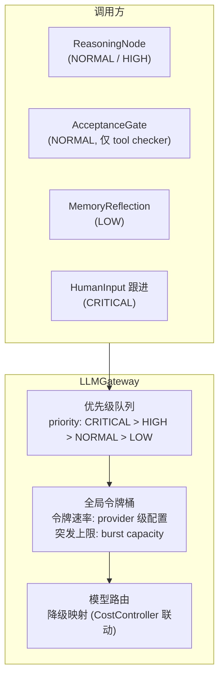

## 3. 子系统详细设计

### 3.1 LLM 接口层

- **✅ Decision D1: LLM 调用层抽象粒度** → B (中粒度): 提供 `chat(request): Response` 统一接口，内部处理 streaming / tool_calls / response 解析。Provider 实现仅关注 HTTP 传输。

```
LLMGateway
  ├── chat(request, options): AsyncGenerator<Chunk>
  ├── estimateTokens(messages): number
  │     → 支持多模态: 自动识别 ContentPart[] 中的 ImagePart,
  │       委托 LLMProvider.estimateImageTokens() 计算图片 token (§3.2.8.3)
  └── getModelCapabilities(modelId): ModelCapabilities
        → 含 supportsVision / maxImageSize / maxImagesPerRequest / supportedImageInputModes

LLMProvider (plugin service)
  ├── chat(request): AsyncIterable<Chunk>
  ├── modelInfo(): ModelInfo
  ├── estimateImageTokens(imageUrl, detail): number  ← v0.18: 图片 token 估算
  ├── supportedImageInputModes: ("file_id"|"url"|"base64")[]  ← v0.19: 声明支持的图片传递方式
  ├── uploadFile(data: Buffer, mimeType: string): Promise<FileReference>  ← v0.19: file_id 模式上传
  └── deleteFile(fileId: string): Promise<void>  ← v0.19: file_id 模式清理
```

> **v0.19 变更**: LLMProvider 接口扩展——新增 `supportedImageInputModes` 声明 Provider 支持的图片传递方式 (D47 三策略)；新增 `uploadFile()` / `deleteFile()` 方法支持 file_id 模式的文件生命周期管理。`getModelCapabilities` 返回值中 `imageInputMode` 替换为 `supportedImageInputModes` 数组。

**思维链 (Thinking) 协议**: 支持 Claude 等模型的 extended thinking 功能。`LLMProvider.chat()` 返回的 `Chunk` 类型中包含 `thinking` 字段——当 Provider 支持思维链时，思维内容实时流式输出并记录到 DAG 节点的 `outputSnapshot` 中，但不计入消息压缩管线（避免压缩丢失推理过程）。

#### 3.1.1 全局令牌桶与优先级队列



**令牌桶配置**: 按 LLM Provider 独立设置速率限制。当多个 Agent 并发调用同一 Provider 时，全局令牌桶统一调度，避免触发 Provider API 的速率限制。

**优先级场景**: CRITICAL 用于 HITL 跟进（人类等待中）；HIGH 用于 URGENT 标记的任务；NORMAL 为默认；LOW 用于反思/整理类非紧急操作。

---
