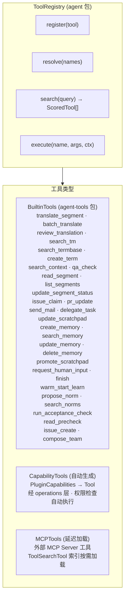
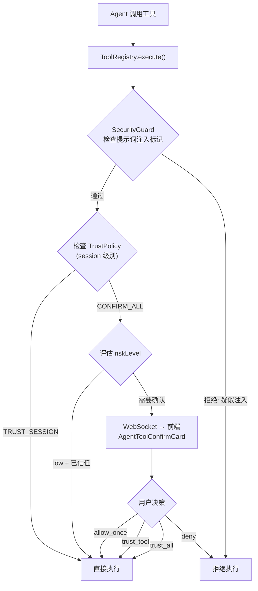

### 3.3 工具系统



> **v0.14 变更**: BuiltinTools 新增 `read_precheck`（按需读取 PreCheck 笔记）、`delegate_task`（委派任务）、`compose_team`（动态组队）。
> **v0.16 变更**: BuiltinTools 新增 `issue_create`（支持 `parentIssueId` 字段进行 Issue 拆分，独立于 delegate_task 的任务分解机制）。

**工具确认流程**:



**工具延迟加载策略**: 当 agent 注册工具总 token > 上下文窗口 × 10% 时，非核心工具仅作为 tool_search 索引存在，由 LLM 按需搜索加载。

**工具结果多模态支持** _(v0.18)_: 工具的执行结果可以包含 `ContentPart[]`（文本 + 图片混合）。典型场景：`search_context` 返回包含 UI 截图的上下文；`read_segment` 返回含内嵌图片的源内容。工具结果中的图片受 §3.2.8.4 压缩管线图片规则约束（单次结果最多 `maxImagesPerToolResult` 张图片）。

**副作用分类**: 工具注册时需声明副作用类型，供 SideEffectJournal (§3.14.7) 使用：

```
ToolDefinition.sideEffectType:
  ├── "none"      — 纯读取操作 (search_tm, read_segment, search_norms, run_acceptance_check, read_precheck, ...)
  ├── "internal"  — 仅影响内部数据库状态 (translate_segment, create_term, propose_norm, delegate_task, ...)
  ├── "external"  — 触发不可逆的外部操作 (send_mail[外部], webhook, MCP 工具调用)
  └── "mixed"     — 同时包含内部和外部副作用

ToolDefinition.toolSecurityLevel:
  ├── "standard"       — 常规操作 (翻译、检索、记忆、规范检索、验收检查)
  ├── "privileged"     — 涉及权限/配置修改的操作 (需 supervisor 权限)
  └── "administrative" — 涉及项目/组织级管理的操作 (需 admin 权限, 双重确认)

ToolDefinition.batchHint? (v0.20 新增 — 微工作流亲和性提示, §3.6.7):
  ├── commonCompanions: string[]   — 常见伴生工具列表 (PromptEngine 编入工具描述)
  └── description: string          — 批量调用场景描述
```

#### 3.3.2 工具执行上下文总线 _(v0.21 新增)_

> 受 Claude Code Agent 架构 ToolUseContext 模式启发，为工具执行引入统一的上下文对象。

> **与现有代码的关系 (v0.29)**: 现有代码库中 `@cat/plugin-core` 已定义 `AgentToolProvider` 抽象类——工具通过插件机制注册，每个工具声明 `name/description/parameters(Zod)/execute/target/confirmationPolicy/timeoutMs`。现有 `execute` 签名为 `(args, ctx: { traceId, sessionId, signal? }) => Promise<unknown>`。本架构的 `ToolExecutionContext` 是对现有 `ctx` 的**超集扩展**——在保留 `traceId/sessionId` 的基础上新增 permissions/cost/vcsMode/sideEffectJournal/hooks 等请求级上下文。实现时，`AgentToolProvider.execute` 的 `ctx` 类型应扩展为 `ToolExecutionContext` (或通过适配器注入)。
>
> 此外，现有工具的 `confirmationPolicy` (auto_allow/session_trust/always_confirm) 可映射到架构中的确认流程——`auto_allow` 对应 `TrustPolicy.TRUST_SESSION` 下的直接执行；`always_confirm` 对应 `CONFIRM_ALL` 模式下的 WebSocket 确认。`target: "server" | "client"` 已有，与架构的执行目标分离设计兼容。

当前 `ToolRegistry.execute(name, args, ctx)` 的 `ctx` 参数由各调用点临时拼接，缺少统一的类型约束和生命周期管理。随着工具种类增加（§3.3 已有 30+ 内建工具），不同工具对上下文的需求差异导致 ctx 参数的隐式契约越来越难维护。

**ToolExecutionContext 统一接口**:

```typescript
interface ToolExecutionContext {
  /** 当前 session 信息 */
  session: { sessionId: string; agentId: string; projectId: string };
  /** 权限上下文 (来自 SecurityGuard §3.25) */
  permissions: ResolvedPermissions;
  /** 成本上下文 (来自 CostController §3.22) */
  cost: { budgetId: string; remainingTokens: number };
  /** VCS 模式 (来自 EntityVCS §3.14) */
  vcsMode: "trust" | "audit" | "isolation";
  /** 副作用日志 (来自 SideEffectJournal) */
  sideEffectJournal: SideEffectJournal;
  /** Hook 事件发射器 (来自 HookRunner §3.29) */
  hooks: { emit: (event: HookEvent) => Promise<HookResult> };
}
```

**统一接口设计理由**: 虽然多数工具仅需 session + permissions，但统一接口消除了各调用点临时拼接 ctx 的隐式契约问题。不需要的字段通过惰性求值 (lazy getter) 避免性能开销——例如 `cost` 字段仅在工具实际读取时才查询 CostController，轻量工具不会触发额外开销。

**与 DI 的关系**: ToolExecutionContext 不取代依赖注入，而是作为**请求级上下文**补充 DI 的**应用级单例**。工具仍通过 DI 获取 ToolRegistry、MemoryStore 等服务引用；ToolExecutionContext 提供与当前请求绑定的动态上下文（sessionId、剩余预算、当前 VCS 模式等）。

- **✅ Decision D52: 工具执行上下文模型** → 统一 ToolExecutionContext 接口 (A)。所有工具通过同一上下文对象获取请求级依赖，不需要的字段通过惰性求值避免开销。消除隐式契约，使工具签名 `(args, ctx: ToolExecutionContext) → Result` 类型安全且可自文档化。

---
