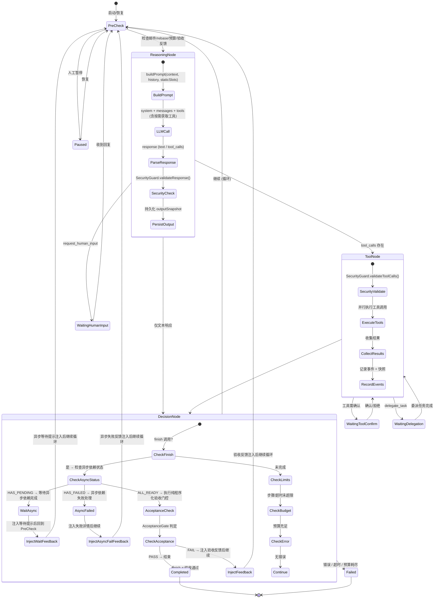

### 3.6 Agent Runtime (通用 DAG 执行引擎)

#### 3.6.1 为什么从 while 循环迁移到 DAG

v0.7 中 GENERAL 类型的 Agent 使用简单 while 循环（D1 决策），WORKFLOW 类型使用 Graph/DAG 执行器。实践中发现两个核心问题：

1. **调试黑箱**: while 循环中每一步（prompt 构建 → LLM 调用 → 工具执行 → 继续判断）是不可独立寻址的代码块。当系统在 Team 三原语（Issue/PR + 邮件 + 调度器）的组合下运行时，只能逐步打断点、逐日志排查——在复杂场景下几乎不可能定位问题在提示词设计还是系统设计。

2. **双类型分裂**: GENERAL 和 WORKFLOW 两种 agent 类型共享工具、提示词和权限，但运行时控制流完全不同。这导致调试工具、时间线可视化、回溯机制需要两套实现。

**解决方案**: 统一所有 Agent 为通用 DAG 执行模型。关键约束——**DAG 用于实现调试可寻址性，不用于剥夺 LLM 的决策权**。

#### 3.6.2 通用三节点循环 DAG



> **v0.14 变更**: buildPrompt 描述改为 `staticSlots`（静态注入层）；tools 列表注明包含按需获取工具；新增 `WaitingDelegation` 状态支持委派 (§3.9.3.1)。
> **v0.17 变更**: 移除 `WaitingSubagent` 状态，统一为 `WaitingDelegation` (§3.11)。

**原则 11（LLM 主权不可侵犯）在 DAG 中的体现**:

```
❌ 错误设计 (硬编码管道):
   [translate] → [review] → [publish]
   每个节点绑定固定的工具调用和固定的输入输出格式

✅ 正确设计 (通用循环):
   [Reasoning Node] → [Tool Node] → [Decision Node]
   │                     │               │
   │ LLM 完全自主决定    │ 执行 LLM     │ 程序化检查
   │ 调用哪些工具、      │ 选择的任意    │ 继续条件
   │ 生成什么文本、      │ 工具组合      │ (非 LLM 决策)
   │ 制定什么策略        │               │
```

- **Reasoning Node**: 构建提示词（静态注入层）+ 调用 LLM → LLM 完全自主决定回复内容（文本和/或工具调用）。系统不预设"这一步应该调翻译工具"或"下一步必须审校"。LLM 可主动调用 search_memory / search_norms 等按需获取工具获取所需上下文。**LLM 响应在安全检查和解析后立即持久化到 outputSnapshot**，用于后续 replay。
- **Tool Node**: 执行 LLM 在 Reasoning Node 中选择的工具。系统忠实执行，不筛选、不重排序、不注入额外工具调用。**支持并行执行**: 当 LLM 在单次响应中返回多个 `tool_calls` 时，ToolNode 并行执行所有工具调用并收集结果——这是微工作流 (§3.6.7) 的系统侧基础。
- **Decision Node**: 纯程序化判断——是否调用了 finish？是否达到步骤上限？是否超时？是否超预算？finish 被调用时**首先检查关联 ChangeSet 的 asyncStatus（§3.14.11.4）**——若 `HAS_PENDING` 则注入等待提示并回到 PreCheck 等待异步依赖完成（如向量化），避免在异步任务未完成时执行验收；若 `HAS_FAILED` 则注入失败详情让 Agent 决定重试或跳过;仅当 `ALL_READY` 时才触发 AcceptanceGate 纯程序化验收检查——这是确定性判断而非 LLM 决策，不违反 LLM 主权原则。LLM 层面的质量评审应通过 Team Pipeline with Feedback 模式实现（§3.9 模式 4, §3.27.10）。

**与原 WORKFLOW 类型的关系**: 原 WORKFLOW 类型用于"预定义流程，步骤严格可控"的场景。在新模型下，此类需求通过 **Skill 指引 + Issue 依赖** 的组合实现——Skill 提供步骤建议（LLM 自主遵循），Issue 依赖提供硬约束（系统强制）。不再需要独立的 WORKFLOW 运行时。

#### 3.6.2.1 与现有 `@cat/graph` 基础设施的关系 _(v0.29 新增)_

> 现有代码库包含 `@cat/graph` (图 DSL、Condition、Blackboard) 和 `@cat/workflow` (图运行时、检查点、补偿) 两个包。`@cat/graph` 定义的节点类型为: `llm | tool | router | parallel | join | human_input | transform | loop | subgraph`；`@cat/workflow` 提供 DAG 执行、Blackboard 快照、Patch 机制和幂等重试。

**Agent DAG 节点与现有图节点的映射**:

| Agent DAG 节点 | 现有 `@cat/graph` 节点类型 | 映射方式                                           |
| -------------- | -------------------------- | -------------------------------------------------- |
| ReasoningNode  | `llm`                      | 语义等价——构建 prompt + 调用 LLM + 解析响应        |
| ToolNode       | `tool`                     | 语义等价——执行工具调用、收集结果                   |
| DecisionNode   | `router`                   | 复用路由判断能力，扩展验收门控和 asyncStatus 检查  |
| PreCheck       | `transform`                | 复用数据转换能力，扩展为邮件/rebase/预算等多项检查 |

- **✅ Decision D57: Agent DAG 引擎与现有图基础设施的关系** → 语义层包装 (A)：Agent DAG 引擎在 `packages/agent` 中实现专属节点语义层 (ReasoningNode/ToolNode/DecisionNode/PreCheck 作为对 llm/tool/router/transform 的高阶封装)，复用 `@cat/graph` 的 Blackboard/Patch/Condition 和 `@cat/workflow` 的检查点/幂等/补偿基础设施。必要时可对基础设施做通用能力扩展（但不将 Agent 业务语义泄漏到通用图层）。

#### 3.6.3 DAG 节点的可调试性

每个 DAG 节点是独立可寻址的执行单元：

```
Session → Run → Step[N]
                  ├── nodeType: "reasoning" | "tool" | "decision" | "precheck"
                  ├── nodeId: 全局唯一
                  ├── inputSnapshot: 节点输入 (黑板状态 + 消息历史摘要)
                  ├── outputSnapshot: 节点输出 (LLM 响应 / 工具结果 / 决策结果)
                  │     → 含多模态内容: ContentPart[] 中的图片 part 以 URL 或 file_id 引用形式持久化,
                  │       避免 base64 膨胀快照体积; replay 时通过 URL/file_id 重新加载 (§3.2.8)
                  ├── duration: 执行耗时
                  ├── tokenUsage: { prompt, completion, total }
                  ├── toolCalls?: [{ name, args, result, duration }]
                  ├── securityFlags?: [{ type, severity, detail }]
                  ├── acceptanceResult?: AcceptanceVerdict (仅 Decision Node)
                  ├── injectedContextSources?: string[] (按需获取工具返回的来源 ID 列表)
                  └── metadata: { promptHash, modelId, ... }
```

> **v0.14 变更**: 新增 `injectedContextSources` 字段记录该节点中 Agent 主动检索的上下文来源（memory ID / norms entry ID），用于 KnowledgeHealthMonitor 衍生品溯源 (§3.28)。

**调试能力矩阵**:

| 能力          | while 循环 (v0.7) | 通用 DAG (v0.8+)                                                         |
| ------------- | ----------------- | ------------------------------------------------------------------------ |
| 暂停          | Session 级        | 任意节点边界                                                             |
| 重放 (replay) | 从 snapshot 恢复  | 从任意节点确定性回放：使用录制的 outputSnapshot，不重新调用 LLM (§3.6.6) |
| 重试 (retry)  | —                 | 从任意节点重新调用 LLM，产生可能不同的输出 (§3.6.6)                      |
| 回退          | 整个 Run 回退     | 回退到指定节点，从该点分叉新 Run                                         |
| 单步执行      | 不支持            | "执行下一个节点后暂停"模式                                               |
| 断点          | 不支持            | 按 nodeType 或条件设置断点 (如 "工具名=translate 时暂停")                |
| Prompt 审查   | 日志级            | 每个 Reasoning Node 保存完整 prompt 快照，可在 UI 中查看和对比           |
| 归因定位      | 困难              | 精确定位到具体节点："第 N 步的 Reasoning Node 注入了错误的记忆"          |

**与现有 Graph 系统的关系 (✅ D57)**: 通用 DAG 复用 `@cat/graph` 的 Blackboard/Patch/Condition 和 `@cat/workflow` 的检查点/幂等/补偿基础设施。Agent 专属节点（ReasoningNode, ToolNode, DecisionNode, PreCheck）在 `packages/agent` 中作为对通用节点类型 (llm/tool/router/transform) 的高阶语义封装实现，Blackboard 在节点间传递状态。

#### 3.6.4 PreCheck 节点详述

PreCheck 在每轮 DAG 循环开始前执行一组程序化检查：

```
PreCheck Node:
  1. 检查邮件队列 — 有新邮件则注入到 messages（URGENT 邮件在上一轮 Tool Node 完成后即被处理）
  2. VCS Rebase 检查 — 仅 Isolation Mode (Tier 2): 若 main 有更新，执行轮次边界 rebase (D20)
  3. 成本预算检查 — 查询 CostController 剩余配额
  4. Issue/PR 状态同步 — 检查当前关联 Issue/PR 是否被外部修改
  5. 安全检查 — SecurityGuard 检查累计异常标记
  6. 规范板变更检查 — 检查规范板是否有新增/修改条目，若有则写入 precheck_notes
  7. 验收反馈注入 — 若上一轮 Decision Node 的验收检查返回 FAIL，将验收反馈注入到 Reasoning Node 上下文中
  8. 委派结果回收 — 检查是否有已完成的委派任务结果需要回收 (§3.9.3.1)
  9. 异步依赖状态轮询 — 查询关联 ChangeSet 中 PENDING 条目的异步任务完成情况（§3.14.11），更新 asyncStatus；若全部 READY 则标记为 URGENT 通知 Agent 可尝试 finish
  10. 输出: URGENT 结果直接注入 messages; ROUTINE 结果写入 precheck_notes (Agent 可通过 read_precheck 按需读取)
```

> **v0.14 变更**: 第 6 项改为写入 precheck_notes 而非直接注入上下文；新增第 8 项委派结果回收；第 9 项明确 URGENT/ROUTINE 分流。

#### 3.6.4.1 PreCheck 上下文注入策略——缓解 LLM 推理连续性干扰

**问题本质**: PreCheck 节点执行 VCS rebase、邮件检查等操作，产生的信息会被注入到下一轮 Reasoning Node 的上下文中。当 Agent 正在处理复杂推理链时，这些**与当前推理无关的系统消息**可能扰乱 LLM 的注意力和思维连续性。

- **✅ Decision D29: PreCheck 上下文注入策略** → 静默注入 + 延迟通知 (B): PreCheck 结果按紧急度分级——URGENT 立即注入 messages 并标注 `[URGENT]`；ROUTINE 写入黑板的 `precheck_notes` 命名空间，Agent 可通过 `read_precheck` 工具按需读取；SILENT 仅记录到 OTel 日志。最小化对推理连续性的干扰，同时保证 URGENT 信息及时送达。

> **v0.14 更新**: ROUTINE 级结果不再"被动可见于 buildPrompt()"，而是仅写入黑板 precheck_notes，需 Agent 主动调用 `read_precheck` 工具读取——与 §3.2.5 按需获取模型一致。

**分级规则**:

```
PreCheck 结果分级:
  URGENT (立即注入 messages):
    - 标记为 URGENT 的邮件
    - SecurityGuard 告警
    - VCS rebase 冲突 (需 Agent 决策解决)
    - 预算达到 critical 阈值
    - Issue 被外部强制取消或重分配
    - 验收检查 FAIL 反馈 (验收失败需 Agent 立即知晓)
    - 委派任务完成结果 (需 Agent 整合到当前工作)

  ROUTINE (写入 blackboard.precheck_notes, Agent 调用 read_precheck 按需读取):
    - 普通邮件到达 (附摘要)
    - VCS rebase 成功 (无冲突)
    - 预算状态正常/warning
    - Issue/PR 非关键字段变更
    - 规范板内容变更

  SILENT (仅 OTel 日志):
    - 定时心跳检查通过
    - 缓存刷新事件
    - 系统内部健康检查
```

**设计约束**: 无论采用哪种注入策略，PreCheck 的**执行**是确定性的程序化操作（不调用 LLM），其开销仅在于注入策略对后续 Reasoning Node 的影响。

#### 3.6.5 运行状态持久化

每个节点执行后，`agentRun` 记录 blackboard 快照，`agentEvent` 记录事件流。DAG 模型使每个节点成为独立的持久化检查点：

```
Run #1: [precheck_0, reasoning_0, tool_0, decision_0, precheck_1, reasoning_1, ...]
         snap_v0    → snap_v1   → snap_v2 → snap_v3  → snap_v4    → snap_v5   → ...

回退到 reasoning_1: 从 snap_v4 恢复黑板 → 从 reasoning_1 重新执行 (新 Run)
单步调试: 执行 tool_0 后暂停 → 人类审查 snap_v2 中的工具结果 → 确认后继续
```

**ReasoningNode 的特殊持久化**: 除黑板快照外，每个 ReasoningNode 还额外持久化完整的 `outputSnapshot`（包含 LLM 原始响应和解析后的 tool_calls），为 replay 语义 (§3.6.6) 提供数据基础。

#### 3.6.6 ReasoningNode 重放与重试语义

**问题本质**: ReasoningNode 是 DAG 中唯一的非确定性节点——其内部调用 LLM，即使输入完全相同，输出也可能不同。

- **重放 (Replay)**: 目的是**精确重现历史执行路径**。使用录制的 `outputSnapshot` 而不是重新调用 LLM。零 LLM 成本。
- **重试 (Retry)**: 目的是**探索替代执行路径**。重新调用 LLM，接受不同输出。按正常 LLM 调用计费。

**语义定义**:

```
replay(runId, fromNodeId, toNodeId):
  1. 创建新 Run, 从 fromNodeId 的 inputSnapshot 开始
  2. 对 [fromNodeId..toNodeId] 范围内的每个节点:
     ├── ReasoningNode: 直接应用录制的 outputSnapshot (不调用 LLM, 零成本)
     ├── ToolNode: 直接应用录制的工具结果 (不执行工具, 零副作用)
     └── DecisionNode / PreCheck: 重新执行程序化逻辑 (确定性)
  3. 结果: 精确重现 [from..to] 的执行历史

retry(runId, nodeId, modifiedInput?):
  1. 创建新 Run, 从 nodeId 的 inputSnapshot 开始 (或使用 modifiedInput 替换)
  2. 从该节点开始正常执行 (重新调用 LLM, 重新执行工具)
  3. 结果: 从 nodeId 开始的新执行路径

fork(runId, nodeId):
  1. replay(runId, 0, nodeId)  — 先确定性重放到 nodeId
  2. 然后从 nodeId 开始 retry — 新的 LLM 调用
  3. 结果: 保留 [0..nodeId) 的历史 + nodeId 开始的新路径
```

**关键约束**:

- **ReasoningNode.outputSnapshot 不可省略**: 每个 ReasoningNode 执行完毕后**必须**持久化完整的 LLM 响应。这是 replay 确定性的唯一保证。
- **ToolNode 的确定性**: replay 时通过应用录制的 `toolResults` 跳过实际执行，避免重复副作用。
- **成本差异**: replay 零 LLM 成本；retry 按正常 LLM 调用计费。CostController 在计量时区分 replay 和 retry。

#### 3.6.7 微工作流与批量工具调用 _(v0.20 新增)_

> **回应补充关切**: "应该模仿 GitHub Copilot agent，允许 agent 一次输出多个工具调用以实现'微工作流'，避免一个简单的邮件发送或 todo 修改就需要占用一次完整循环导致 token 浪费。"

**问题本质**: 每轮 DAG 循环 (ReasoningNode → ToolNode → DecisionNode → PreCheck) 消耗一次完整的 LLM 推理成本。当 Agent 需要执行一系列简单操作（如 `send_mail` + `pr_update` + `create_memory`）时，若每个操作占用一轮循环，则产生大量冗余推理 token 消耗——上一轮推理的唯一产出是"调用一个简单工具"，而下一轮推理又需重新加载全部上下文仅为"调用下一个简单工具"。

**现有系统支持**: ToolNode **已经支持并行执行多个 tool_calls**——当 LLM 在单次响应中返回 N 个 `tool_calls` 时，ToolNode 并行执行全部 N 个工具调用，在同一轮 DAG 循环中完成。因此**系统层面无需修改**，瓶颈在于 LLM 是否被引导去批量输出工具调用。

**解决方案——提示词级微工作流引导 (Prompt-level Micro-workflow Guidance)**:

```
设计原则:
  ✅ 通过提示词引导 LLM 批量输出 tool_calls → 纯建议性, 不违反 Principle 11
  ❌ 系统层面强制合并/拆分 tool_calls → 剥夺 LLM 决策权, 违反 Principle 11
```

**三层引导机制**:

```
第 1 层 — 全局微工作流规则 (PromptEngine 静态注入层 slot #4 扩展):
  在全局规则中加入通用批量调用引导:
  "## 工具调用效率规则
   当你需要连续执行多个独立操作时（如发送邮件+更新 Issue/PR+记录记忆），
   应在单次响应中同时输出所有工具调用，而非逐个调用。
   每次推理都有完整的上下文加载成本，合并调用可显著降低 token 消耗。
   仅当后续操作依赖前一操作的返回值时，才需要分轮调用。"

第 2 层 — 工具亲和性提示 (ToolRegistry 元数据):
  ToolDefinition 新增 batchHint 字段:
    batchHint?: {
      commonCompanions: string[],  // 常见伴生工具列表
      description: string          // 批量调用场景描述
    }

  示例:
    send_mail.batchHint = {
      commonCompanions: ["pr_update", "create_memory"],
      description: "发送邮件后通常需要同步更新 Issue/PR 状态和记录操作记忆"
    }
    finish.batchHint = {
      commonCompanions: ["pr_update", "create_memory", "promote_scratchpad"],
      description: "完成任务时通常需要同步更新 Issue/PR、保存记忆和推广工作笔记"
    }

  PromptEngine 在构建工具列表时，将 batchHint 信息编入工具描述的末尾:
    "send_mail: 发送邮件给 Team 内成员。
     💡 高效提示: 常与 pr_update, create_memory 一起调用。"

第 3 层 — Skill 级微工作流模式 (Skill 定义中的显式批量指引):
  在 Skill 步骤描述中显式标注可批量执行的操作组:
  "### 8. 收尾操作 (可合并为单次调用)
   同时执行以下操作:
   - pr_update(status: DONE)
   - create_memory(翻译经验)
   - send_mail(审校通知)
   然后调用 finish 报告结果。"
```

**与 Principle 11 (LLM 主权不可侵犯) 的一致性**:

| 层级           | 性质       | LLM 自由度                          |
| -------------- | ---------- | ----------------------------------- |
| 全局规则       | 纯文本建议 | LLM 可完全忽略, 仍逐个调用          |
| 工具亲和性提示 | 元数据提示 | 仅作为工具描述的补充信息            |
| Skill 批量指引 | 步骤建议   | 与现有 Skill 步骤同等——指引而非强制 |

**系统不做的事**:

- ❌ 不在 ToolNode 中自动合并/拆分工具调用
- ❌ 不在 DecisionNode 中惩罚"每轮只调用一个工具"的行为
- ❌ 不在 ReasoningNode 中注入"你必须批量调用"的强制指令
- ❌ 不修改 DAG 循环结构（保持 Reasoning→Tool→Decision 三节点通用模型）

**可观测性**: `agent.reasoning.tool_calls_per_turn` (M40) 直方图追踪每轮推理的工具调用数量分布；`agent.reasoning.efficiency` (M41) 作为成本优化参考指标（非 KPI），帮助运维人员识别低效 Agent 定义并优化其提示词。

#### 3.6.8 Hook 集成点 _(v0.21 新增)_

DAG 循环在以下时机调用 HookRunner（§3.29）：

```
PreCheck
  │
  ▼
hookRunner.run("PreReasoningNode")    ← 可观察即将发送的 prompt 概况
  │
ReasoningNode → LLM.chat()
  │
ToolNode:
  for each tool_call:
    hookRunner.run("PreToolUse")      ← 可观察/阻止/补充
    execute tool
    hookRunner.run("PostToolUse")     ← 可观察/补充
  │
DecisionNode
  │
hookRunner.run("PostDecisionNode")    ← 可观察本轮决策
```

> **渐进迁移**: Phase 0–1 中 SecurityGuard 和 CostController 仍在 DAG 循环中硬编码运行。Phase 2 引入 Hook 系统后，逐步将横切逻辑迁移为 hook handler，DAG 循环最终只保留纯状态推进逻辑。

#### 3.6.9 错误恢复分类 _(v0.21 新增)_

> 受 Claude Code Agent 架构的错误恢复三分类模型启发，为 DAG 循环引入显式的错误分类与恢复路径。

DAG 循环中的错误按性质分为三类，每类对应独立的恢复路径和重试预算：

| 错误类型         | 典型场景                          | 恢复路径                                     | 独立重试预算  |
| ---------------- | --------------------------------- | -------------------------------------------- | ------------- |
| **截断错误**     | LLM 输出被截断（max_tokens 耗尽） | 向 LLM 发送续写提示，请求从断点继续          | 3 次          |
| **上下文溢出**   | 消息历史超出上下文窗口            | 触发压缩管线 (§3.2.3)，压缩后重试            | 2 次          |
| **工具执行失败** | 工具返回错误、超时、权限被拒      | 将错误信息注入 messages，交由 LLM 决定下一步 | 遵循 maxTurns |

**关键设计**: 三类错误的重试预算**相互独立**——截断恢复不消耗上下文溢出的预算，反之亦然。这避免了"一类频发错误耗尽全局重试次数，导致其他类型错误无法恢复"的问题。全局 `maxTurns` 作为最终兜底，确保无论哪类错误累积，Agent 不会无限循环。

**预算管理实现**:

```
ErrorRecoveryBudget (per Session)
  ├── truncation:     { remaining: 3, max: 3 }   -- 截断恢复：向 LLM 发送续写提示
  ├── contextOverflow: { remaining: 2, max: 2 }   -- 上下文溢出：触发压缩管线后重试
  ├── toolFailure:     无独立预算, 遵循 maxTurns  -- 工具失败：注入错误信息交 LLM 决策
  └── globalMaxTurns:  session.maxTurns            -- 全局兜底：所有类型共享的硬上限
```

**独立预算消耗规则**: 每次错误恢复只消耗对应类型的预算计数器。当某类预算耗尽时，该类错误的恢复行为降级为工具失败模式（即注入错误信息交 LLM 自主处理），不阻断 DAG 循环。仅当 `globalMaxTurns` 耗尽时才强制终止 Session。

- **✅ Decision D51: 错误恢复预算模型** → 三类错误独立预算 + 全局 maxTurns 兜底 (A)。独立预算避免单类高频错误耗尽全局额度；截断恢复 3 次、上下文溢出 2 次的默认值基于翻译场景中错误频率分布的经验估计，可通过 AgentDefinition 覆盖。
