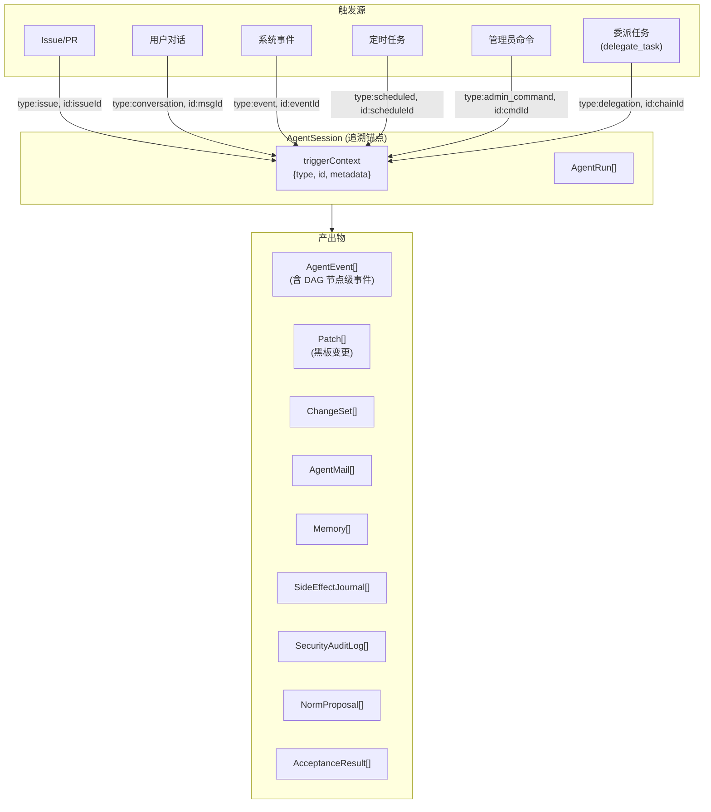

### 3.8 任务追溯体系 (Task Traceability)

核心问题：系统中存在多种触发 Agent 工作的方式（Issue/PR 任务、用户对话、事件、定时、管理员命令、委派），但无论触发方式如何，Agent 的工作过程都应该是可追溯的。

**追溯模型**:

> **v0.14 变更**: 触发源新增 `delegation` 类型，triggerContext 中记录 `delegationChainId` 便于追溯完整委派链。

- **✅ Decision D13: 任务追溯 Session 绑定** → 单一 triggerContext 字段 (A): 每个 Session 仅关联一个触发源。批量操作场景下应为每个 Issue 创建独立 Session。

**设计要点**:

1. **AgentSession 作为追溯锚点**: `agent_session` 中的 `triggerContext` 字段（JSONB）记录触发类型和来源 ID。
2. **Issue/PR → Session 查询**: `WHERE triggerContext->>'type' = 'issue' AND triggerContext->>'id' = :issueId`。
3. **任务分解追溯**: 父 Issue → 子 Issue (via `parentIssueId`) → 各子 Issue 的 Session → Events/ChangeSet。
4. **转派追溯**: 原任务 → 委派任务 (via `delegationChainId`) → 新 Session。
5. **委派链追溯**: 同一 `delegationChainId` 下的所有 Issue 和 Session 可一次查询获得完整链条——从原始发起者到最终执行者的完整路径 (§3.9.3.1)。
6. **DAG 节点级追溯**: Session → Run → Step[N] → nodeType + inputSnapshot + outputSnapshot，可精确定位到每一步推理和工具调用。
7. **成本追溯**: Session → Run → Step[N].tokenUsage → CostLedger，可按 Session/Agent/Team/Project 归因成本。委派链中的成本可按 `delegationChainId` 聚合。
8. **重放追溯**: replay 操作记录源 Run 和目标 Run 的映射关系，审查者可追溯"这次重放基于哪次原始执行"。
9. **安全事件追溯**: Session → SecurityAuditLog，记录每次 SecurityGuard 拦截和安全异常。
10. **验收追溯**: Session → AcceptanceResult，记录每次 AcceptanceGate 的判定结果（PASS/FAIL/PARTIAL）、各检查器分项得分和修正历史。
11. **VCS 锚点 (v0.23)**: 所有追溯链最终锚定于 EntityVCS 的 ChangeSet 条目 (原则 13)。VCS 是系统中业务实体变更的**唯一权威记录**——不论触发方式（Agent/人类/事件/定时），所有写操作经 VCS 层产生 ChangeSet 审计轨迹。委派链中的变更可按 `delegationChainId` 聚合，拆分 Issue 的变更可按 `splitGroupId` 聚合，均追溯至 VCS 而非仅日志。

