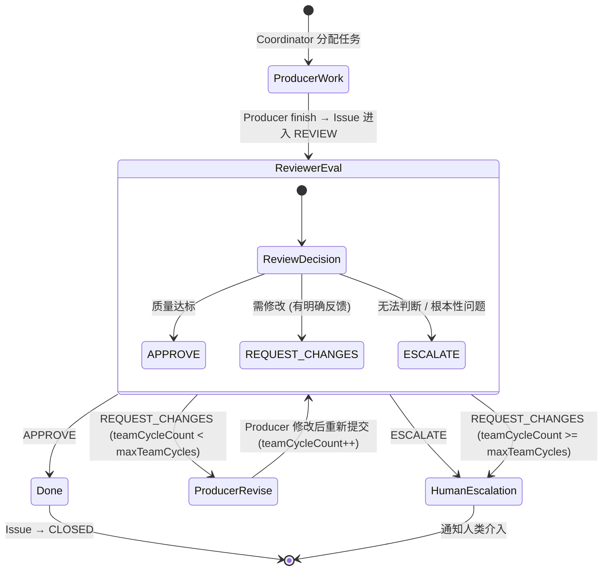
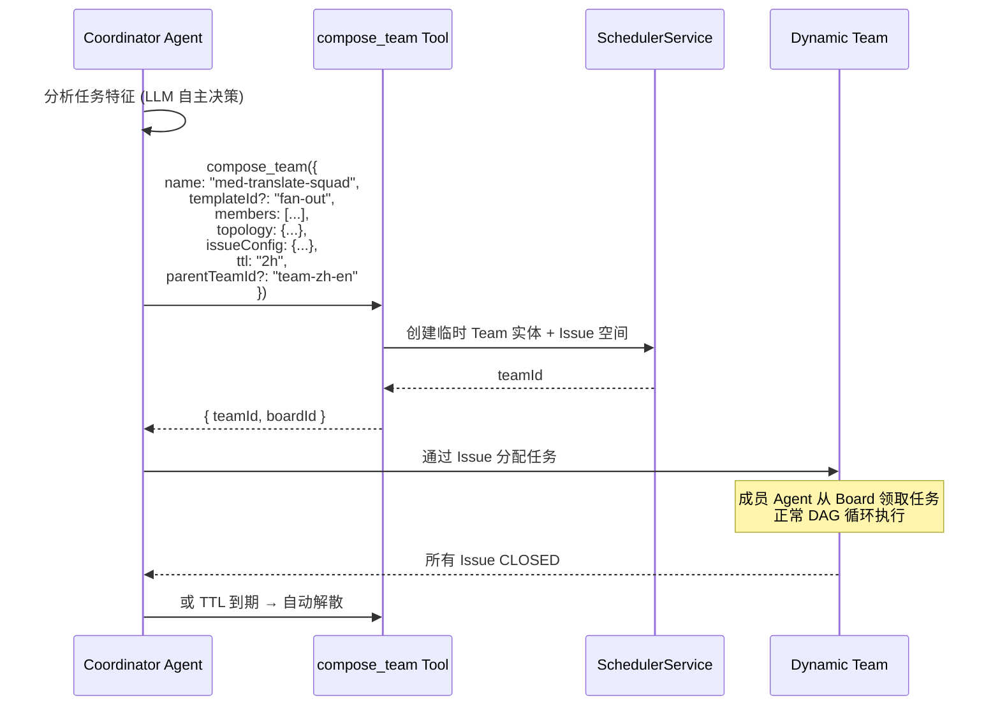

### 3.9 Team 系统 (多 Agent 协作)

> **三原语**: Issue/PR (§3.7) + 邮件 (§3.10) + 调度器 (§3.17) 组合实现 Team 协作。

**TeamCoordinator** 是 Team 内的编排角色——本身也是一个 Agent，通过 Agent 定义中的 coordinating 配置拥有管理 Team 的能力。**Coordinator 不是独立的通用 Agent**，而是每个 Team 实例内部的编排核心——其形态因 Team 模式而异。

**Team 编排模式** (由 Coordinator 配置涌现，非硬编码):

```
模式 1: Pipeline (串行流水线)
  Translator → Reviewer → TermManager
  DAG 依赖: card-B depends on card-A
  Coordinator 形态: 流水线定义本身即协调逻辑，TeamRuntime 负责步骤顺序推进，无需独立 Coordinator Agent
  会话终止: 所有流水线步骤完成 (§3.9.1)

模式 2: Fan-out / Fan-in (并行分发)
  Coordinator → [Translator-01, Translator-02, ..., Translator-N]
            → (全部完成) → Reviewer
  Coordinator 形态: 复杂规划 Agent——分析任务特征、动态分解为并行子任务、收集/合并最终结果
  会话终止: 所有 Fan-out 分支完成 + Fan-in 聚合完成 (§3.9.1)

模式 3: Expert Pool (专家池)
  Coordinator 分析 Issue → 指派给最合适的专家 Agent (其他专家休眠)
  专家 Agent 完成工作后 → 结果回报 Coordinator
  Coordinator 形态: 路由分析 Agent——Session 启动时分析任务内容并分派到合适的专家 Agent, 其余专家不激活
  会话终止: 内容任务完成 (指派的专家完成当前任务并回报) (§3.9.1)
  注: 连续的 Issue 处理不是 Expert Pool Session 自身的职责;
      系统在程序层面按调度规则 (§3.17) 将允许的 Issue 逐个喂入 Team Session

模式 4: Pipeline with Feedback (审校反馈循环)
  Producer → Reviewer → [通过: DONE / 拒绝: 回到 Producer]
  邮件: Reviewer 附修改意见 → Producer 改进
  Coordinator 形态: 流水线定义 + 反馈路由逻辑（解析 Reviewer 判定后决定继续/回退/升级）
  会话终止: Reviewer APPROVE / teamCycleCount >= maxTeamCycles / ESCALATE (§3.9.1)
  注: Producer-Reviewer 是此模式的典型配置——Producer 为翻译者，Reviewer 为质量评审者，
      通过 teamCycleCount/maxTeamCycles 控制反馈循环上限

模式 5: Dynamic Team (v0.14 新增)
  Coordinator 分析任务 → compose_team 动态组建临时团队
  Coordinator 形态: 调用 compose_team 的 Agent 即为隐式 Coordinator
  任务完成后 Team 自动解散 (§3.9.2)
  会话终止: 所有子任务完成 / TTL 到期 (§3.9.1)
```

> **v0.16 变更**: 移除原模式 5 "Producer-Reviewer" 作为独立模式，将其合并为模式 4 "Pipeline with Feedback" 的特定配置模式（Producer-Reviewer 本质上就是 Pipeline with Feedback 的一种典型配置）。原模式 6 "Dynamic Team" 重编号为模式 5。Team 模式总数从 6 减少为 5。每种模式新增 Coordinator 形态说明和会话终止条件引用。

**Coordinator 在各模式中的具体形态**:

| Team 模式              | Coordinator 形态                      | 复杂度 | 是否需要独立 Coordinator Agent    |
| ---------------------- | ------------------------------------- | ------ | --------------------------------- |
| Pipeline               | 流水线定义 + TeamRuntime 步骤推进     | 低     | 否（系统处理）                    |
| Fan-out / Fan-in       | 任务分解规划器 + 结果合并器           | 高     | 是（需要 LLM 智能分解任务）       |
| Expert Pool            | 任务路由分析器 (必须显式 Coordinator) | 中     | 是（分析任务并指派到合适专家）    |
| Pipeline with Feedback | 流水线定义 + 反馈路由 + 迭代控制      | 中     | 可选（简单场景系统处理）          |
| Dynamic Team           | compose_team 发起者                   | 中     | 是（发起者 Agent 即 Coordinator） |

**模式配置**: 编排模式不是 Team 的枚举属性，而是由 TeamCoordinator 的配置（通信拓扑、Issue/PR 状态配置、Coordinator 策略）组合涌现的行为模式。系统提供**模式模板 (orchestration templates)**——预定义的拓扑 + 列 + 策略组合——方便用户一键初始化常用编排模式，但 Team 运行后 Coordinator 可动态调整配置。

**Coordinator 的任务粒度与验收职责**:

Coordinator Agent 在将外部任务分解为内部子 Issue 时，应用粒度调整启发式 (§3.7.5) 并为每个 Issue 分配纯程序化验收标准 (§3.27):

```
外部任务: "翻译文档 A (1000 条, 5 章)"
  ↓
Coordinator 分析:
  - 各章节互相引用术语? → 是: 合并为 1 个 Issue (由 1 个 Translator 连续处理)
  - 需要加速? → 是且章节独立: 拆为 5 个 Issue (Fan-out)
  - 上下文窗口够? → 1000 条 × avg context < 窗口: 1 个 Issue 即可
  - 需要 LLM 质量评审? → 是: 配置 Pipeline with Feedback 模式 (§3.9 模式 4, §3.9.1 通用终止机制)
  ↓
结果:
  1 个翻译 Issue (batchSize=1000) + acceptanceCriteria: {
    checkers: ["completeness", "qa_check", "terminology_consistency", "norms_compliance"],
    thresholds: { completion_rate: 1.0, qa_score: 0.85, term_consistency: 0.90, norms_compliance: 0.95 }
  }
  1 个审校 Issue (依赖翻译) + acceptanceCriteria: {
    checkers: ["review_coverage"],
    thresholds: { review_coverage: 1.0 }
  }
```

**与 Issue/PR 的关系**: Team 的任务通过 Issue/PR 系统管理：

1. **对外接口**: 外部（人类和其他 Team/Agent）通过创建 Issue/PR 来向 Team 派发任务
2. **内部流转**: Team 内部的任务流转通过 Issue 状态机操作完成

**Agent 自创 Team**: Coordinator 类 Agent 可在运行时动态创建 Team（需 `supervisor` 权限）。规划在 Phase 3 实现。但 §3.9.2 提供的 `compose_team` 机制是其轻量替代——无需预先定义 Team 实体。

#### 3.9.1 通用 Team 会话终止机制 _(v0.16 重新设计)_

- **✅ Decision D41: Team 会话终止泛化** → 统一终止框架 (A): 为所有 5 种 Team 模式定义通用的会话终止语义，包括"何时结束"、"输出是什么"、"如何防止无限循环"三个维度。原 Producer-Reviewer 有限退出机制（reviewCycleCount/maxReviewCycles）泛化为通用的 `teamCycleCount`/`maxTeamCycles`，适用于所有包含反馈循环的 Team 模式。

**问题本质**: 在单 Agent 系统中，Agent 停止调用工具 (finish) = 会话结束。但在多 Agent Team 系统中，"会话何时结束"的语义因 Team 模式不同而不同——Pipeline 的结束与 Expert Pool 的结束是完全不同的概念。缺乏统一的终止语义会导致：(1) 无限循环——反馈循环模式中 Reviewer 和 Producer 永远达不成一致；(2) 资源泄漏——Team 完成但未正确释放资源；(3) 输出不确定——Team 运行结束后"什么算最终产出"定义不清。

**通用终止框架——三个维度**:

| 维度                          | 定义                                 | 适用范围      |
| ----------------------------- | ------------------------------------ | ------------- |
| **正常终止条件 (NormalExit)** | 定义"任务完成"的充分条件             | 所有 5 种模式 |
| **输出定义 (TeamOutput)**     | Team 运行结束后的"最终产出"是什么    | 所有 5 种模式 |
| **无限循环防护 (LoopGuard)**  | 防止 Team 永远不终止的确定性保护机制 | 所有 5 种模式 |

**各 Team 模式的终止语义**:

```
模式 1: Pipeline (串行流水线)
  正常终止: 流水线最后一步的 Agent 调用 finish 且验收通过
  输出: 最后一步 Agent 的 ChangeSet + 整个流水线各步的聚合 ChangeSet
  无限循环防护:
    - 每步有独立的 maxSteps 限制 (Agent 定义中 constraints.maxSteps)
    - Pipeline 级别总超时 (TeamConfig.pipelineTimeout)
    - 任一步骤超限 → ESCALATE 到 Coordinator/人类

模式 2: Fan-out / Fan-in (并行分发)
  正常终止: 所有 Fan-out 分支完成 (各分支 Agent 均 finish) + Fan-in 聚合完成
  输出: Coordinator 聚合所有分支的 ChangeSet + 合并报告
  无限循环防护:
    - 各分支独立 maxSteps + 超时
    - Fan-in 等待超时 (TeamConfig.fanInTimeout): 超过阈值后 Coordinator 可决定使用部分结果
    - 分支失败策略: fail_fast (任一失败则整体失败) / best_effort (收集成功的分支)

模式 3: Expert Pool (专家池)
  正常终止: Coordinator 指派的专家 Agent 完成当前内容任务并回报 (非 Issue 清空)
  输出: 专家 Agent 的 ChangeSet + 任务结果回报
  无限循环防护:
    - 专家 Agent 有独立 maxSteps + 超时
    - Session 级总超时 (TeamConfig.boardTimeout)
    - 专家无响应 / 超时 → ESCALATE 到 Coordinator → 人类
  注: Expert Pool Session 处理单个任务; 连续 Issue 的处理由系统
      调度层 (§3.17) 在 Session 维度外程序化驱动——每个 Issue 触发一个新 Session

模式 4: Pipeline with Feedback (审校反馈循环)
  正常终止: Reviewer 判定 APPROVE (三种判定之一)
  输出: Producer 最终版本的 ChangeSet + Reviewer 的评审记录 (changeset_review)
  无限循环防护 (核心机制):
    - teamCycleCount / maxTeamCycles (issue 字段):
      每次 Reviewer 给出 REQUEST_CHANGES → teamCycleCount++
      teamCycleCount >= maxTeamCycles → 强制退出 → ESCALATE 到 Coordinator/人类
    - Reviewer 三种判定:
      APPROVE: 质量达标 → 正常终止
      REQUEST_CHANGES: 需修改 → teamCycleCount++ → 若未超限则回到 Producer
      ESCALATE: 无法判断/根本性问题 → 直接退出 → 通知人类介入
    - Pipeline 级总超时 (TeamConfig.pipelineTimeout): 兜底超时保护

模式 5: Dynamic Team
  正常终止: 所有子任务完成 (由 compose_team 发起者判断)
  输出: 所有成员 Agent 的聚合 ChangeSet + 临时 Board 所有 Issue 结果
  无限循环防护:
    - TTL 强制: TTL 到期后 SchedulerService 强制解散 (§3.9.2)
    - 未完成任务在 TTL 到期时 ESCALATE 到发起者/人类
    - 成员级 maxSteps + 超时
```

**Pipeline with Feedback 反馈循环详述**:



**反馈循环退出条件（确定性，非 LLM 决策）**:

```
退出条件检查 (由 TeamRuntime / Coordinator 在 Issue 状态变更时执行):
  if verdict == APPROVE:
    → Issue CLOSED，退出循环
  elif verdict == ESCALATE:
    → 通知人类介入，退出循环
  elif verdict == REQUEST_CHANGES:
    if issue.teamCycleCount >= issue.maxTeamCycles:
      → 升级: 通知 Coordinator → 通知人类
      → 附带完整迭代历史 (所有轮次的 Reviewer 反馈 + Producer 修改)
      → 人类可选择: 手动 APPROVE / 手动修改 / 重新分配
    else:
      → issue.teamCycleCount += 1
      → Issue 回到 Producer (label: NEEDS_REWORK)
      → Reviewer 反馈通过 send_mail 发送给 Producer
```

**Reviewer 的 Prompt 集成**: Reviewer Agent 的 Skill 定义中包含结构化的评审框架——要求 Reviewer 在每次评审时明确输出三选一判定 (APPROVE / REQUEST_CHANGES / ESCALATE)，并附带理由。系统解析 Reviewer 的结构化输出，提取判定结果。

**与 AcceptanceGate 的协同**:

```
完整的质量保障流程:
  1. Producer 完成翻译 → finish
  2. AcceptanceGate 纯程序化验收 (completeness, qa_check, terminology, norms)
     ├── PASS → 进入 Reviewer 评审 (若配置了 Pipeline with Feedback 模式)
     ├── FAIL → 反馈注入 → Producer 重试 (不计入 teamCycleCount)
     └── PARTIAL → 人类介入
  3. Reviewer LLM 评审 (流畅度, 上下文准确性, 整体质量)
     ├── APPROVE → DONE
     ├── REQUEST_CHANGES → Producer 修改 (teamCycleCount++)
     └── ESCALATE → 人类介入

关键区分:
  - AcceptanceGate: 纯程序化、确定性、零 LLM 成本 → 拦截明显缺陷
  - Pipeline with Feedback: LLM 评审、概率性、有 LLM 成本 → 评判翻译质量
  - 两者互补: 程序化关卡过滤明显问题，LLM 关卡评判微妙质量
```

**通用终止配置模型 (TeamConfig 扩展)**:

```
team_config (Team 定义的一部分)
  ├── terminationPolicy:
  │     ├── pipelineTimeout?: string        -- Pipeline/Feedback 模式的总超时 (如 "4h")
  │     ├── fanInTimeout?: string           -- Fan-in 等待超时 (如 "2h")
  │     ├── boardTimeout?: string           -- Expert Pool Board 超时 (如 "24h")
  │     ├── maxTeamCycles?: int             -- 反馈循环默认最大轮次 (如 3)
  │     ├── branchFailPolicy?: "fail_fast" | "best_effort"  -- Fan-out 分支失败策略
  │     └── onTimeout: "escalate" | "force_complete" | "partial"
  │           escalate: 通知 Coordinator/人类
  │           force_complete: 使用当前已完成的结果作为输出
  │           partial: 标记为 PARTIAL 进入人工审核
  └── ...
```

**成本考量**: Pipeline with Feedback 模式中 Reviewer 的每次评审消耗 LLM tokens。`maxTeamCycles` 天然地限制了成本上限。Coordinator 在配置模板时应根据任务复杂度和预算设定合理的 `maxTeamCycles`。

**异步依赖等待与 COMPLETING 阶段** _(v0.28 新增)_:

当 Team 成员产出的 ChangeSet 包含具有异步依赖的实体操作（§3.14.11，如 TranslatableString 向量化）时，Team 终止前需确保所有异步依赖完成。为此在正常终止条件与最终 COMPLETED 之间插入 **COMPLETING** 过渡阶段：

```
Team 终止流程 (含异步依赖等待):
  1. NormalExit 条件满足 → Team 状态进入 COMPLETING
  2. COMPLETING 阶段:
     → 收集所有成员关联的 ChangeSet
     → 聚合 asyncStatus:
        ├── ALL_READY → 直接进入 COMPLETED
        ├── HAS_PENDING → 等待，订阅 ChangeSetAsyncStatusChanged 事件
        │                  超时保护: TeamConfig.asyncWaitTimeout (默认 30 分钟)
        │                  超时后: 按 terminationPolicy.onTimeout 策略处理
        │                  - escalate: 通知 Supervisor / 人类（推荐）
        │                  - force_complete: 标记 PENDING 条目为 SKIPPED，继续 COMPLETED
        └── HAS_FAILED → 通知 Coordinator 评估:
                          - 可重试: 触发重试 → 回到等待
                          - 不可重试: 记录 partial 结果 → COMPLETED (with warnings)
  3. COMPLETED → 正常输出 TeamOutput

TeamConfig 扩展:
  terminationPolicy:
    ├── asyncWaitTimeout?: string   -- COMPLETING 阶段异步等待超时 (默认 "30m")
    └── ... (原有字段不变)
```

此机制确保 Team 产出的所有实体变更（含异步副作用）在 Team 声明完成前均已落地，避免 COMPLETED 状态产出不完整的数据。

#### 3.9.2 动态组队机制 _(v0.14 新增)_

> **回应补充关切**: "强化一下委派机制和动态组队机制——有一些需要动态组成 team 或者动态委派给第三个 agent 的场景还没考虑"。

**问题本质**: 静态 Team 定义在设计时确定成员和拓扑，但许多协作场景需要在运行时**按需组建临时团队**。例如：

- Coordinator 分析到某个翻译任务涉及医学术语，需要临时拉入一个"医学术语专家 Agent"
- 审校过程中发现需要多人辩论（多 Reviewer 辩论模式），需要动态扩展 Reviewer 数量
- 突发批量任务需要临时扩容并行处理能力

**设计方案**:



**`compose_team` 工具接口**:

```
compose_team({
  name: string,                    // 临时 Team 显示名
  templateId?: string,             // 可选: 从模式模板初始化 (pipeline / fan-out / expert-pool / feedback-loop)
  members: [                       // 成员列表
    { agentId: string, role?: string },  // 已有 Agent
    // 或
    { agentDefId: string, role?: string, count?: number }  // 从定义创建实例
  ],
  topology?: {                     // 通信拓扑 (Team 内邮件通信遵循严格 DAG — D38 决策)
    edges: [{ from: string, to: string }],
    bidirectional?: boolean        // 默认 false
  },
  issueConfig?: {                  // Issue 配置
    labels?: string[]
  },
  ttl?: string,                    // 存活时间 (如 "2h", "until-all-done")
  parentTeamId?: string,           // 父 Team (用于权限继承和追溯)
  acceptanceCriteria?: object      // Team 级验收标准
})
→ { teamId, boardId, memberAgentIds }
```

**动态 Team 的生命周期**:

```
CREATING → ACTIVE → COMPLETING → DISSOLVED
  │                      │              │
  │ compose_team         │ 所有 Issue   │ 资源释放
  │ 创建实体             │ DONE 或      │ 成员 Agent
  │ + Issue 空间         │ TTL 到期     │ 回归原 Team
  │ + 启动成员           │              │ (或闲置池)
```

**安全约束**:

- 调用 `compose_team` 需要 `supervisor` 权限
- 动态 Team 继承 `parentTeamId` 的安全上下文（SecurityGuard 规则集）
- 成员 Agent 的 `agentSecurityLevel` 不得高于 Coordinator 的安全级别
- TTL 是硬限制——到期后 SchedulerService 强制解散，未完成任务升级到人类

**与静态 Team 的关系**:

| 特性     | 静态 Team                | 动态 Team (compose_team)       |
| -------- | ------------------------ | ------------------------------ |
| 定义时机 | 管理员/系统预定义        | Coordinator 运行时按需创建     |
| 成员变更 | 管理员操作               | 创建时确定，运行中不可变更     |
| 生命周期 | 长期存在                 | 任务完成或 TTL 到期后自动解散  |
| 拓扑     | 静态定义 (可运行时微调)  | 创建时指定 (软推荐)            |
| 适用场景 | 常规翻译团队、固定流水线 | 临时专家组、突发扩容、辩论评审 |
| 追溯     | Team 实体持久存在可查询  | 解散后保留元数据快照供追溯     |

#### 3.9.3 委派与 Issue 拆分 _(v0.16 重新设计)_

- **✅ Decision D42: 委派与 Issue 拆分分离** → 双机制独立设计 (A): 将原"多级委派"拆分为两个语义清晰的独立机制——**委派 (Delegation)** 用于任务重路由到更合适的执行者，**Issue 拆分 (Issue Splitting)** 用于将一个 Issue 分解为多个子 Issue。两者在触发时机、数据流、追溯模型上完全不同。

**两种机制的核心区别**:

| 维度         | 委派 (Delegation)                               | Issue 拆分 (Issue Splitting)                       |
| ------------ | ----------------------------------------------- | -------------------------------------------------- |
| **目的**     | 任务重路由: 当前执行者发现任务更适合他人        | 任务分解: 将大任务拆为多个可独立执行的小任务       |
| **触发者**   | 当前任务执行者 (Agent 或 Team)                  | 有 Issue 拆分权限的 Agent (通常是 Coordinator)     |
| **结果流**   | 系统程序化回传到委派发起者（TaskExecutor 接口） | 各子 Issue 独立完成，父 Issue 自动聚合             |
| **生命周期** | 委派完成后结果回到发起者，发起者继续执行        | 子 Issue 各自独立完成，父 Issue 在所有子 Issue 关闭后完成 |
| **通信**     | 独立于邮件系统，TaskExecutor 直接通道           | 标准 Issue/PR 操作                                 |
| **追溯**     | delegationChainId 链式追溯                      | splitGroupId 聚合追溯 (统一视图 + 逐 Issue 视图)   |

##### 3.9.3.1 委派机制 (Delegation)

> **v0.17 变更**: 委派机制的完整设计已移至 §3.11（委派系统），包括统一后的 `delegate_task` 接口、委派回放与持久化 (DelegationReplayStore)、安全约束等。本节保留简要说明和与 Issue 拆分的对比。

**用途**: 委派存在的核心场景是——Agent/Team 在执行任务过程中发现该任务更适合另一个 Agent/Team 来完成。例如：

- 一个昂贵的翻译 Agent 收到一个探索性任务 → 委派给廉价的指令跟随模型
- 一个 Coordinator + Expert Pool Team 分析后发现任务是单 Agent 可完成的 → 委派给单个 Agent
- Agent A 发现翻译涉及法律条款 → 委派给法律翻译专家 Agent B

**统一接口**: `delegate_task` 是唯一的委派工具（原 `spawn_subagent` 已废弃并统一到 `delegate_task`，详见 §3.11.1）。委派目标可以是 Agent 或 Team（原则 2——TaskExecutor 同构）。

**委派模式**:

| 模式             | 行为                                               | 适用场景               |
| ---------------- | -------------------------------------------------- | ---------------------- |
| `WAIT`           | 委派者进入 WAITING_DELEGATION 状态，等待结果后继续 | 需要结果才能继续的场景 |
| `FIRE_AND_CHECK` | 委派者继续执行，通过 PreCheck 回收结果             | 可并行的非阻塞委派     |

**结果回传——TaskExecutor 统一接口**: 委派结果由系统**程序化回传**，不经过邮件系统。完整的回传流程、持久化机制和回放能力见 §3.11.3 和 §3.11.4。

**结果回收** (PreCheck Node §3.6.4 第 8 项):

```
PreCheck 委派结果回收:
  1. 查询 delegationChainId 下 status=CLOSED 的委派 Issue
  2. 收集结果数据 (task output + ChangeSet references)
  3. 将结果直接注入到下一轮 Reasoning Node 上下文（TaskExecutor 回传通道）
  4. 更新委派状态: 标记结果已回收
```

> **v0.17 变更**: 委派与 subagent 统一为同一机制 (§3.11)。`spawn_subagent` 废弃。委派交互的持久化和回放由 delegation_event 事件流保障 (§3.11.4)。

##### 3.9.3.2 Issue 拆分机制 (Issue Splitting) _(v0.16 新增)_

**用途**: Issue 拆分是当一个 Agent（通常是 Coordinator）判断一个 Issue 应该拆分为多个子 Issue，每个子 Issue 由不同的 Agent/Team 独立执行。这与委派有本质区别——委派是"我做不了，你来做"，Issue 拆分是"这个太大，拆成几个小的分别做"。

**典型场景**:

- Coordinator 收到"翻译文档 A（1000 条）"→ 拆为 5 个子 Issue 按章分配
- 审校过程中发现某章需要深度审校 → 拆出独立子 Issue
- 大任务需要并行加速 → 拆分为多个可并行处理的子 Issue

**`issue_create` 工具接口（Issue 拆分）**:

```
issue_create({
  parentIssueId: string,             // 父 Issue ID
  subIssues: [
    {
      title: string,
      description: string,
      assigneeHint?: { type: "agent"|"team"|"role", id: string },
      dependsOn?: string[],          // 子 Issue 间的 DAG 依赖 (引用其他子 Issue 的临时 ID)
      acceptanceCriteria?: object,   // 子 Issue 独立的验收标准
      batchSize?: number,            // 子 Issue 包含的条目数
      metadata?: object
    }
  ],
  splitPolicy: "SUSPEND_PARENT" | "PARALLEL_PARENT",
  aggregationConfig?: {
    changesetView: "unified" | "separated" | "both",  // 变更集视图模式
    costView: "unified" | "separated" | "both"         // 成本视图模式
  }
})
→ { splitGroupId, subIssueIds: string[], parentIssueStatus }
```

**拆分策略**:

| 策略              | 行为                                                       | 适用场景               |
| ----------------- | ---------------------------------------------------------- | ---------------------- |
| `SUSPEND_PARENT`  | 父 Issue 暂停，等待所有子 Issue 关闭后自动关闭            | 父 Issue 完全由子 Issue 替代 |
| `PARALLEL_PARENT` | 父 Issue 继续执行，子 Issue 并行独立执行                  | 父 Issue 仍有独立工作量 |

**聚合追溯模型**:

```
issue_create(拆分) 产生的数据结构:
  父 Issue (splitGroupId = G1, 暂停)
    ├── 子 Issue A (parentIssueId = 父, splitGroupId = G1)
    │     ├── ChangeSet A1
    │     ├── ChangeSet A2
    │     └── Cost: 1200 tokens
    ├── 子 Issue B (parentIssueId = 父, splitGroupId = G1)
    │     ├── ChangeSet B1
    │     └── Cost: 800 tokens
    └── 子 Issue C (parentIssueId = 父, splitGroupId = G1, dependsOn: [A])
          ├── ChangeSet C1
          └── Cost: 1500 tokens

聚合追溯视图:
  统一视图 (unified): 按 splitGroupId 聚合所有子 Issue 的 ChangeSet 和 Cost
    → Total Cost: 3500 tokens
    → All ChangeSets: [A1, A2, B1, C1]

  逐 Issue 视图 (separated): 每个子 Issue 独立展示 ChangeSet 和 Cost
    → Issue A: 1200 tokens, [A1, A2]
    → Issue B: 800 tokens, [B1]
    → Issue C: 1500 tokens, [C1]

  双视图 (both): 同时提供统一和逐 Issue 两种视图 (默认)
```

**子 Issue 生命周期**:

```
issue_create(拆分) 执行:
  1. 验证父 Issue 存在且状态允许拆分 (OPEN)
  2. 创建所有子 Issue (parentIssueId = 父, splitGroupId = 新 UUID)
  3. 创建子 Issue 间 DAG 依赖
  4. 若 SUSPEND_PARENT: 父 Issue 标记为暂停 (label: SPLIT_PENDING)
  5. 子 Issue 创建后 → Agent 可通过 issue_claim 认领

子 Issue 完成:
  1. 子 Issue Agent finish → AcceptanceGate 验收 → status = CLOSED
  2. 检查同 splitGroupId 下是否所有子 Issue CLOSED
  3. 全部关闭 → 父 Issue 自动关闭 (或进入最终 REVIEW 流程)
  4. 聚合 ChangeSet 记录 + 成本报告可用
```

**与 §3.7.2 任务分解的关系**: §3.7.2 描述的是 Coordinator 在任务规划阶段通过创建子 Issue (`parentIssueId`) 来分解任务——这是**规划时分解**。`issue_create(parentIssueId)` 提供的是**执行时分解**——Agent 在执行过程中发现需要进一步拆分时的运行时能力。两者共享 `parentIssueId` 追溯链路，但触发时机和使用场景不同。

**安全约束**:

- 调用 `issue_create(parentIssueId)` 需要对父 Issue 有写权限
- 子 Issue 继承父 Issue 的安全上下文
- `splitGroupId` 确保聚合追溯仅限于同一拆分组

#### 3.9.4 跨子系统死锁检测 _(v0.20 新增)_

> **回应补充关切**: "在 Team 通信维持严格 DAG 拓扑的同时，多级委派和动态组队可能形成循环依赖——如 Agent A 等待 B 的邮件，B 又在 Issue 上等待 A 产出的数据——导致任务静默死锁。"

**问题本质**: 系统中存在多个**独立的等待维度**，每个维度内部有 DAG/有限退出保护，但**跨维度**可形成隐式循环：

```
等待维度:
  1. Issue 依赖: issue-A FINISH_TO_START issue-B → B 等 A 完成
  2. 委派 WAIT 模式: Agent A 的 Session 阻塞等待 Agent B 的委派结果
  3. 单例约束 (原则 12): Agent B 正在执行 Session X，新任务排队等待
  4. 邮件等待: Agent A 在等 B 的审校回复，B 正忙于处理 A 的委派
  5. 动态 Team 等待: 临时 Team 的成员等待另一 Team 成员产出

隐式循环示例:
  Agent-A(session) --WAIT委派--> Agent-B
  Agent-B(session) --Issue依赖--> Issue-X(assignee=Agent-A)
  Agent-A(session) --占用中--> 无法处理 Card-X
  → 死锁: A 等 B 完成委派, B 等 A 完成 Card-X, A 因 Session 单例无法开始 Card-X
```

**单维度内无循环保证**:

| 维度       | 已有防护                                      | 缺口                             |
| ---------- | --------------------------------------------- | -------------------------------- |
| Issue 依赖  | issue 依赖写入时检查环 (拓扑排序验证)         | 无——维度内安全                   |
| 委派链     | `maxDelegationDepth` 深度限制 + 不可自委派    | 深度限制不防环（A→B→C→A 仍可能） |
| 邮件拓扑   | Team 内 DAG 约束 (D38)                        | 无——维度内安全                   |
| 单例约束   | 排队等待                                      | 本身不成环，但放大其他维度环     |

**解决方案——统一等待图 (Unified Wait-Graph)**:

```
WaitGraphService
  ├── 数据源:
  │     ├── Issue: issue.status ≠ CLOSED 的依赖边
  │     ├── Delegation: status=ACTIVE 且 mode=WAIT 的委派关系
  │     ├── Agent 单例: 当前占用 Agent 的 Session → 该 Session 的等待目标
  │     └── 邮件: URGENT 邮件的 pending reply (可选, 邮件等待通常有超时)
  │
  ├── 节点: Agent/Team 实例 (TaskExecutor ID)
  ├── 边: "X 等待 Y" 关系 (跨维度统一)
  │
  ├── registerWait(waiterId, waiteeId, dimension, metadata)
  │     → 在等待图中添加边, 立即执行在线环检测
  │     → 若检测到环: 抛出 DeadlockDetectedError, 阻止等待建立
  │
  ├── releaseWait(waiterId, waiteeId)
  │     → 移除等待边
  │
  └── detectCycles(): DeadlockReport[]
        → 离线全图检测 (定时任务兜底)
        → 返回所有环路径及参与者
```

**两层防护策略**:

```
第 1 层 — 在线预防 (同步, 零延迟):
  delegate_task(WAIT 模式) 执行前:
    1. 构建虚拟边: caller → target
    2. 检查 target 当前是否 (直接或间接) 等待 caller
    3. 若形成环 → 拒绝 WAIT 模式, 自动降级为 FIRE_AND_CHECK + 日志告警
       (FIRE_AND_CHECK 不阻塞 caller, 打破环路)

  issue 依赖写入前:
    1. 标准 DAG 拓扑排序验证 (已有)
    2. 扩展: 检查依赖边是否与当前等待图形成跨维度环

第 2 层 — 离线检测 (定时, 兜底):
  SchedulerService 定时任务 (如每 60s):
    1. WaitGraphService.detectCycles() 全图扫描
    2. 发现环 → 触发 DeadlockAlert:
       - OTel 日志 + 指标 (M38 deadlock.detected.count)
       - HITL 通知 (Tier 1 — 建议性) → 人类选择:
         a. 取消某条委派 (打破环)
         b. 手动关闭某个 Issue (释放依赖)
         c. 强制释放某 Agent Session (允许排队任务执行)
```

**环检测算法**: 统一等待图节点数 = 活跃 Agent/Team 数量（通常 < 100），使用 DFS 着色法 (O(V+E)) 即可实时完成，无需复杂优化。

**与 Principle 11 的一致性**: 死锁检测是**边界守护**（划定资源安全边界），不指导 LLM "应该做什么"。当 WAIT 模式因环检测被降级为 FIRE_AND_CHECK 时，LLM 仍完全自主决定后续策略——可以选择轮询结果、转向其他任务、或请求人工干预。

**与单例约束 (原则 12) 的交互**: 等待图中 Agent 单例约束表现为隐式边——如果 Agent B 正在执行 Session X，而 Session X 的 Issue 依赖于 Agent A 的产出，则存在隐式 "B 等待 A" 关系。WaitGraphService 通过查询 Agent B 当前 Session 关联的 Issue 依赖来发现此类隐式等待。
