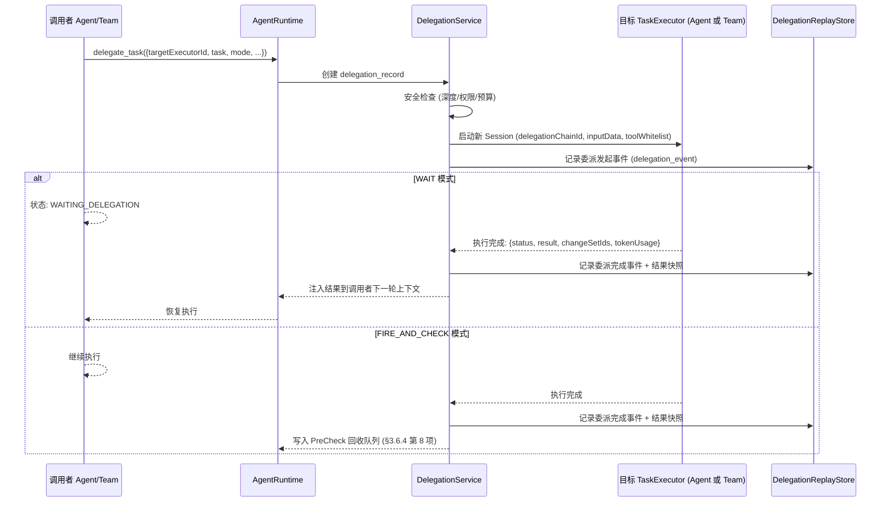

### 3.11 委派系统 (Delegation) _(v0.17 统一重写)_

> **v0.17 重大变更**: 将原"Subagent 系统"与"委派机制 (§3.9.3.1)"统一为单一概念——**委派 (Delegation)**。两者本质相同：均为 Agent/Team 绕过邮件 DAG 拓扑，将任务分派给另一个 Agent/Team，在新 Session 中执行，完成后系统程序化回传结果。原 `spawn_subagent` 工具废弃，统一使用 `delegate_task`。

#### 3.11.1 统一动机

v0.16 中 `spawn_subagent` 与 `delegate_task` 被描述为不同机制——前者是"短期、层级化、一对一"，后者是"对等、跨 Team、可追溯"。但实际分析发现两者**在数据流、执行模型和系统交互上完全同构**：

| 维度             | spawn_subagent (v0.16) | delegate_task (v0.16)           | **统一后 delegate_task (v0.17)**  |
| ---------------- | ---------------------- | ------------------------------- | --------------------------------- |
| 触发             | 父 Agent 调用工具      | 当前执行者调用工具              | 当前执行者调用工具                |
| 目标             | 仅 Agent               | Agent 或 Team (TaskExecutor)    | Agent 或 Team (TaskExecutor)      |
| Session          | 创建子 Session         | 创建独立 Session                | 创建子 Session                    |
| 通信             | 绕过邮件，直接回传     | 绕过邮件，TaskExecutor 直接通道 | 绕过邮件，TaskExecutor 统一通道   |
| 等待模式         | 同步等待 / 后台        | WAIT / FIRE_AND_CHECK           | WAIT / FIRE_AND_CHECK             |
| 权限             | 继承 + 白名单 (不提升) | 不超出委派者 (不提升)           | 继承 + 白名单 (不提升)            |
| 追溯             | Session 父子关系       | delegationChainId 链            | delegationChainId 链              |
| ChangeSet/Replay | 无显式持久化机制       | delegationChainId 聚合查看      | delegationChainId 聚合 + 持久回放 |

统一后的核心认知：**委派就是"绕过通信拓扑的任务分派"**——无论目标是简单子 Agent 还是复杂 Team，无论层级关系如何，都是同一个机制的不同配置。

#### 3.11.2 统一后的 delegate_task 接口

```
delegate_task({
  targetExecutorId: string,       // 目标 Agent ID 或 Team ID (TaskExecutor 同构, 原则 2)
  task: {
    title: string,
    description: string,
    inputData: object,            // 任务输入数据
    acceptanceCriteria?: object   // 委派任务的验收标准
  },
  delegationMode: "WAIT" | "FIRE_AND_CHECK",
  timeout?: string,               // 超时时间
  toolWhitelist?: string[],       // 目标可用工具白名单 (原 spawn_subagent 的白名单能力)
  inheritScope?: "full" | "whitelist_only"   // 权限继承模式 (默认 whitelist_only)
})
→ { delegationId, sessionId, cardId, delegationChainId }
```

**与 v0.16 的变更**: `spawn_subagent` 工具废弃。所有原 `spawn_subagent` 调用迁移为 `delegate_task` 调用 (兼容映射: `spawn_subagent(agentId, task, inputData, timeout)` → `delegate_task({ targetExecutorId: agentId, task: { title: task, inputData }, delegationMode: "WAIT", timeout })`)。

#### 3.11.3 委派生命周期



#### 3.11.4 委派回放与持久化 (DelegationReplayStore) _(v0.17 新增)_

> **回应补充关切**: 委派绕过邮件 DAG 后，交互记录缺乏显式持久化回放机制。邮件系统内的通信天然有 `agent_mail` 表持久化，但委派交互（发起、执行过程、结果回传）仅散落在各自 Session 的 DAG 节点中，缺少统一的回放入口。

**问题**: 当一条委派链跨越 3 层（A→B→C），审计者需要回溯完整交互过程时，必须分别查阅 3 个 Session 的 DAG 日志并手动关联——这违反了原则 3（全链路可追溯）和原则 5（步骤级可观测）。

**解决方案——delegation_event 事件流**:

```
delegation_event
  ├── id: UUID
  ├── delegationId: FK → delegation_record
  ├── delegationChainId: string          -- 整条委派链共享的 ID
  ├── eventType: "INITIATED" | "ACCEPTED" | "PROGRESS" | "COMPLETED" | "FAILED" | "TIMEOUT" | "RESULT_COLLECTED"
  ├── fromExecutorId: string             -- 事件发起者 (Agent/Team ID)
  ├── toExecutorId: string               -- 事件目标 (Agent/Team ID)
  ├── sessionId: FK → agent_session      -- 关联的 Session
  ├── dagNodeId: string?                 -- 关联的 DAG 节点 (如有)
  ├── payload: jsonb                     -- 事件数据
  │     INITIATED:  { task, inputData, delegationMode, toolWhitelist }
  │     ACCEPTED:   { targetSessionId }
  │     PROGRESS:   { progressSummary, completionRate? }
  │     COMPLETED:  { status, resultSummary, changeSetIds, tokenUsage }
  │     FAILED:     { error, failedAtNode? }
  │     TIMEOUT:    { elapsedMs, lastKnownState }
  │     RESULT_COLLECTED: { collectedBy, injectionTarget }
  ├── createdAt: timestamp
  └── metadata: jsonb?
```

**delegation_record (v0.17 增强)**:

```
delegation_record
  ├── id: UUID
  ├── delegationChainId: string
  ├── parentDelegationId: FK → delegation_record?   -- 父委派 (支持链式追溯)
  ├── callerExecutorId: string
  ├── targetExecutorId: string
  ├── callerSessionId: FK → agent_session
  ├── targetSessionId: FK → agent_session?          -- 目标 Session (创建后填入)
  ├── delegationMode: "WAIT" | "FIRE_AND_CHECK"
  ├── delegationDepth: int (default 0)
  ├── status: "PENDING" | "ACTIVE" | "COMPLETED" | "FAILED" | "TIMEOUT" | "COLLECTED"
  ├── task: jsonb                                    -- 委派任务描述
  ├── result: jsonb?                                 -- 执行结果
  ├── changeSetIds: string[]?                        -- 产生的变更集
  ├── tokenUsage: jsonb?                             -- 总 token 消耗
  ├── toolWhitelist: string[]?                       -- 工具白名单
  ├── startedAt, completedAt, collectedAt: timestamp?
  └── createdAt
```

**回放能力**:

```
DelegationReplayStore
  ├── getChainTimeline(delegationChainId): DelegationEvent[]
  │     → 按时间排序的整条委派链事件流, 可在 UI 中以时间线形式回放
  │
  ├── getChainTree(delegationChainId): DelegationTreeNode
  │     → 委派链的树状结构 (A→B→C), 每个节点包含 delegation_record + 事件摘要
  │
  ├── getDelegationDetail(delegationId): DelegationDetail
  │     → 单次委派的完整信息: record + events + 关联 Session + ChangeSets
  │
  └── replayDelegation(delegationId): ReplaySession
        → 委派执行的确定性回放 (复用 §3.6.6 DAG replay 机制)
```

**与 SessionTimelinePlayer 的集成**: DelegationChainView (§3.20) 从 `delegation_event` 表读取事件流，在时间线上展示委派链的发起、执行、结果回传等关键节点。支持从委派事件钻入到目标 Session 的 DAG 执行视图。

#### 3.11.5 安全约束

- **✅ Decision D8: 委派权限** → 继承 + 白名单: 被委派的目标继承调用者的权限子集，受 `toolWhitelist` 约束。
- **权限不提升**: 目标 TaskExecutor 的 `agentSecurityLevel` 不得高于调用者。SecurityGuard 在 `delegate_task` 时验证此约束，防止通过委派间接提权。
- **深度限制**: `maxDelegationDepth` 默认 3 (可配置)，防止无限委派链。
- **死锁预防**: WAIT 模式委派前，DelegationService 调用 `WaitGraphService.registerWait()` 执行在线环检测。若检测到跨子系统循环等待（如 A→B 委派 + B 的 Issue 依赖 A 的产出），WAIT 模式自动降级为 FIRE_AND_CHECK 并记录告警日志 (§3.9.4)。
- **成本归因**: 委派链中所有 LLM 成本归因到 `delegationChainId` 对应的原始任务根。
- **ChangeSet 统一**: 委派链中各执行者的 ChangeSet 通过 `delegationChainId` 关联，可按链聚合查看。

#### 3.11.6 与其他机制的关系

| 机制                    | 用途                         | 与委派的区别                               |
| ----------------------- | ---------------------------- | ------------------------------------------ |
| **邮件 (§3.10)**        | Team 内成员间异步通信        | 受 DAG 拓扑约束; 委派绕过邮件              |
| **Issue 拆分 (§3.9.3.2)** | 将大任务分解为多个独立子 Issue | 任务分解 vs 任务重路由; 子 Issue 独立生命周期 |
| **动态组队 (§3.9.2)**   | 运行时按需组建临时 Team      | 组建新 Team vs 向已有 Agent/Team 分派任务  |

> **v0.17 变更**: `spawn_subagent` 废弃，统一为 `delegate_task`。新增 `delegation_event` 事件流和 `DelegationReplayStore` 提供完整的委派交互持久化和回放能力，弥补绕过邮件系统后缺失的追溯通道。
