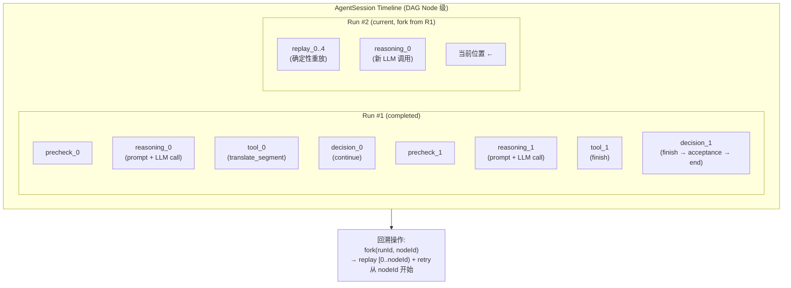

### 3.12 时间线与回溯系统



**基于 Patch 的变更管理** (利用现有 graph 包的 `Patch` 类型):

```typescript
interface Patch {
  metadata: {
    patchId: string;
    parentSnapshotVersion: number;
    actorId: string;
    timestamp: Date;
    nodeId: string;
    nodeType: string; // reasoning | tool | decision | precheck
  };
  updates: Record<string, unknown>;
}
```

每个 DAG 节点执行产生的黑板变更封装为 Patch。回溯 = 选择一个节点并从该点分叉。DAG 模型使回溯粒度从"Run 级"细化到"节点级"。

