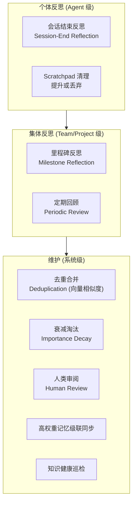

### 3.13 记忆系统 (Memory)

> Agent 的核心竞争力之一是**经验可累积**——与传统无记忆翻译流水线的根本区别。

#### 3.13.1 记忆类型

| 类型                 | 说明                       | 典型场景                                    |
| -------------------- | -------------------------- | ------------------------------------------- |
| TRANSLATION_DECISION | 特定翻译选择的理由和上下文 | "此处 'bank' 译为'银行'而非'河岸'因上下文…" |
| TERMINOLOGY_USAGE    | 术语使用偏好和例外情况     | "该项目中 API 保留英文不翻译"               |
| STYLE_PREFERENCE     | 翻译风格偏好               | "该项目偏好简洁直译，避免意译"              |
| REVIEW_PATTERN       | 审校中反复出现的问题模式   | "该 Translator 经常混淆主被动语态"          |
| CONTEXT_KNOWLEDGE    | 项目/领域相关的背景知识    | "该产品的目标用户是 B2B 企业"               |
| COLLABORATION_NOTE   | 团队协作中的约定           | "与 Reviewer-01 约定: 技术术语保留原文"     |
| ERROR_CORRECTION     | 已纠正的错误记录           | "第 42 段: '接口' 应为 '界面'（UI 上下文）" |

> `type` 枚举不包含 `NORM`——规范板条目不在记忆表中存储，改为 Agent 通过 `search_norms` 工具按需检索（详见 §3.13.10）。这消除了双写一致性问题，并使记忆系统专注于"经验性知识"而非"指令性规范"。

#### 3.13.2 数据模型

```
agent_memory
  ├── id (uuid)
  ├── agentId (FK → agent_definition)
  ├── sessionId (FK → agent_session, 可选)
  ├── scope: SESSION | AGENT | TEAM | PROJECT
  ├── lifecycle: EPHEMERAL | SESSION | PERSISTENT | EXPIRABLE
  ├── type: TRANSLATION_DECISION | TERMINOLOGY_USAGE | STYLE_PREFERENCE
  │         | REVIEW_PATTERN | CONTEXT_KNOWLEDGE | COLLABORATION_NOTE
  │         | ERROR_CORRECTION
  ├── content: TranslatableString
  │     (利用 Domain 中已有类型，天然支持多语言 + 自动 embedding 向量化)
  ├── importance: LOW | MEDIUM | HIGH | CRITICAL
  ├── source: HUMAN | AGENT | SYSTEM | WARM_START
  ├── humanUserId (可选 — 若 source=HUMAN，记录具体用户 ID)
  ├── actorRoleAtCreation: string (产出者在创建时的项目角色)
  │     例: 'project_admin' | 'project_translator' | 'reviewer' | 'regular_member'
  ├── signalType: string (信号类型，决定记忆价值)
  │     例: 'REJECTION_REASON' | 'DIRECT_CORRECTION' | 'MANUAL_TRANSLATION'
  │         | 'APPROVAL' | 'WARM_START_CONFIRMED' | 'AGENT_DERIVED'
  ├── goldenWeight: number (动态黄金权重)
  │     范围: 0.0 ~ 3.0, 默认 1.0
  │     由 actorRoleAtCreation × signalType 计算得出
  ├── derivedFromGoldenId (可选 — 若从高权重记忆推导而来)
  ├── derivativeHealthScore: number (派生物健康度, 范围 0.0~1.0, 默认 null)
  │     仅对 goldenWeight >= 1.5 的记忆有意义，由 KnowledgeHealthMonitor (§3.28) 计算
  ├── supersededByMemoryId (可选 — 若已被更新版本替代)
  ├── linkedEntity: { entityType, entityId } (可选)
  ├── tags: string[]
  ├── expiresAt (可选 — EXPIRABLE 专用)
  └── createdAt, updatedAt
```

**TranslatableString 内容结构**: 记忆的 `content` 使用 Domain 中已有的 `TranslatableString` 类型——这意味着记忆内容天然支持多语言，且每个语言变体自动 embedding 向量化（利用 pgvector 扩展），无需额外向量化管道。

#### 3.13.3 层级与生命周期

**层级 (scope)**：

| 层级    | 可见范围                  | 特点           |
| ------- | ------------------------- | -------------- |
| SESSION | 当前 Session 内           | 自动到期       |
| AGENT   | 同一 Agent 的所有 Session | Agent 私有经验 |
| TEAM    | Team 内所有成员 Agent     | 团队共享知识   |
| PROJECT | 项目内所有 Agent 和 Team  | 项目规范和标准 |

**生命周期 (lifecycle)**：

| 生命周期   | 说明                   | 典型场景                       |
| ---------- | ---------------------- | ------------------------------ |
| EPHEMERAL  | 仅存在于运行时内存     | 临时计算结果                   |
| SESSION    | Session 结束后自动清理 | 当前任务的中间推理             |
| PERSISTENT | 持久存储，不自动过期   | 术语决策、风格标准、高权重记忆 |
| EXPIRABLE  | 有到期时间，到期后清理 | 临时规则、过渡期标准           |

#### 3.13.4 记忆检索与评分

Agent 通过 `search_memory` 工具**按需检索**相关记忆（§3.2.5 按需获取层）。检索使用**五因子评分**:

```
score(memory, query) =
    goldenWeight(memory)                              ← 动态黄金权重
  × importance_weight(memory.importance)
  × vector_similarity(memory.content.embedding, query.embedding)
  × recency_factor(memory.updatedAt)
  × healthPenalty(memory)                             ← 健康惩罚因子
```

> 对 `derivativeHealthScore < 0.5` 的黄金记忆，healthPenalty = derivativeHealthScore（如果一条高权重记忆的派生物大量被拒绝或修正，该记忆的检索评分将被惩罚）。对无 derivativeHealthScore 或得分 >= 0.5 的记忆，healthPenalty = 1.0（无惩罚）。这是**原则 10（知识自愈性）**的核心机制——防止"错误的黄金标准"持续高分占位。

**goldenWeight 计算**:

```
goldenWeight(memory) = actorRoleWeight(memory.actorRoleAtCreation)
                     × signalTypeWeight(memory.signalType)
```

**actorRoleWeight 查找表**:

| actorRoleAtCreation  | 权重 | 说明                       |
| -------------------- | ---- | -------------------------- |
| `project_admin`      | 1.5  | 项目管理员——最高决策权     |
| `project_translator` | 1.3  | 项目自身译员——熟悉项目风格 |
| `reviewer`           | 1.2  | 审校者——质量把关视角       |
| `regular_member`     | 1.0  | 项目普通成员——默认基准     |
| `agent`              | 0.8  | Agent 生成——低于任何人类   |
| `warm_start`         | 0.7  | 热启动自动提取——未经确认   |
| _(缺失/未知)_        | 1.0  | 兜底默认值                 |

**signalTypeWeight 查找表**:

| signalType             | 权重 | 说明                                 |
| ---------------------- | ---- | ------------------------------------ |
| `REJECTION_REASON`     | 2.0  | 人类拒绝翻译的拒绝原因——最珍贵的信号 |
| `DIRECT_CORRECTION`    | 1.8  | 人类直接修正译文——明确的质量标准     |
| `MANUAL_TRANSLATION`   | 1.5  | 人类手动翻译并通过审核               |
| `APPROVAL`             | 1.2  | 人类审核通过（未做修改）             |
| `WARM_START_CONFIRMED` | 1.0  | 热启动结果经人类确认                 |
| `AGENT_DERIVED`        | 0.8  | Agent 从高权重记忆推导               |
| _(缺失/未知)_          | 1.0  | 兜底默认值                           |

**示例计算**:

```
项目管理员拒绝了一个翻译并写了拒绝原因:
  goldenWeight = 1.5 (project_admin) × 2.0 (REJECTION_REASON) = 3.0  ← 最高权重

项目译员手动翻译:
  goldenWeight = 1.3 (project_translator) × 1.5 (MANUAL_TRANSLATION) = 1.95

普通成员翻译通过审核:
  goldenWeight = 1.0 (regular_member) × 1.2 (APPROVAL) = 1.2

Agent 从黄金标准推导的记忆:
  goldenWeight = 0.8 (agent) × 0.8 (AGENT_DERIVED) = 0.64

热启动自动提取且未经确认:
  goldenWeight = 0.7 (warm_start) × 1.0 (WARM_START_CONFIRMED) = 0.7

---
健康惩罚示例:
  管理员拒绝原因 (goldenWeight=3.0)，但派生翻译 60% 被拒绝:
  → derivativeHealthScore = 0.38  (由 KnowledgeHealthMonitor §3.28 计算)
  → healthPenalty = 0.38
  → 最终 effective_golden = 3.0 × 0.38 = 1.14  ← 实质降权
  → 触发 KnowledgeHealth WARNING → 通知管理员审查该记忆
```

检索流程：

```
search_memory(query, scope?, types?, tags?, limit=10, minGoldenWeight?):
  1. 按 scope 和访问权限过滤候选记忆
  2. 利用 TranslatableString 的 pgvector embedding 进行语义相似度检索 (top-K × 3)
  3. 对 top-K×3 候选计算五因子评分 (含 goldenWeight + healthPenalty)
  4. 若指定 minGoldenWeight，过滤掉 goldenWeight < minGoldenWeight 的记忆
  5. 排序截断到 limit
  6. 返回结果列表 (含 score、metadata、goldenWeight、derivativeHealthScore)
```

> **v0.14 变更**: 记忆检索从 ContextStore 自动注入改为 Agent 通过 `search_memory` 工具按需获取（§3.2.5）。ContextStore 仍提供底层检索能力，但不再自动注入 slot #12 / #14。Agent 的提示词中包含按需检索指引，引导 Agent 在需要时主动调用 `search_memory`。高权重信号同样通过 `search_memory(minGoldenWeight=1.5)` 按需获取。

#### 3.13.5 记忆工具

```
BuiltinTools (记忆相关):
  ├── create_memory(scope, type, content, importance, linkedEntity?, tags?)
  │     创建新记忆。source 根据调用者自动设定 (Agent 调用→AGENT, 人类编辑→HUMAN)。
  │     创建时自动计算 goldenWeight = actorRoleWeight × signalTypeWeight。
  │     创建前自动检查同 scope+linkedEntity 下是否有高相似度记忆，提示合并。
  ├── search_memory(query, scope?, types?, tags?, limit?, minGoldenWeight?)
  │     语义检索记忆。minGoldenWeight 参数按权重阈值筛选
  │     (如 minGoldenWeight=1.5 仅返回高权重记忆)。
  │     返回结果额外包含 derivativeHealthScore 字段。
  ├── update_memory(memoryId, updates)
  │     更新记忆内容/importance/tags。当 Agent 更新 goldenWeight >= 1.5 的记忆时，
  │     系统记录警告日志并需要 SecurityGuard 审核 (原则 7 保障)。
  ├── delete_memory(memoryId)
  │     删除记忆。仅创建者或有权限的用户可删除。
  │     删除 goldenWeight >= 1.5 的记忆需要人类确认。
  └── promote_scratchpad(scratchpadKey, scope, lifecycle, linkedEntity?, tags?)
        将 Scratchpad 中的指定条目提升为持久记忆。source=AGENT。
        goldenWeight 默认为 0.8 (agent) × 0.8 (AGENT_DERIVED) = 0.64。
```

#### 3.13.6 记忆与 EntityVCS 的交互

- **✅ Decision D18: 记忆实体是否纳入版本控制** → 按层级选择性纳入 (B): PROJECT 级记忆受版本控制（在 Isolation Mode 下写入工作分支），AGENT/TEAM 级记忆直写 DB。`changeset_entry.entityType = 'memory_item'` 仅出现在 PROJECT 级记忆的变更中 _(v0.24: 重命名 `memory` → `memory_item`, 精确对应 DB 表 MemoryItem)_。

**PROJECT 级记忆分支冲突解决策略** (仅 Isolation Mode):

```
冲突检测:
  merge(branch → main) 时，若 branch 中新建的 PROJECT 级记忆 M_branch
  与 main 中已有记忆 M_main 满足以下条件之一，标记为冲突:
    1. 同一 linkedEntity + 同一 tags 子集 (如同一术语的翻译决策)
    2. content embedding 余弦相似度 > 0.9 (语义高度重叠)

冲突解决策略 (三级):
  1. 自动合并 — 若两条记忆 content 不矛盾 (如一条记录用法场景, 另一条记录排除场景)
     → 合并为一条综合记忆, importance 取两者最大值
     → goldenWeight 取两者最大值
  2. 保留两者 — 若两条记忆代表不同视角且无法自动判断优劣
     → 两条都保留, 各自标记来源分支, importance 降为 MEDIUM (待人工裁决)
     → 在 ChangeSet 审核 UI 中以并列对比形式展示供审核者选择
  3. 人工裁决 — 审核者在 ChangeSet Review 中显式选择保留哪一条或创建新版本
     → changeset_entry.reviewStatus = CONFLICT, 必须人工处理后才能 merge

冲突特殊规则:
  - goldenWeight >= 1.5 的记忆在冲突中优先保留 → Agent 生成记忆不得覆盖高权重记忆
  - 两条高权重 (goldenWeight >= 1.5) 记忆冲突 → 按 goldenWeight 高者优先；
    权重相同 → 必须人工裁决
```

**AGENT/TEAM 级记忆的分支清理**: AGENT/TEAM 级记忆直写 DB，不受 VCS 管控。当分支被 abandon 时，通过 `sessionId` 关联批量标记为 `lifecycle = EXPIRABLE, expiresAt = now + 7d`（保留 7 天宽限期供人工检查），而非直接删除。

#### 3.13.7 记忆可视化

记忆管理需要专门的可视化界面（见 §3.20 可视化系统）：

- **记忆浏览器**: 按 scope/lifecycle/entity/tags/source 多维度筛选和浏览，高权重记忆 (goldenWeight >= 1.5) 以特殊标记高亮
- **记忆时间线**: 展示记忆的创建/修改/过期历史
- **实体关联视图**: 查看某个业务实体关联的所有记忆
- **Agent 记忆画像**: 展示某个 Agent 的记忆分布（按主题、实体类型、重要性等）
- **向量空间可视化**: 将记忆 embedding 降维 (t-SNE/UMAP) 展示聚类分布，帮助识别重复记忆和主题聚堆
- **黄金权重仪表盘**: 展示项目中高权重记忆的分布（按 actorRole × signalType 的热力图）、Agent 利用率、级联影响范围
- **知识健康面板**: 展示各黄金记忆的 `derivativeHealthScore` 变化趋势、异常预警列表、健康度低于阈值的记忆清单及其派生谱系图（详见 §3.28 KnowledgeHealthMonitor）

#### 3.13.8 记忆整合与反思 (Memory Consolidation & Reflection)

> 解决多轮任务中记忆膨胀问题。

**整合机制三层模型**:



**个体反思 (Agent-Level Reflection)**:

- **会话结束反思**: Agent Session 正常结束时，Runtime 触发一次轻量"反思"步骤——向 LLM 发送当前 Session 的 Scratchpad 内容和本次创建的记忆列表，要求总结、合并重复项、标记可删除项。
- **Scratchpad 清理**: 反思步骤同时评估 Scratchpad 中未提升的条目——有跨会话价值的自动 `promote_scratchpad`，无价值的丢弃。

**集体反思 (Team/Project-Level Consolidation)**:

- **里程碑反思**: 在项目关键节点由 Coordinator 触发 Team 级记忆回顾——汇总各成员 Agent 的记忆，提取共性模式。
- **定期回顾**: 通过 SchedulerService 的 cron 触发，定期对指定 scope 的记忆执行去重和重要性重评估。

**系统级维护**:

- **去重合并**: 创建新记忆时，系统利用 TranslatableString 的 embedding 自动检索同 scope + 同 linkedEntity 下的语义相似记忆。相似度超过阈值时提示 Agent 合并而非创建新条目。
- **重要性衰减**: PERSISTENT 记忆的 importance 随时间和未被检索的次数缓慢衰减。衰减不直接删除记忆，而是降低排序权重。**goldenWeight >= 1.5 的记忆豁免自动衰减——但 derivativeHealthScore < 0.3 的黄金记忆例外，其 importance 以正常速率衰减**（原则 10: 知识自愈性）。
- **人类审阅**: 记忆管理 UI 支持人类审阅记忆，批量删除低质量条目、修正错误记忆。
- **高权重记忆级联同步**: 当人类修改或删除高权重记忆时，触发级联检查——查找所有引用该记忆的 Agent 派生记忆，标记为 `NEEDS_REVALIDATION` (详见 §3.13.9)。
- **知识健康巡检**: KnowledgeHealthMonitor (§3.28) 定期对所有 goldenWeight >= 1.5 的记忆执行健康检查，更新 `derivativeHealthScore`。健康度异常低的记忆将被标记并通知项目管理员审查。

- **✅ Decision D22: 记忆整合触发机制** → 混合策略 (D): 事件驱动为主（会话结束 + 里程碑），阈值为兜底（超过 N 条时 Session 内也触发一次）。

#### 3.13.9 人类黄金标准架构保障

> 回应**原则 7（人类内容至高性 + 动态分级）**——人类产出的信号价值不是均一的，系统需根据产出者的权限角色和信号类型进行动态分级。

**黄金标准的识别与来源**:

| 来源                     | signalType           | actorRole 示例        | goldenWeight 范围 | source 值  |
| ------------------------ | -------------------- | --------------------- | ----------------- | ---------- |
| 人类拒绝翻译的拒绝原因   | REJECTION_REASON     | reviewer / admin      | 2.4 ~ 3.0         | HUMAN      |
| 人类直接修正译文         | DIRECT_CORRECTION    | translator / reviewer | 2.16 ~ 2.7        | HUMAN      |
| 人类手动翻译通过审核     | MANUAL_TRANSLATION   | translator / member   | 1.5 ~ 1.95        | HUMAN      |
| 人类审核通过（未做修改） | APPROVAL             | reviewer              | 1.2 ~ 1.8         | HUMAN      |
| 热启动学习提取（已确认） | WARM_START_CONFIRMED | —                     | 0.7               | WARM_START |
| Agent 从高权重记忆推导   | AGENT_DERIVED        | agent                 | 0.64              | AGENT      |

**反降级保障机制**:

```
规则 1 — 高权重记忆不可被 Agent 自动覆盖:
  当 Agent 尝试 update_memory(goldenWeight >= 1.5 的记忆):
    → SecurityGuard 拦截
    → 记录安全审计日志 (含原记忆 goldenWeight 和 Agent 请求详情)
    → 通知 Supervisor
    → Agent 只能创建新的 AGENT 来源记忆
      (goldenWeight = 0.64, 与高权重记忆并存但评分更低)

规则 2 — 高权重记忆删除需人类确认:
  当 Agent 或系统尝试 delete_memory(goldenWeight >= 1.5 的记忆):
    → 自动触发 request_human_input(approval) 请求
    → 人类未确认前，记忆保持不变

规则 3 — 冲突解决中按权重排序:
  VCS merge 冲突中:
    → goldenWeight 较高的记忆自动保留
    → goldenWeight 相同 → 人工裁决
    → Agent 记忆 (goldenWeight < 1.0) 永不自动覆盖人类记忆 (goldenWeight >= 1.0)

规则 4 — 高权重记忆级联失效保护:
  当人类修改高权重记忆 G 时:
    1. 查找所有 derivedFromGoldenId = G.id 的派生记忆
    2. 将派生记忆标记为 NEEDS_REVALIDATION
    3. 下次检索时，NEEDS_REVALIDATION 记忆评分降低 50%
    4. Agent 在 Session-End Reflection 时重新评估这些记忆

规则 5 — 健康度驱动的自动降权:
  当 KnowledgeHealthMonitor 检测到黄金记忆 G 的 derivativeHealthScore < 0.5:
    1. G 的检索评分被 healthPenalty 乘性惩罚 (§3.13.4)
    2. G 从 Agent 高权重检索结果中被排除 (search_memory(minGoldenWeight=1.5) 额外过滤 healthPenalty < 0.5)
    3. 系统生成 WARNING 事件 → 通知项目管理员审查 G
    4. 管理员可选择:
       a. 修正 G 的内容 → 触发规则 4 级联 + 重置 derivativeHealthScore
       b. 确认 G 无误 → 手动重置 derivativeHealthScore = 1.0 (强制标记为健康)
       c. 归档 G → lifecycle 转为 EXPIRABLE
    → 这确保了"错误的黄金标准"不会因高权重而持续占位（原则 10）
```

- **✅ Decision D31: 黄金标准传播机制** → 惰性失效 + 下次检索触发 (B): 修改时仅标记派生记忆为 NEEDS_REVALIDATION，下次 Agent 检索到该记忆时自动触发重新评估。与现有检索流程自然融合，实现简单。

#### 3.13.10 规范板与记忆系统的边界划分

> **核心关注**: "规范板的设计看似比较美好，但是管理上是否会与原有的记忆系统有冲突？"——规范板条目同时作为 `type=NORM` 记忆存在于记忆表中会导致双写不一致、检索评分混淆、生命周期冲突。因此采用清晰的边界划分。

**问题诊断**:

| 问题             | 描述                                                                                                                  |
| ---------------- | --------------------------------------------------------------------------------------------------------------------- |
| **双写一致性**   | 规范板条目在 `norms_board_entry` 表和 `agent_memory` 表各有一份，更新/归档需双写，存在不一致窗口                      |
| **检索评分混淆** | NORM 类型记忆与经验记忆在检索中混合排序——规范板条目本质是"指令"而非"经验"，不应参与语义相似度竞争                     |
| **生命周期冲突** | 规范板条目有独立的 DRAFT/ACTIVE/ARCHIVED 生命周期；映射为记忆后又叠加了 EPHEMERAL/PERSISTENT/EXPIRABLE 的记忆生命周期 |
| **语义歧义**     | Agent 混合接收时，"参考经验"和"遵循规范"的语义边界模糊——Agent 可能将规范当作可选参考忽略                              |

**边界划分方案**:

```
┌──────────────────────────────────────────────────────────────────────┐
│                   Agent 按需获取通道 (§3.2.5)                        │
│                                                                      │
│  search_memory 工具 (经验)       search_norms 工具 (规范)            │
│  ┌──────────────────────┐      ┌──────────────────────┐             │
│  │ agent_memory 表       │      │ norms_board_entry 表  │             │
│  │ (五因子评分)          │      │ (ACTIVE 状态直查)     │             │
│  │                      │      │                      │             │
│  │ 7 种经验类型:         │      │ 规范类型:              │             │
│  │ TRANSLATION_DECISION │      │ TERMINOLOGY           │             │
│  │ TERMINOLOGY_USAGE    │      │ STYLE                 │             │
│  │ STYLE_PREFERENCE     │      │ WORKFLOW              │             │
│  │ REVIEW_PATTERN       │      │ QUALITY               │             │
│  │ CONTEXT_KNOWLEDGE    │      │ SAFETY                │             │
│  │ COLLABORATION_NOTE   │      │                      │             │
│  │ ERROR_CORRECTION     │      │ 生命周期: 规范板独立管理 │             │
│  │                      │      │ DRAFT → ACTIVE → ARCHIVED │         │
│  │ 语义: "参考经验"      │      │ 语义: "遵循规范"       │             │
│  └─────────┬────────────┘      └─────────┬────────────┘             │
│            │                              │                          │
│            ▼                              ▼                          │
│  Agent 主动检索时:              Agent 主动检索时:                    │
│  "以下是相关经验供参考,         "以下是项目规范,                      │
│   可根据判断灵活运用"            你必须严格遵守"                      │
└──────────────────────────────────────────────────────────────────────┘
```

> **v0.14 变更**: 注入通道从 PromptEngine 自动 slot 注入改为 Agent 通过 `search_memory` / `search_norms` 工具按需获取。语义边界不变——经验性知识和强制规范仍然分离，但获取方式从"被动接收"变为"主动检索"。

**关键设计决策**:

1. **单一数据源**: 规范板条目仅存储在 `norms_board_entry` 表中，不再映射到 `agent_memory` 表。消除双写一致性问题。
2. **独立检索通道**: 规范板通过 `search_norms` 工具独立检索，不参与记忆评分竞争。Agent 主动检索时明确区分"经验参考"和"强制规范"。
3. **独立生命周期**: 规范板条目有自己的 DRAFT → ACTIVE → ARCHIVED 生命周期，不叠加记忆的 lifecycle 枚举。
4. **检索路径分离**: `search_memory` 仅检索 `agent_memory` 表；`search_norms` 仅检索 `norms_board_entry` 表。两套检索逻辑完全独立。

**与 PromptEngine 的关系** (§3.2.5 按需获取层):

| 按需获取工具                                | 数据源              | 检索方式                                 | 语义              |
| ------------------------------------------- | ------------------- | ---------------------------------------- | ----------------- |
| `search_memory(query)`                      | `agent_memory` 表   | 五因子评分语义检索                       | 经验参考 (可选)   |
| `search_memory(query, minGoldenWeight=1.5)` | `agent_memory` 表   | goldenWeight ≥ 1.5 + healthPenalty ≥ 0.5 | 高权重信号 (优先) |
| `search_norms(query)`                       | `norms_board_entry` | ACTIVE 状态语义检索                      | 项目规范 (强制)   |
| `run_acceptance_check()`                    | 验收标准 (§3.27)    | 当前任务关联                             | 验收标准 (强制)   |
