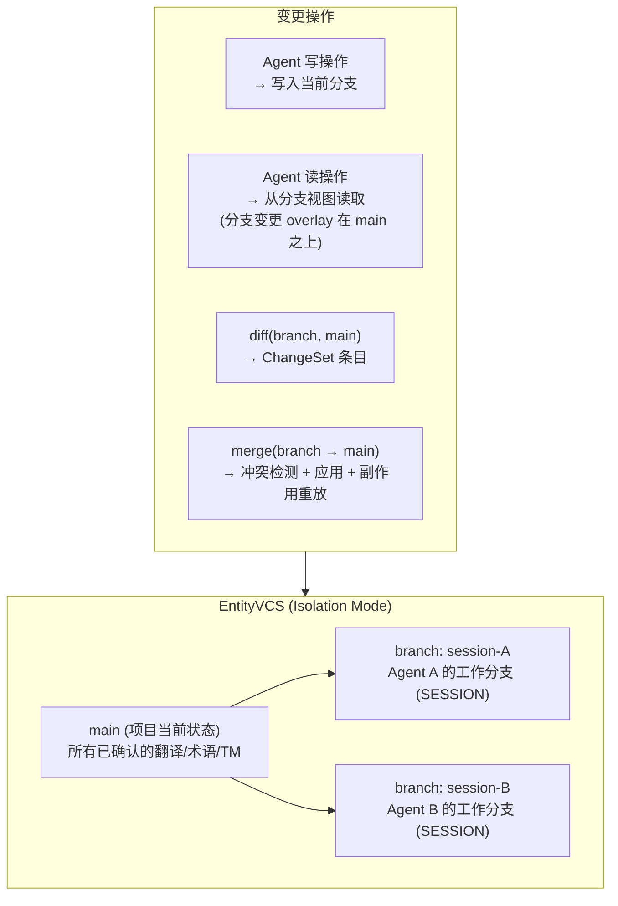

### 3.14 变更集与版本控制系统 (ChangeSet & EntityVCS)

> **定位 (v0.23 提升)**: EntityVCS 是 CAT 平台的**核心基础设施** (原则 13 — 版本控制即平台基座)，以 **Project** 为中心，将与其相关的一切业务实体纳入版本控制。VCS 具有双重价值：(1) Agent 安全兜底——确保所有 Agent 操作可追溯、可审计、可回滚；(2) TMS 平台基本能力——为人类用户提供翻译资产的完整版本管理。

> EntityVCS 提供**两级模式**——Audit Mode (Tier 1) 和 Isolation Mode (Tier 2)——加上不经 VCS 的 Trust Mode，共三种运行模式。

#### 3.14.1 ChangeSet 数据模型

```
changeset
  ├── id, agentRunId
  ├── branchId (仅 Isolation Mode; Audit Mode 为 null)
  ├── teamRunId (可选)
  ├── pullRequestId (可选 — 关联的 PR，用于任务级追溯)
  ├── delegationChainId (可选 — 关联的委派链 ID，用于委派链级变更集聚合, §3.9.3.1)
  ├── splitGroupId (可选 — 关联的 Issue 拆分组 ID，用于拆分 Issue 聚合追溯, §3.9.3.2)
  ├── status: PENDING | APPROVED | PARTIALLY_APPROVED | REJECTED | APPLIED | CONFLICT
  ├── createdBy (agentId), reviewedBy (userId)
  ├── summary (LLM 自动生成的变更摘要)
  └── createdAt, reviewedAt, appliedAt

changeset_entry
  ├── id, changesetId
  ├── entityType: translation | element | document | document_tree | comment | comment_reaction | term | term_concept | memory_item | project_settings | project_member | project_attributes | context
  ├── entityId
  ├── action: CREATE | UPDATE | DELETE
  ├── before (jsonb), after (jsonb)
  ├── fieldPath (可选 — 变更发生的具体字段路径, 用于字段级 diff, 如 "stringId" 或 "approvedTranslationId")
  ├── riskLevel: LOW | MEDIUM | HIGH
  ├── conflictWith (可选)
  └── reviewStatus: PENDING | APPROVED | REJECTED | CONFLICT

entity_branch (仅 Isolation Mode)
  ├── id, projectId, name
  ├── type: SESSION
  ├── sessionId
  ├── baseVersion (分支创建时 main 的版本标识)
  ├── currentBaseVersion (当前 rebase 后的 main 版本，初始 = baseVersion)
  ├── status: ACTIVE | MERGED | ABANDONED | REJECTED | PENDING_REVIEW
  └── createdBy, createdAt

entity_branch_entry (仅 Isolation Mode)
  ├── id, branchId, sessionId
  ├── entityType, entityId
  ├── action: CREATE | UPDATE | DELETE
  ├── data (jsonb: 实体完整快照)
  ├── baseVersion (main 中该实体的版本号)
  └── createdAt
```

> **v0.14 变更**: changeset 新增 `delegationChainId` 字段，支持按委派链聚合变更集——审核 UI 可展示整条委派链的全部变更。
> **v0.16 变更**: changeset 新增 `splitGroupId` 字段，支持按 Issue 拆分组聚合变更集——审核 UI 可展示拆分 Issue 的统一/逐 Issue 变更视图。

#### 3.14.2 两级模式详解

##### 3.14.2.1 Audit Mode (审计模式, Tier 1)

**设计目标**: 最小化复杂度，直接写 main + 事后审计。

```
Audit Mode 写操作流程:
  1. Agent 通过 ToolNode 写操作 (如 translate) → 中间件拦截
  2. 中间件直写 main (DB) + 自动创建 ChangeSet 条目
  3. OCC (乐观并发控制):
     → Agent 写入时携带 expectedVersion
     → 若 expectedVersion ≠ currentVersion → 冲突
     → 冲突策略: 通知 Agent 重新读取后决策 (last-writer-wins 需 Agent 显式确认)
  4. ChangeSet 可选审核: 管理员可在事后审阅 ChangeSet 并选择回滚
  5. 回滚: 生成反向 ChangeSet 并应用
```

**Audit Mode 不需要的复杂组件**:

| 不需要的组件            | 原因                                       |
| ----------------------- | ------------------------------------------ |
| entity_branch 表        | 无分支概念，所有写操作直接到 main          |
| entity_branch_entry 表  | 无分支 overlay                             |
| Overlay 视图缓存        | 无分支视图，标准 DB 查询即可               |
| Rebase 逻辑             | 无分支 base 概念                           |
| Agent-Local Consistency | 所有 Agent 共享同一 main 视图              |
| SideEffectJournal 延迟  | 副作用立即执行（与 Trust Mode 相同）       |
| PRVCSProjection         | PR 是 VCS 分支状态的权威投影                |

**OCC 实现**: 在 `entity_branch_entry` 不存在的情况下，OCC 依赖业务实体自身的 `version` 字段（已在多数 domain 实体上存在或可扩展）。ChangeSet 中间件在写操作前检查 version 匹配。

##### 3.14.2.2 Isolation Mode (隔离模式, Tier 2)

**设计目标**: 为需要严格审核和隔离的场景提供完整分支能力。



**核心概念**:

- **main**: 项目的当前已确认状态。所有人类和 Agent 在无分支上下文时读取的基线。
- **工作分支 (SESSION branch)**: 每个 AgentSession 在 Isolation Mode 下自动获得一个工作分支。Session 结束或 merge 后关闭。
- **分支视图 (branch view)**: Agent 读取数据时返回 "main + 本分支变更" 的合并视图。
- **diff**: 自动生成 ChangeSet 条目——与 ChangeSet 模型完全兼容。
- **merge**: 审核通过后将变更应用到 main，同时重放分支中记录的外部副作用（§3.14.7）。

#### 3.14.3 项目快照与回归

```
entity_snapshot
  ├── id, projectId
  ├── name, description
  ├── level: PROJECT | DOCUMENT | DOCUMENT_GROUP
  ├── scopeFilter (jsonb — 快照范围过滤器)
  ├── mainVersion (快照时 main 的版本标识)
  ├── createdBy (userId | agentId)
  └── createdAt
```

**回归流程**:

```
revert(snapshotId):
  1. diff(当前 main, snapshot 时刻的 main) → 生成反向 ChangeSet
  2. 自动为当前状态创建快照 (safety snapshot)
  3. 应用反向 ChangeSet → main 回到快照状态
  4. 若需恢复: revert(safety snapshot)
```

#### 3.14.4 Domain 层拦截策略

- **✅ Decision D19: EntityVCS 的 Domain 层拦截策略** → Domain 层 VCS-aware 中间件 (C): 中间件拦截读操作和写操作，根据 Session 分支上下文自动路由。附加约束：必须保证 Agent-Local Consistency (§3.14.5)。

#### 3.14.5 Agent-Local Consistency 保证 (仅 Isolation Mode)

**Agent-Local Consistency 语义**:

```
对于在 Isolation Mode 下工作的 Agent Session S (关联分支 B):

  读操作语义:
    READ(entity) = B.overlay(entity) ?? main.currentBase(B).get(entity)

  写操作语义:
    WRITE(entity, data) → B.put(entity, data)

  可见性保证:
    1. read-your-own-writes: Agent 自己的写入在下一次读取时立即可见
    2. branch isolation: 其他 Agent 的未合并写入对当前 Agent 不可见
    3. 跨轮次更新: 根据 D20 的 rebase 策略决定 main 新变更的可见性
```

**Overlay 视图缓存优化**:

```
缓存粒度: 按 entityType + entityId 分段缓存 (而非全分支整体缓存)

缓存结构:
  cache_key = f"{branchId}:{entityType}:{entityId}"
  cache_value = { data: merged_entity, branchEntryVersion: last_entry_version }

失效策略:
  1. 写操作时: 仅失效被写入的 entityType:entityId 对应的缓存条目
     → Agent 翻译 segment-42 时，只失效 segment-42 的缓存
     → 其他 9,999 个 segment 的缓存仍然有效
  2. Rebase 时: 批量失效在 rebase 中被更新的实体 (main deltaEntities)
  3. 批量读取优化 (list_segments 等):
     → 先从缓存中获取所有已缓存的实体
     → 对缓存未命中的实体执行 overlay 查询
     → 结果写入缓存

预期效果:
  - 稳态缓存命中率: >95%
  - 写放大: O(1) 每次写操作仅失效一个缓存条目
  - 内存占用: 按活跃实体数而非全项目实体数增长
```

- **✅ Decision D20: 分支 base 更新策略** → 轮次边界 rebase (C): 分支在每个 DAG 循环的 PreCheck Node 中检查 main 是否有更新，若有则执行 rebase。同一轮次内视图稳定。补充约束：引入 `rebase` 操作供管理 Agent/人类在必要时手动 rebase 并解决冲突。仅在 Isolation Mode 下适用。

#### 3.14.6 运行模式

| 模式                        | 说明                                                      | 适用场景                                                     | 复杂度 |
| --------------------------- | --------------------------------------------------------- | ------------------------------------------------------------ | ------ |
| **Trust Mode**              | Agent 工具直接执行 operations → DB 写入                   | 低风险、受信环境、自动化流水线                               | 最低   |
| **Audit Mode (Tier 1)**     | Agent 工具直写 main + 记录 ChangeSet → 可选事后审核 + OCC | 需要审计轨迹、基本冲突检测的正式项目 (默认)                  | 低     |
| **Isolation Mode (Tier 2)** | Agent 工具写入工作分支 → diff 生成 ChangeSet → 审核+合并  | 高风险操作、多 Agent 重叠工作、新 Agent 试用期、严格审核需求 | 高     |

- **✅ Decision D6: 变更集粒度** → per-run + teamRunId 关联: Team 成员的变更集通过 `teamRunId` 关联，审核 UI 中可整体查看。
- **✅ Decision D10: 权限越界检测** → dry-run: Isolation Mode 下暂存时执行 dry-run 权限检查。

**冲突检测与解决**:

| 模式           | 冲突检测机制                        | 解决方式                                         |
| -------------- | ----------------------------------- | ------------------------------------------------ |
| Audit Mode     | OCC entity version 校验             | Agent 重新读取 + 决策；或标记为冲突通知人类      |
| Isolation Mode | merge 时 diff 对比 (branch vs main) | 自动合并不重叠变更；重叠标记 CONFLICT 由人类仲裁 |

**委派链变更集聚合**: 同一 `delegationChainId` 下多个 Agent 的 ChangeSet 在审核 UI 中可以"按委派链聚合查看"——展示从原始任务到最终执行的完整变更链条，便于审核者理解变更上下文。

**拆分 Issue 变更集聚合**: 同一 `splitGroupId` 下多个子 Issue 的 ChangeSet 在审核 UI 中提供双视图——"统一视图"合并展示所有子 Issue 变更，"逐 Issue 视图"按子 Issue 独立展示，两种视图均包含成本归因数据 (§3.9.3.2)。

#### 3.14.7 外部副作用补偿机制

> 本节处理两类副作用：(1) **工具级外部副作用** — Agent 通过工具显式触发的外部操作（邮件、Webhook、MCP 调用）；(2) **实体内生异步依赖** — 业务实体的增删改自身隐含的外部操作（如 TranslatableString 插入时触发向量化队列任务）。两类副作用在 VCS 分支生命周期中必须被统一管理。

##### 3.14.7.1 工具级外部副作用 (Tool-Level Side Effects)

> Review/Isolation Mode 下 Agent 执行的外部副作用（邮件、Webhook、MCP 工具）在分支被 Abandon 或 Reject 时无法回滚。

**问题本质**: 数据库层面的变更可以通过分支 abandon 来回滚，但外部副作用（已发送的邮件、已触发的 Webhook）是**不可逆的**。

**副作用补偿分级**:

```
compensationType (工具注册时声明):
  ├── "reversible"         — 可完全撤销 (如取消已排队但未发送的 webhook、撤回草稿邮件)
  ├── "notification_only"  — 不可撤销, 仅能发送补偿通知 (如 "请忽略之前的审核请求邮件")
  └── "none"               — 不可撤销且无有意义的补偿手段 (如已提交到第三方翻译平台的内容)
```

**SideEffectJournal (副作用日志)**:

```
side_effect_journal
  ├── id, branchId, sessionId
  ├── effectType: EMAIL | WEBHOOK | MCP_CALL | NOTIFICATION
  ├── toolName (触发此副作用的工具名)
  ├── payload (jsonb — 完整的调用参数，用于延迟重放)
  ├── compensationType: "reversible" | "notification_only" | "none"
  ├── status: PENDING | EXECUTED | CANCELLED | COMPENSATED | FAILED
  ├── compensationPayload (jsonb — 补偿操作的参数, 可选)
  ├── executedAt (实际执行时间)
  └── createdAt
```

**工作流 (Isolation Mode)**:

```
Isolation Mode 下的外部副作用处理:
  1. 工具系统检查工具的 sideEffectType (§3.3)
  2. 若 sideEffectType = "external" 且当前在 Isolation Mode:
     a. deferrable = true (默认):
        → 不立即执行外部操作
        → 将调用参数记录到 side_effect_journal (status = PENDING)
        → 向 Agent 返回 "已记录，将在分支合并后执行" 的提示
     b. deferrable = false (时效性操作):
        → 立即执行, 记录到 Journal (status = EXECUTED)
        → 同时记录 compensationType 和 compensationPayload
  3. 分支合并 (merge) 时:
     → 取出该分支所有 PENDING 的副作用条目
     → 按创建时间顺序重放执行
     → 执行成功 → status = EXECUTED
     → 执行失败 → status = FAILED, 通知 Supervisor
  4. 分支废弃 (abandon) 或拒绝 (reject) 时:
     → PENDING 副作用 → status = CANCELLED (无外部影响)
     → 已 EXECUTED 且 compensationType = "reversible" → 执行 compensationPayload → status = COMPENSATED
     → 已 EXECUTED 且 compensationType = "notification_only" → 发送补偿通知 → status = COMPENSATED
     → 已 EXECUTED 且 compensationType = "none" → 仅记录日志 (无法补偿)
```

**Trust Mode / Audit Mode 下**: 外部副作用直接执行，不经过 Journal。Audit Mode 仅记录内部数据变更到 ChangeSet，外部副作用的行为与 Trust Mode 一致。

**设计原则**: **系统不承诺无法兑现的能力**。对于不可逆的外部副作用，系统的策略是：(1) 在 Isolation Mode 下尽可能延迟执行（deferrable = true 的操作）；(2) 对无法延迟的操作提供补偿通知机制而非声称可以"撤销"；(3) 管理员在配置 Agent 时应将高风险外部操作设为 Isolation Mode + 人工审核，确保 merge 前副作用不会执行。

##### 3.14.7.2 实体内生异步依赖 (Entity-Internal Async Dependencies)

> 部分业务实体的增删改操作自身隐含外部依赖——操作的完成需要等待异步外部流程。这与工具级副作用的本质区别在于：**工具级副作用是 Agent 显式发起的、可延迟的外部操作；实体内生依赖是实体数据完整性的固有要求，无法被简单延迟——实体在依赖完成前处于不完整状态。**

**典型案例 — TranslatableString (vectorizedString)**:

```
TranslatableString.INSERT 的异步依赖链:
  1. 向量化请求：插入新的 TranslatableString 行后，
     需通过 operations 层向任务队列发布向量化任务
  2. 外部处理：向量化服务（embeddings API）处理文本
  3. 结果回写：向量化完成后更新 chunkSetId 字段
  4. 就绪状态：chunkSetId != null 后实体才算"完整可用"

  类似模式的实体还可能包括:
  - 任何依赖外部 NLP 处理管线的实体
  - 需要异步校验/审核后才生效的实体
```

**实体内生依赖的关键特征**:

| 特征     | 工具级副作用 (§3.14.7.1) | 实体内生异步依赖 (§3.14.7.2)                |
| -------- | ------------------------ | ------------------------------------------- |
| 触发方式 | Agent 显式调用工具       | 实体增删改自动触发                          |
| 可延迟性 | 大多可延迟到 merge 后    | **不可延迟** — 实体不完整影响后续读取和计算 |
| 完成约束 | merge 后重放即可         | 必须在实体被消费前完成                      |
| 回滚语义 | 补偿通知/撤销            | 取消异步任务 + 删除不完整实体               |
| VCS 表征 | SideEffectJournal        | EntityAsyncDependency (§3.14.11 统一管理)   |

**SideEffectJournal 扩展**: `effectType` 枚举新增 `ENTITY_ASYNC_DEP`，用于记录实体内生异步依赖条目。但实体内生依赖的完整生命周期管理由 §3.14.11 ApplicationMethodRegistry 统一负责。

```
side_effect_journal.effectType:
  EMAIL | WEBHOOK | MCP_CALL | NOTIFICATION | ENTITY_ASYNC_DEP
```

#### 3.14.8 全实体版本控制覆盖范围 _(v0.23 新增, v0.24 基于真实 Schema 校准)_

> 本节定义 EntityVCS 覆盖的全部业务实体类型、各类型的 diff 算法和 merge 策略。以 **Project** 为中心，所有与项目关联的业务实体均纳入版本控制。各实体的字段定义均基于 `@cat/db` 中的 Drizzle schema (`packages/db/src/drizzle/schema/schema.ts`)。

> **术语对齐说明 (v0.29)**: 本文档中使用的 **TranslatableString** 对应代码库中的 `VectorizedString` 表 (`@cat/db`)。之所以在架构文档中使用 TranslatableString 这一名称，是因为它更准确地描述了该实体的业务语义 (可翻译文本)，而 VectorizedString 是其实现层名称 (带向量化能力的文本)。在实现时应以代码库中的实际表名 `VectorizedString` 为准。相关表还包括 `TranslatableElement`（可翻译元素，持有对 VectorizedString 的引用）。

> **v0.29 校验**: 以下 13 种 entityType 已与代码库中的实际 DB 表逐一校验。其中 `project_settings`、`project_member`、`project_attributes` 是复合映射（分别映射到 Setting/PluginConfigInstance、PermissionTuple、Project+ProjectTargetLanguage），不对应单独的表——这是设计意图，非遗漏。`context` 映射到 `TranslatableElementContext` 表（代码库中存在）。

**受控实体清单**:

| entityType           | 对应 DB 表                                   | 业务含义         | 典型粒度                                                                                                                  | 变更频率 | 风险等级默认值 |
| -------------------- | -------------------------------------------- | ---------------- | ------------------------------------------------------------------------------------------------------------------------- | -------- | -------------- |
| `translation`        | Translation                                  | 翻译条目         | 单条翻译 (translatorId, translatableElementId, stringId→TranslatableString, meta)                                         | 极高     | LOW            |
| `element`            | TranslatableElement                          | 可翻译元素       | 文档内翻译单元 (documentId, sortIndex, sourceStartLine/EndLine, translatableStringId→源文本, approvedTranslationId, meta) | 中       | MEDIUM         |
| `document`           | Document                                     | 文档实体         | 单个文档 (name, projectId, fileHandlerId, fileId, isDirectory)                                                            | 低       | HIGH           |
| `document_tree`      | DocumentClosure                              | 文档树结构       | 闭包表行 (ancestor, descendant, depth, projectId)                                                                         | 低       | HIGH           |
| `comment`            | Comment                                      | 评论 (多态)      | 单条评论 (targetType: TRANSLATION\|ELEMENT, targetId, content, parentCommentId, rootCommentId, languageId)                | 中       | LOW            |
| `comment_reaction`   | CommentReaction                              | 评论表态         | 单条 reaction (commentId, userId, type: +1/-1/LAUGH/…)                                                                    | 高       | LOW            |
| `term`               | Term                                         | 术语条目         | 单条术语 (text, languageId, termConceptId→TermConcept, type, status, creatorId)                                           | 中       | MEDIUM         |
| `term_concept`       | TermConcept                                  | 术语概念         | 一组同义术语的概念容器 (definition, glossaryId, stringId)                                                                 | 低       | MEDIUM         |
| `memory_item`        | MemoryItem                                   | 翻译记忆条目     | 单条 TM (memoryId, sourceStringId, translationStringId, sourceTemplate, translationTemplate, slotMapping)                 | 高       | LOW            |
| `project_settings`   | Setting (全局) / PluginConfigInstance (实例) | 项目/全局设置    | 键值对 (key→value) 或插件配置实例 (configId, value)                                                                       | 低       | HIGH           |
| `project_member`     | PermissionTuple                              | 项目成员 (ReBAC) | 权限元组 (subjectType, subjectId, relation, objectType="PROJECT", objectId)                                               | 低       | HIGH           |
| `project_attributes` | Project + ProjectTargetLanguage              | 项目基本属性     | 项目 (name, description, creatorId) + 目标语言集 (languageId, projectId)                                                  | 低       | HIGH           |
| `context`            | TranslatableElementContext                   | 上下文资源       | 单条上下文 (type: TEXT\|JSON\|FILE\|MARKDOWN\|URL, jsonData, fileId, textData, translatableElementId)                     | 低       | LOW            |

> **v0.24 变更**: 新增 `comment_reaction`、`term_concept` 两个 entityType, 将原 `memory` 重命名为 `memory_item` 以精确对应 DB 表 MemoryItem (Memory 表本身只是容器, 不承载可版本化内容)。entityType 总数从 11 扩展至 13。

**风险等级自动升级规则**: 实体的默认风险等级可被以下条件覆盖——(1) 操作为 DELETE 时，风险等级至少为 MEDIUM；(2) 操作者为新 Agent（试用期内）时，风险等级上调一级；(3) 批量操作（单个 ChangeSet 内同类 entity 数量 > 阈值）时，风险等级上调一级。

#### 3.14.9 类型专属 Diff 算法 _(v0.23 新增, v0.24 基于真实 Schema 重写)_

> 不同实体类型的结构和语义差异决定了不能使用统一的 JSON deep-diff。每种 entityType 注册专属的 `DiffStrategy`，负责生成语义化的变更描述。
>
> **核心原则**: 区分 **集合追加操作** (INSERT 到父容器) 与 **字段修改操作** (UPDATE 已有实体)。前者天然无冲突 (如为元素新增一条翻译、新增一条评论、新增一个术语)；后者需要逐字段冲突检测。

**DiffStrategy 接口**:

```
DiffStrategy<T extends EntityType>
  ├── diff(before: T | null, after: T | null): DiffResult
  ├── isConflict(ours: DiffResult, theirs: DiffResult): boolean
  ├── autoMerge(base: T, ours: DiffResult, theirs: DiffResult): MergeResult | CONFLICT
  └── renderSummary(diff: DiffResult): string   // 人类可读的变更摘要

DiffResult
  ├── entityType: string
  ├── changes: FieldChange[]            // 逐字段变更列表
  ├── semanticLabel: string             // 语义化标签 (如 "翻译内容变更", "成员角色提升")
  └── impactScope: LOCAL | CASCADING    // 变更影响范围: 仅本实体 vs 级联影响其他实体

FieldChange
  ├── path: string                      // 字段路径 (如 "stringId", "approvedTranslationId")
  ├── type: ADD | REMOVE | MODIFY       // 变更类型
  ├── before: any, after: any           // 变更前后值
  └── semanticHint?: string             // 可选语义提示 (如 "翻译内容变更", "状态流转")

MergeResult
  ├── merged: T                         // 合并后的实体
  ├── autoResolved: FieldChange[]       // 自动解决的字段冲突
  └── status: CLEAN | AUTO_RESOLVED     // 是否发生了自动冲突解决
```

**各实体类型 Diff/Merge 策略 (基于真实 DB Schema)**:

##### translation (Translation 表)

| 字段       | DB 列                                 | Diff 关注点              | 合并策略                                                                                | 冲突判定      |
| ---------- | ------------------------------------- | ------------------------ | --------------------------------------------------------------------------------------- | ------------- |
| 翻译内容   | `stringId` → TranslatableString.value | 核心字段——翻译文本变更   | 同一 translation 的 stringId 被两方修改为不同值 → **强制冲突** (翻译内容不允许自动覆盖) | 强制冲突      |
| 译者       | `translatorId`                        | 记录谁贡献了翻译         | last-writer-wins (元数据性质)                                                           | 不冲突        |
| 扩展元数据 | `meta` (jsonb)                        | 质量评分、标注等扩展信息 | JSON deep-merge；同一 key 不同值 → 冲突                                                 | 同 key 不同值 |

**集合追加规则**: 为同一 TranslatableElement 新增 Translation (INSERT) — **无冲突**, 直接追加入关联列表。TranslatableElement 下可有多条翻译 (来自不同译者)，新增翻译本质上是向集合追加元素。

##### element (TranslatableElement 表)

| 字段       | DB 列                                                    | Diff 关注点                                    | 合并策略                                            | 冲突判定               |
| ---------- | -------------------------------------------------------- | ---------------------------------------------- | --------------------------------------------------- | ---------------------- |
| 源文本引用 | `translatableStringId` → TranslatableString.value        | 源文本变更 → 级联标记关联 translation 为需重译 | **强制冲突** + impactScope=CASCADING                | 源文本变更影响所有翻译 |
| 批准的翻译 | `approvedTranslationId`                                  | 审批状态变更                                   | 两方同时批准不同翻译 → **冲突**                     | 不同值 → 冲突          |
| 排序位置   | `sortIndex`                                              | 元素在文档内排序                               | 数值冲突取较小者 (保持稳定排序) 或 last-writer-wins | 通常不冲突             |
| 源文件位置 | `sourceStartLine`, `sourceEndLine`, `sourceLocationMeta` | 定位信息                                       | last-writer-wins (解析器生成, 非人工编辑)           | 不冲突                 |
| 扩展元数据 | `meta` (jsonb)                                           | 占位符、最大长度等扩展信息                     | JSON deep-merge                                     | 同 key 不同值 → 冲突   |

**级联影响**: `translatableStringId` 变更时系统应自动标记该元素下所有未完成 translation 为 NEEDS_RETRANSLATION (通过 impactScope=CASCADING 触发)。

##### document (Document 表)

| 字段       | DB 列           | Diff 关注点         | 合并策略                            | 冲突判定             |
| ---------- | --------------- | ------------------- | ----------------------------------- | -------------------- |
| 文档名     | `name`          | 显示名变更          | 两方改为不同名 → **冲突**           | 不同值 → 冲突        |
| 文件处理器 | `fileHandlerId` | 解析器绑定变更      | **强制人工** (影响所有元素解析)     | 任何变更 → HIGH 风险 |
| 关联文件   | `fileId`        | 源文件替换          | **强制人工** (可能导致元素重新解析) | 任何变更 → HIGH 风险 |
| 是否目录   | `isDirectory`   | 类型标记变更 (罕见) | **强制人工**                        | 任何变更 → 冲突      |

##### document_tree (DocumentClosure 闭包表)

> 文档树使用 **闭包表** (Closure Table) 模式, 每条记录为 `(ancestor, descendant, depth, projectId)`。移动一个文档节点会导致多行闭包记录的批量变更。

| 操作                          | Diff 关注点            | 合并策略                                    | 冲突判定                                                   |
| ----------------------------- | ---------------------- | ------------------------------------------- | ---------------------------------------------------------- |
| 移动节点 (改变 ancestor 关系) | 批量闭包行变更         | **强制人工** — 文档树重构必须原子执行       | 两方移动同一节点或其子树 → 冲突; 移动后形成循环引用 → 拒绝 |
| 新增节点 (插入新闭包行)       | 新文档加入树           | **无冲突** — 新节点的闭包行与既有节点不重叠 | —                                                          |
| 删除节点 (删除闭包行)         | 影响所有子孙的闭包关系 | **强制人工**                                | 级联删除需确认子树处理方式                                 |

##### comment (Comment 表)

| 字段     | DB 列                              | Diff 关注点                         | 合并策略                               | 冲突判定                    |
| -------- | ---------------------------------- | ----------------------------------- | -------------------------------------- | --------------------------- |
| 评论内容 | `content`                          | 评论正文修改                        | 同一评论 content 被两方修改 → **冲突** | 强制冲突 (仅作者本人可编辑) |
| 评论目标 | `targetType` + `targetId`          | 评论关联对象 (TRANSLATION\|ELEMENT) | 通常不变; 若变更 → **强制人工**        | 目标变更 → 冲突             |
| 线程关系 | `parentCommentId`, `rootCommentId` | 评论线程结构                        | 通常 INSERT 时写入, 不后续修改         | 罕见; 若变更 → 冲突         |

**集合追加规则**: 新增评论 (INSERT) 或回复已有评论 (INSERT with parentCommentId) — **无冲突**, 直接创建实体。评论以追加为主。

##### comment_reaction (CommentReaction 表)

| 操作               | Diff 关注点          | 合并策略                                                 | 冲突判定 |
| ------------------ | -------------------- | -------------------------------------------------------- | -------- |
| 新增 reaction      | 对评论添加表态       | **无冲突** — 直接 INSERT (unique 约束: commentId+userId) | —        |
| 修改 reaction type | 同一用户改变表态类型 | last-writer-wins (低风险操作)                            | 不冲突   |
| 删除 reaction      | 取消表态             | 直接删除                                                 | 不冲突   |

##### term (Term 表)

| 字段     | DB 列                                                     | Diff 关注点         | 合并策略                                                         | 冲突判定                                      |
| -------- | --------------------------------------------------------- | ------------------- | ---------------------------------------------------------------- | --------------------------------------------- |
| 术语文本 | `text`                                                    | 术语本身的文字表述  | 同一 term 的 text 被两方修改 → **强制冲突** (术语一致性要求)     | 强制冲突                                      |
| 所属概念 | `termConceptId`                                           | 术语归入不同概念组  | 两方将同一术语移到不同 concept → **冲突**                        | 不同值 → 冲突                                 |
| 术语类型 | `type` (FULL_FORM\|ACRONYM\|ABBREVIATION\|…)              | 术语分类            | last-writer-wins (低敏感)                                        | 通常不冲突                                    |
| 术语状态 | `status` (PREFERRED\|ADMITTED\|NOT_RECOMMENDED\|OBSOLETE) | 术语推荐级别        | 取"更严格者" (OBSOLETE > NOT_RECOMMENDED > ADMITTED > PREFERRED) | 两方设为不同状态 → 取更严格者 (AUTO_RESOLVED) |
| 语言     | `languageId`                                              | 术语语言 (通常不变) | 若变更 → **强制人工**                                            | 罕见变更 → 冲突                               |

**集合追加规则**: 在 Glossary / TermConcept 下新增 Term (INSERT) — **无冲突**, 直接创建。同一 TermConcept 下可有多条不同语言/变体的术语。

##### term_concept (TermConcept 表)

| 字段       | DB 列        | Diff 关注点        | 合并策略                        | 冲突判定        |
| ---------- | ------------ | ------------------ | ------------------------------- | --------------- |
| 定义       | `definition` | 概念释义           | 两方改为不同文本 → **冲突**     | 不同值 → 冲突   |
| 关联字符串 | `stringId`   | 标准化翻译文本引用 | 两方修改 → **冲突**             | 不同值 → 冲突   |
| 所属术语库 | `glossaryId` | 跨术语库迁移       | **强制人工** (影响术语库一致性) | 任何变更 → 冲突 |

**集合追加规则**: 在 Glossary 下新增 TermConcept (INSERT) — **无冲突**。

##### memory_item (MemoryItem 表)

| 字段     | DB 列                                            | Diff 关注点     | 合并策略                                                   | 冲突判定             |
| -------- | ------------------------------------------------ | --------------- | ---------------------------------------------------------- | -------------------- |
| 源文本   | `sourceStringId` → TranslatableString.value      | TM 源端         | sourceStringId + translationStringId 对同时修改 → **冲突** | 强制冲突             |
| 译文     | `translationStringId` → TranslatableString.value | TM 目标端       | 同上                                                       | 同上                 |
| 模板     | `sourceTemplate`, `translationTemplate`          | 占位符化模板    | 两方修改同一 template → **冲突**                           | 不同值 → 冲突        |
| 槽位映射 | `slotMapping` (jsonb)                            | 占位符→原值映射 | JSON deep-merge                                            | 同 key 不同值 → 冲突 |
| 关联来源 | `sourceElementId`, `translationId`               | 溯源引用        | last-writer-wins (元数据性质)                              | 不冲突               |

**集合追加规则**: 在 Memory 下新增 MemoryItem (INSERT) — **无冲突**, 直接追加。TM 条目是典型的追加式集合。

##### project_settings (Setting / PluginConfigInstance 表)

| 操作                            | Diff 关注点      | 合并策略                                  | 冲突判定                             |
| ------------------------------- | ---------------- | ----------------------------------------- | ------------------------------------ |
| 新增 key (INSERT Setting)       | 新配置项         | **无冲突** — 不同 key 的设置直接合并      | —                                    |
| 修改同一 key 的 value           | 配置值变更       | 同 key 不同 value → **冲突**              | 强制冲突                             |
| 修改 PluginConfigInstance.value | 插件配置变更     | 两方修改同一 configId 的 value → **冲突** | JSON deep-merge; 同路径不同值 → 冲突 |
| 安全相关设置变更                | 权限、VCS 模式等 | **强制 HIGH 风险 + 人工审核**             | 始终冲突                             |

##### project_member (PermissionTuple 表, ReBAC 模型)

| 操作                       | Diff 关注点    | 合并策略                                               | 冲突判定       |
| -------------------------- | -------------- | ------------------------------------------------------ | -------------- |
| 新增成员 (INSERT 权限元组) | 授予项目访问权 | **无冲突** — 新增 (subjectId, relation, objectId) 元组 | —              |
| 修改角色 (UPDATE relation) | 角色变更       | 两方修改同一 subjectId 的 relation → **冲突**          | 强制冲突       |
| 移除成员 (DELETE 权限元组) | 撤销访问权     | **强制 HIGH 风险 + HITL 审批**                         | 始终需人工确认 |
| 角色降级                   | 权限缩减       | **强制 HIGH 风险**                                     | 始终需人工确认 |

##### project_attributes (Project + ProjectTargetLanguage 表)

| 字段       | DB 列                        | Diff 关注点 | 合并策略                                                                                           | 冲突判定        |
| ---------- | ---------------------------- | ----------- | -------------------------------------------------------------------------------------------------- | --------------- |
| 项目名     | Project.`name`               | 显示名变更  | 两方改为不同名 → **冲突**                                                                          | 不同值 → 冲突   |
| 描述       | Project.`description`        | 说明文本    | last-writer-wins (低敏感)                                                                          | 通常不冲突      |
| 目标语言集 | ProjectTargetLanguage 行集合 | 语言对配置  | 新增语言 (INSERT) → **无冲突**; 删除语言 → **强制冲突** + impactScope=CASCADING (影响所有翻译条目) | 删除 → 级联冲突 |

**级联影响**: 删除目标语言会影响该语言下所有翻译条目, 系统应在 impactScope=CASCADING 中列出受影响的翻译数量, 供审核者决策。

##### context (TranslatableElementContext 表)

| 字段       | DB 列                                    | Diff 关注点     | 合并策略                      | 冲突判定            |
| ---------- | ---------------------------------------- | --------------- | ----------------------------- | ------------------- |
| 上下文类型 | `type` (TEXT\|JSON\|FILE\|MARKDOWN\|URL) | 类型变更 (罕见) | **强制人工**                  | 类型变更 → 冲突     |
| 文本内容   | `textData`                               | 纯文本上下文    | 两方同时修改 → **冲突**       | 不同值 → 冲突       |
| JSON 数据  | `jsonData` (jsonb)                       | 结构化上下文    | JSON deep-merge               | 同路径不同值 → 冲突 |
| 关联文件   | `fileId`                                 | 文件型上下文    | 两方替换为不同文件 → **冲突** | 不同值 → 冲突       |

**集合追加规则**: 为同一 TranslatableElement 新增上下文 (INSERT) — **无冲突**, 直接追加。一个元素可有多条上下文资源。

**Merge 三方对比模型** (Isolation Mode):

```
三方合并 (Three-Way Merge):
  base  = 分支创建时 (或上次 rebase 后) main 中该实体的状态
  ours  = 分支中该实体的当前状态 (Agent 工作成果)
  theirs = main 中该实体的最新状态 (其他 Agent/人类的变更)

合并流程:
  1. diff(base, ours)  → ourChanges
  2. diff(base, theirs) → theirChanges
  3. 对每个 FieldChange:
     a. 仅 ours 或仅 theirs 修改了该字段 → 取修改方的值 (无冲突)
     b. 双方修改了不同字段 → 各取各方的值 (无冲突)
     c. 双方修改了同一字段:
        → 值相同 → 无冲突 (convergent edit)
        → 值不同 → 调用 entityType 的 DiffStrategy.autoMerge()
           → AUTO_RESOLVED → 记录到 autoResolved 列表, 审核时高亮
           → CONFLICT → 标记为冲突, 等待人工仲裁
```

#### 3.14.10 变更集可视化 _(v0.23 新增)_

> ChangeSet 可能包含多种实体类型的混合变更 (如一次 Agent 运行同时修改了翻译、术语和评论)。变更集可视化需要处理异构实体的统一展示。

**ChangeSet 可视化架构**:

```
ChangeSetViewer (前端主组件)
  ├── ChangeSetSummaryBar
  │   ├── 变更统计 (按 entityType 分类: 翻译 +42, 术语 +3, 评论 +7)
  │   ├── 风险分布 (LOW: 42, MEDIUM: 7, HIGH: 3)
  │   └── 审核进度 (已审核 32/52, 冲突 2)
  │
  ├── ChangeSetGroupedView (按 entityType 分组展示, 共 13 种 entityType)
  │   ├── TranslationDiffGroup
  │   │   └── TranslationDiffCard[] — stringId→翻译文本对比, translatorId 归因
  │   ├── ElementDiffGroup
  │   │   └── ElementDiffCard[] — 元素结构变更 (translatableStringId/approvedTranslationId/sortIndex), 关联翻译影响提示
  │   ├── DocumentDiffGroup
  │   │   └── DocumentDiffCard[] — 文档名/fileHandlerId/fileId 变更
  │   ├── DocumentTreeDiffGroup
  │   │   └── DocumentTreeDiffCard[] — 闭包表行变更 (节点移动/新增/删除)
  │   ├── CommentDiffGroup
  │   │   └── CommentDiffCard[] — 评论 content 变更, 线程上下文 (parentCommentId/rootCommentId)
  │   ├── CommentReactionDiffGroup
  │   │   └── CommentReactionDiffCard[] — 评论表态新增/变更 (type)
  │   ├── TermDiffGroup
  │   │   └── TermDiffCard[] — 术语 text/termConceptId/type/status 变更
  │   ├── TermConceptDiffGroup
  │   │   └── TermConceptDiffCard[] — 术语概念 definition/glossaryId 变更
  │   ├── MemoryItemDiffGroup
  │   │   └── MemoryItemDiffCard[] — TM 条目 sourceStringId/translationStringId/template 变更
  │   ├── ContextDiffGroup
  │   │   └── ContextDiffCard[] — 上下文 textData/jsonData/fileId 变更
  │   ├── SettingsDiffGroup
  │   │   └── SettingsDiffCard[] — 配置项 key/value 对比, 影响范围标注
  │   ├── MemberDiffGroup
  │   │   └── MemberDiffCard[] — 权限元组变更 (relation/subjectId), 角色影响
  │   └── AttributesDiffGroup
  │       └── AttributesDiffCard[] — 项目 name/description 变更, 目标语言集增删
  │
  ├── ChangeSetTimelineView (按时间线展示变更顺序)
  │   └── 每条变更按 createdAt 排列, 显示操作者 (Agent/人类)、entityType 图标、摘要
  │
  ├── ChangeSetConflictPanel (冲突解决)
  │   └── ThreeWayDiffView — base/ours/theirs 三方对比, 逐字段合并选择器
  │
  └── ChangeSetImpactGraph (级联影响图)
      └── 展示变更的级联关系 (如 element.translatableStringId 变更 → 关联的 translation 需重译)
```

**审核视图模式**:

| 视图模式       | 适用场景                     | 展示方式                                                            |
| -------------- | ---------------------------- | ------------------------------------------------------------------- |
| **分组视图**   | 默认视图, 按 entityType 归类 | 折叠面板, 每组显示变更数量和风险分布                                |
| **时间线视图** | 理解变更发生顺序             | 时间轴展示, 适合审核 Agent 的决策过程                               |
| **文档视图**   | 以文档为锚点查看关联变更     | 文档树导航, 点击文档查看其下所有 element/translation/comment 的变更 |
| **冲突视图**   | 专注解决冲突                 | 仅展示 CONFLICT 状态的条目, 提供三方对比和合并工具                  |
| **影响视图**   | 评估变更的级联影响           | 有向图展示实体间的影响传播链                                        |

#### 3.14.11 变更集应用方法注册表 (ApplicationMethodRegistry) _(v0.27 新增, v0.28 扩展)_

> 不同 entityType 不仅 diff/merge 策略各异 (§3.14.9 DiffStrategy)，其变更的**应用方式**也有根本差异。部分实体的增删改是纯数据库 CRUD (如 Comment、CommentReaction)；另一部分则隐含外部异步依赖 (如 TranslatableString 的向量化)。ApplicationMethodRegistry 与 DiffStrategy 平行注册，每种 entityType 声明其变更如何被实际应用。
>
> **注**: 以下设计基于 D55 定案 A (ApplicationMethodRegistry 平行注册) 展开。

- **✅ Decision D55: 变更集应用方法注册表** → ApplicationMethodRegistry 平行注册 (A)。DiffStrategy 负责"变更了什么"，ApplicationMethod 负责"如何应用变更" (含异步依赖)，两者独立注册通过 entityType 关联；多数纯 CRUD 实体共享默认 `SimpleApplicationMethod`。

##### 3.14.11.1 ApplicationMethod 接口

```
ApplicationMethod<T extends EntityType>
  ├── entityType: string
  ├── asyncDependencySpec: AsyncDependencySpec | null
  │     // null = 纯 CRUD 实体，无异步依赖
  │     // 非 null = 声明该实体操作的异步依赖特征
  │
  ├── applyCreate(entry: ChangeSetEntry, ctx: ApplicationContext): Promise<ApplicationResult>
  ├── applyUpdate(entry: ChangeSetEntry, ctx: ApplicationContext): Promise<ApplicationResult>
  ├── applyDelete(entry: ChangeSetEntry, ctx: ApplicationContext): Promise<ApplicationResult>
  ├── applyRollback(entry: ChangeSetEntry, ctx: ApplicationContext): Promise<ApplicationResult>
  │
  ├── validateDependencies(entityId: string): Promise<DependencyStatus>
  │     // 检查实体的异步依赖是否已完成
  │     // → READY | PENDING | FAILED
  │
  └── compensate(entry: ChangeSetEntry, ctx: ApplicationContext): Promise<void>
        // 补偿操作：取消进行中的异步任务、清理不完整状态

AsyncDependencySpec
  ├── description: string                    // 人类可读描述 (如 "向量化")
  ├── estimatedDuration: number              // 预估完成时间 (ms)，用于超时检测
  ├── retryable: boolean                     // 失败后是否可重试
  ├── maxRetries: number                     // 最大重试次数
  ├── cancellable: boolean                   // 是否可取消进行中的异步任务
  └── completionEvent: string                // 完成时发出的事件名 (如 "vectorization.completed")

ApplicationResult
  ├── status: APPLIED | ASYNC_PENDING | FAILED
  ├── asyncTaskId?: string                   // 若 ASYNC_PENDING，关联的异步任务 ID
  ├── errorMessage?: string                  // 若 FAILED，失败原因
  └── retryAfter?: number                    // 若 FAILED 且可重试，建议重试间隔 (ms)

DependencyStatus
  ├── status: READY | PENDING | FAILED
  ├── pendingDependencies?: PendingDependency[]
  └── failedDependencies?: FailedDependency[]

PendingDependency
  ├── dependencyType: string                 // 如 "vectorization"
  ├── asyncTaskId: string
  ├── startedAt: Date
  ├── estimatedCompletionAt: Date
  └── progress?: number                      // 0–1 进度 (若可获取)

FailedDependency
  ├── dependencyType: string
  ├── asyncTaskId: string
  ├── failedAt: Date
  ├── errorMessage: string
  └── retryable: boolean
```

##### 3.14.11.2 实体应用分类

| entityType           | 应用方式       | asyncDependencySpec                                     | 说明                                                           |
| -------------------- | -------------- | ------------------------------------------------------- | -------------------------------------------------------------- |
| `translation`        | **有异步依赖** | vectorization (via stringId)                            | 创建/更新 Translation 时关联的 TranslatableString 需完成向量化 |
| `element`            | **有异步依赖** | vectorization (via translatableStringId)                | 源文本引用的 TranslatableString 变更时需重新向量化             |
| `term_concept`       | **有异步依赖** | vectorization (via stringId)                            | TermConcept.stringId 指向的 TranslatableString 需向量化        |
| `memory_item`        | **有异步依赖** | vectorization (via sourceStringId, translationStringId) | TM 条目两端的 TranslatableString 均需向量化                    |
| `document`           | 纯 CRUD        | null                                                    | 文档元数据直写                                                 |
| `document_tree`      | 纯 CRUD        | null                                                    | 闭包表行直写                                                   |
| `comment`            | 纯 CRUD        | null                                                    | 评论直写                                                       |
| `comment_reaction`   | 纯 CRUD        | null                                                    | 表态直写                                                       |
| `term`               | 纯 CRUD        | null                                                    | 术语直写                                                       |
| `project_settings`   | 纯 CRUD        | null                                                    | 设置直写                                                       |
| `project_member`     | 纯 CRUD        | null                                                    | 权限元组直写                                                   |
| `project_attributes` | 纯 CRUD        | null                                                    | 项目属性直写                                                   |
| `context`            | 纯 CRUD        | null                                                    | 上下文资源直写                                                 |

> **核心观察**: 当前项目中，异步依赖的共同根源是 **TranslatableString 向量化**。Translation、Element、TermConcept、MemoryItem 四种 entityType 的异步依赖均源于它们直接或间接引用了 TranslatableString。未来若新增其他异步依赖类型 (如外部 NLP 处理管线)，此处可扩展。

##### 3.14.11.3 TranslatableString 穿透写入策略

> TranslatableString 本身不是独立的 VCS 受控实体 (它是内容寻址的共享不可变资源)，但它的生命周期 (创建→向量化→就绪) 直接影响引用它的受控实体的完整性。

**穿透写入 (Write-Through) 策略**:

```
TranslatableString 在所有 VCS 模式下均穿透写入:
  1. Trust Mode:  直写 DB + 同步或异步触发向量化
  2. Audit Mode:  直写 DB + 异步触发向量化 + ChangeSet 记录引用方的变更
  3. Isolation Mode: 直写 DB (穿透分支隔离) + 异步触发向量化
     → 不写入 entity_branch_entry (TranslatableString 非受控实体)
     → 引用方 (translation/element 等) 的变更写入分支 overlay
     → 分支中引用新 TranslatableString 的条目在依赖就绪前被标记为 ASYNC_PENDING
```

**理由**: TranslatableString 是**内容寻址**的 — 相同文本只存一份。将它放入分支 overlay 会破坏内容寻址语义 (分支 A 创建的 string 在分支 B 中不可见，但两者可能包含完全相同的文本)。穿透写入使得 TranslatableString 成为全局共享资源，各分支通过引用 ID 间接使用。

##### 3.14.11.4 ChangeSet Entry 的异步状态追踪

> 当 ChangeSet 中的某条 entry 引用了有异步依赖的实体，该 entry 需要追踪依赖完成状态。

**changeset_entry 扩展**:

```
changeset_entry (扩展字段)
  ├── asyncStatus: READY | PENDING | FAILED | null
  │     // null = 纯 CRUD 实体，无异步依赖
  │     // PENDING = 异步依赖进行中
  │     // READY = 所有异步依赖已完成
  │     // FAILED = 异步依赖失败
  ├── asyncTaskIds: string[] | null
  │     // 关联的异步任务 ID 列表
  └── _snapshotFields: jsonb | null
        // 冗余快照字段——在依赖就绪前保存重建所需的原始数据
        // 例如 translation 的 { _stringValue, _stringLanguageId }
        // 用于: (1) 审核 UI 在向量化完成前展示翻译内容
        //       (2) 异步失败后回滚时无需反查已删除的 TranslatableString
```

**ChangeSet 级聚合状态**:

```
changeset.asyncStatus (派生字段，由 entry 聚合):
  ├── ALL_READY    — 所有 entry 的 asyncStatus 为 READY 或 null
  ├── HAS_PENDING  — 至少一个 entry 的 asyncStatus 为 PENDING
  └── HAS_FAILED   — 至少一个 entry 的 asyncStatus 为 FAILED

规则:
  - changeset.status 只有在 asyncStatus = ALL_READY 时才可流转到 APPLIED
  - asyncStatus = HAS_PENDING 时，ChangeSet 审核 UI 显示"等待异步依赖完成"进度条
  - asyncStatus = HAS_FAILED 时，阻止 APPLIED 流转，需先处理失败条目 (重试/跳过/回滚)
```

##### 3.14.11.5 各 VCS 模式下的异步依赖处理

| 场景                     | Trust Mode             | Audit Mode                                                                     | Isolation Mode                                                                                    |
| ------------------------ | ---------------------- | ------------------------------------------------------------------------------ | ------------------------------------------------------------------------------------------------- |
| **实体创建时触发向量化** | 直接触发，无 VCS 干预  | 直接触发 + ChangeSet entry asyncStatus=PENDING → 任务完成回调更新为 READY      | 穿透写入触发 + ChangeSet entry asyncStatus=PENDING                                                |
| **向量化完成**           | 回调更新 chunkSetId    | 回调更新 chunkSetId + entry asyncStatus→READY                                  | 回调更新 chunkSetId + entry asyncStatus→READY                                                     |
| **向量化失败**           | 记录错误，由操作层重试 | entry asyncStatus→FAILED，阻止 APPLIED                                         | entry asyncStatus→FAILED，阻止 merge                                                              |
| **ChangeSet 回滚**       | N/A                    | applyRollback: 取消进行中的向量化任务 + 删除 TranslatableString (若无其他引用) | 同 Audit Mode                                                                                     |
| **分支废弃 (Isolation)** | N/A                    | N/A                                                                            | compensate: 取消进行中的向量化任务；穿透写入的 TranslatableString 保留 (可能被其他分支/main 引用) |

##### 3.14.11.6 ApplicationMethod 默认实现

```
SimpleApplicationMethod (适用于所有纯 CRUD 实体):
  asyncDependencySpec = null
  applyCreate  → INSERT entity row
  applyUpdate  → UPDATE entity row (OCC version check)
  applyDelete  → DELETE entity row
  applyRollback → 反向 INSERT/UPDATE/DELETE
  validateDependencies → always READY
  compensate   → no-op

VectorizedStringApplicationMethod (适用于引用 TranslatableString 的实体):
  asyncDependencySpec = {
    description: "TranslatableString 向量化",
    estimatedDuration: 5000,
    retryable: true,
    maxRetries: 3,
    cancellable: true,
    completionEvent: "vectorization.completed"
  }
  applyCreate  → INSERT entity + 穿透写 TranslatableString + 发布向量化任务 → ASYNC_PENDING
  applyUpdate  → UPDATE entity + 若 stringId 变更 → 发布新向量化任务 → ASYNC_PENDING
  applyDelete  → DELETE entity + 取消进行中的向量化任务 + 发布外部事件
  applyRollback → 反向操作 + 取消/补偿向量化
  validateDependencies → 检查关联 TranslatableString 的 chunkSetId 是否非 null
  compensate   → 取消进行中的向量化任务
```

##### 3.14.11.6a 异步任务完成通知机制

> 异步依赖从 PENDING 到 READY/FAILED 的状态流转依赖于外部服务的完成回调。本节定义该通知路径。

```
异步依赖完成通知路径:

  1. ApplicationMethod.applyCreate/Update() 发布异步任务
     → 返回 ApplicationResult { status: ASYNC_PENDING, asyncTaskId }
     → changeset_entry.asyncStatus = PENDING
     → 发出 Hook 事件 entity.async_dep.pending

  2. 外部服务 (如向量化 API) 完成处理
     → 通过既有的 operations 层回调机制通知系统
     → 回调 Payload: { asyncTaskId, status: "completed"|"failed", result?, errorMessage? }

  3. AsyncCompletionHandler.onAsyncComplete(payload):
     a. 更新实体字段 (如 TranslatableString.chunkSetId = result.chunkSetId)
     b. 在 changeset_entry 表中检索所有 asyncTaskIds 包含该 asyncTaskId 的条目
     c. 对每条 entry 调用对应 ApplicationMethod.validateDependencies(entityId)
     d. 若 validateDependencies() → READY:
        → changeset_entry.asyncStatus = READY
        → 发出 Hook 事件 entity.async_dep.completed
     e. 若 validateDependencies() → FAILED:
        → changeset_entry.asyncStatus = FAILED
        → 发出 Hook 事件 entity.async_dep.failed

  4. 上层响应:
     → DAG DecisionNode: 轮询循环检测到 asyncStatus 变化，推进流程
     → ChangeSet 审核 UI: 实时更新进度条
     → Team 终止: COMPLETING 状态检测到 ALL_READY 后正式 COMPLETED

  超时保护:
     AsyncCompletionHandler 注册定时扫描任务 (间隔 = estimatedDuration × 2)
     → 超时未收到回调 → 标记 FAILED + retryable → 按 maxRetries 重试
     → 重试耗尽 → 永久 FAILED → 通知 Supervisor (§3.21)
```

##### 3.14.11.7 与其他子系统的交互约束

- **DAG DecisionNode (§3.6)**: Agent 的 finish 判定需检查当前 ChangeSet 的 asyncStatus。若 `asyncStatus = HAS_PENDING`，DecisionNode 不发出 finish 信号，而是注入 "等待异步依赖完成" 消息后进入轮询等待模式 (间隔由 `estimatedDuration` 决定)。若等待超时 → 按 D51 错误恢复预算处理。
- **AcceptanceGate (§3.27)**: 验收检查只在 ChangeSet asyncStatus = ALL_READY 时执行。PENDING 状态的 entry 不应被纳入 completeness/terminology_consistency 等 checker 的计算范围。
- **Issue/PR 状态 (§3.7)**: Issue 关联的分支 (via PR sourceBranchId) 存在 PENDING 异步依赖时，PR 不可合并到 MERGED 状态。UI 展示 "等待异步处理" 标签。
- **Team 终止 (§3.9.1)**: Team 成员产生的 ChangeSet 存在 HAS_PENDING 状态时，Team 进入 COMPLETING 过渡状态而非直接 COMPLETED。所有异步依赖就绪后才真正终止。若异步依赖超时或失败 → 通知 Supervisor (§3.21)。
- **成本归因 (§3.22)**: 异步依赖执行的外部调用 (如 embeddings API) 产生的成本应归因到触发该操作的 Session/Agent。CostController 在向量化任务发布时做**暂估记账** (tentative allocation)，完成后更新为实际成本。
- **Hook 系统 (§3.29)**: 新增 Hook 事件 `entity.async_dep.pending`、`entity.async_dep.completed`、`entity.async_dep.failed`，允许模块监听实体异步依赖的生命周期。
