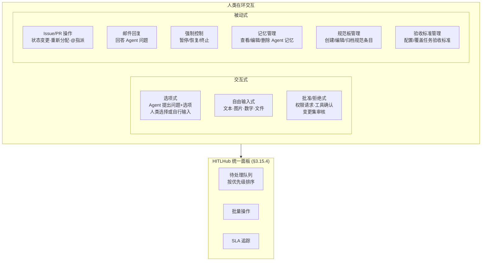

### 3.15 人类在环 (Human-in-the-Loop)



> **v0.14 变更**: 新增 HITLHub 统一面板汇聚所有人类在环请求。

**九类介入点**:

| #   | 介入类型     | 交互模式            | 触发方式                         | 实现基础                                  |
| --- | ------------ | ------------------- | -------------------------------- | ----------------------------------------- |
| ①   | 工具确认     | 批准/拒绝式         | Agent 调用风险工具               | ToolConfirmRequest/Response schema        |
| ②   | 主动请求     | 选项式 / 自由输入式 | Agent 调用 `request_human_input` | DAG WaitingHumanInput 状态                |
| ③   | 变更集审核   | 批准/拒绝式         | Agent 完成一批工作               | ChangeSet Audit/Isolation Mode            |
| ④   | Issue/PR 操作 | 被动（人类主动）    | 人类直接操作 Issue/PR            | PreCheck Node 感知变化                    |
| ⑤   | 邮件回复     | 自由输入式          | Agent 发送待确认邮件             | 邮件注入 Agent 上下文                     |
| ⑥   | 强制控制     | 被动（人类主动）    | 人类随时暂停/恢复                | DAG 节点边界暂停 + 黑板快照               |
| ⑦   | 记忆管理     | 被动（人类主动）    | 人类查看/编辑 Agent 记忆         | 记忆管理 UI + agent_memory 表             |
| ⑧   | 规范板管理   | 被动（人类主动）    | 人类编写/编辑/归档规范条目       | NormsBoardEditor + norms_board_entry 表   |
| ⑨   | 验收标准管理 | 被动（人类主动）    | 人类覆盖验收标准/手动判定        | AcceptanceCriteriaEditor + issue 表       |

**`request_human_input` 工具参数设计**:

```
request_human_input({
  question: string,
  inputType: "choice" | "text" | "number" | "file" | "approval",
  choices?: string[],
  allowFreeform?: boolean,
  fileTypes?: string[],
  context?: string,
  urgency?: "normal" | "urgent",
  timeoutMs?: number,
  timeoutAction?: "escalate" | "default" | "skip"
})
```

**通知渠道**: 通过 `packages/message` 的 `MessageGateway` 统一分发——站内信 + 可选邮件/webhook。

#### 3.15.1 HITL 超时与级联阻塞缓解

> 回应 Team DAG 模式中 `request_human_input` 级联阻塞下游所有 Agent 的问题。

**三级超时处理机制**:

```
Level 1 — 工具级超时 (request_human_input.timeoutMs):
  Agent 在调用时指定超时和超时动作:
  - timeoutAction: "escalate" → 超时后升级通知 (见 §3.21 通知升级)
  - timeoutAction: "default"  → 超时后使用 Agent 自行决策的默认选项
  - timeoutAction: "skip"     → 超时后跳过该询问继续执行

Level 2 — Session 级超时 (agentSession.waitingTimeout):
  当 Session 在 WAITING_HUMAN_INPUT 状态超过阈值:
  1. 首先: 重新发送通知 (提醒)
  2. 若仍超时: 通知 Supervisor (§3.21 责任链 ③)
  3. 若仍超时: TeamCoordinator 介入 (若在 Team 模式):
     a. 将当前 Issue 标记为 BLOCKED
     b. 尝试将任务转派给有类似能力的其他 Agent
     c. 无可用 Agent → 通知 Project Admin

Level 3 — Issue DAG 级联保护:
  当 Issue 进入 BLOCKED 状态时:
  1. 计算所有直接和间接依赖该 Issue 的下游 Issue
  2. 下游 Issue 不进入阻塞 — 保持当前状态但添加 UPSTREAM_BLOCKED 标签
  3. 若下游 Agent 尝试 issue_claim 被阻塞的依赖链:
     → 返回阻塞原因而非 null，Agent 可选择先处理其他无阻塞的任务
  4. Coordinator 收到 BLOCKED 通知后可:
     a. 动态调整 DAG (移除或弱化依赖)
     b. 标记为 DATA 依赖 (不阻塞但标记数据缺失)
     c. 人工介入解除阻塞
```

**与成本控制的交互**: HITL 等待期间 Agent 不消耗 LLM token，但 Session 占用系统资源（内存、连接）。CostController (§3.22) 追踪 HITL 等待时间作为运营成本指标。

#### 3.15.2 HITL 超时策略交互规则与配置验证

**策略交互矩阵**:

| Level 1 (工具级) | Level 2 (Session 级) | Level 3 (Issue DAG) | 交互行为                                            | 风险等级 |
| ---------------- | -------------------- | ------------------- | --------------------------------------------------- | -------- |
| `skip`           | 任意                 | 任意                 | L1 skip 后 Agent 继续执行 → L2/L3 不触发            | 低 ✅    |
| `default`        | 任意                 | 任意                 | L1 default 后 Agent 继续执行 → L2/L3 不触发         | 低 ✅    |
| `escalate`       | 提醒+转派            | BLOCKED 传播         | L1 escalate → L2 提醒 → L2 再超时转派 → L3 标记下游 | 中 ⚠️    |
| `escalate`       | 提醒+转派            | 无下游依赖           | L1 escalate → L2 提醒 → L2 转派 → 结束 (无级联)     | 低 ✅    |
| `escalate`       | 直接通知 Admin       | BLOCKED 传播         | L1 escalate → L2 跳过转派直通 Admin → L3 标记下游   | 高 🔴    |

**核心规则: 层级短路原则**:

```
规则 1 — L1 自动解决则 L2/L3 不激活
规则 2 — L1 escalate 时: L1.timeoutMs < L2.waitingTimeout × 0.5
规则 3 — L2 转派前: reminderIntervalMs < reassignTimeoutMs (至少发一次提醒)
规则 4 — L3 BLOCKED 传播是被动观察 (不主动修改已执行中的任务)
```

**配置验证器 (HITLConfigValidator)**:

```
HITLConfigValidator.validate(config):
  1. 时间窗口一致性检查
  2. 策略兼容性检查 (如 escalate 无 Supervisor 配置时退化为通知 Admin)
  3. 死锁检测 (所有下游 Issue 都依赖阻塞 Issue 且无替代任务)
  4. 推荐默认值: L1=30min, L2.waiting=2h, L2.reminder=30min, L2.reassign=1h
```

- **✅ Decision D30: HITL 超时策略交互规则** → 预设模板 + 自定义 (C): 提供 3 个预测试过的策略模板（"宽松"/"标准"/"严格"），自定义时执行严格验证。

#### 3.15.3 HITL 干预分级 _(v0.14 新增)_

> **回应补充关切**: 合理化 HITL 干预——VCS 安全网的存在使得许多修改可以大胆放手给 Agent 自主完成，只有真正无法回退的操作才需要人类介入。

**问题本质**: v0.13 的九类介入点没有区分"必须人类决策"和"可以 Agent 自主处理"的边界。在 VCS 安全网存在的前提下（特别是 Audit/Isolation Mode），许多看似需要人类确认的操作实际上可以放手让 Agent 自主执行——因为即使出错，ChangeSet 或分支提供了完整的回退能力。

- **✅ Decision D39: HITL 干预分级模型** → 三级分级 (B): 将 9 类介入点按可逆性和影响范围分为 MUST_HUMAN（不可逆操作，如安全级别变更、高权重记忆删除）/ SUGGEST_HUMAN（默认需确认，可按 VCS 模式配置为自主）/ CAN_AUTONOMY（VCS 安全网兜底的低风险操作）三级。

**三级分级方案** (D39 推荐选项 B 详述):

```
┌─────────────────────────────────────────────────────────────────────┐
│ Tier 1: 必须人类 (MUST_HUMAN)                                       │
│ 无论 VCS 模式如何，这些操作必须人类确认，因为操作不可逆或超出技术回退范围 │
│                                                                     │
│ · 安全级别变更 (SecurityGuard 规则修改)                              │
│ · 组织级操作 (删除项目、移除成员、权限角色变更)                      │
│ · VCS merge 冲突中的人工裁决 (两条高权重记忆冲突)                    │
│ · 不可补偿的外部副作用 (compensationType = "none", 已发送第三方翻译)  │
│ · 高权重记忆删除 (goldenWeight >= 1.5)                               │
│ · 删除/归档项目规范 (NormsBoard ACTIVE → ARCHIVED)                   │
├─────────────────────────────────────────────────────────────────────┤
│ Tier 2: 建议人类 (SUGGEST_HUMAN)                                    │
│ 默认需要人类确认，但在特定 VCS 模式下可配置为 Agent 自主              │
│                                                                     │
│ · ChangeSet 审核 (Isolation Mode 下 低风险变更可自动合并)            │
│ · 记忆编辑 (修改非高权重记忆)                                        │
│ · 规范板条目创建/编辑 (DRAFT 状态下 Agent 可自主创建)                │
│ · Pipeline with Feedback 超限升级 (teamCycleCount >= maxTeamCycles)   │
│ · 委派链深度告警 (delegationDepth 接近上限)                          │
├─────────────────────────────────────────────────────────────────────┤
│ Tier 3: 可自主 (CAN_AUTONOMY)                                       │
│ Agent 可自主完成，VCS 安全网提供回退保障                              │
│                                                                     │
│ · 低风险工具确认 (Audit/Isolation Mode 下, 翻译/术语/TM 写操作)      │
│ · PreCheck 常规结果确认                                              │
│ · 低权重记忆创建/更新 (goldenWeight < 1.0)                           │
│ · Issue/PR 自助操作 (领取、进度更新、标记关闭)                     │
│ · 委派任务创建 (delegate_task, 在权限范围内)                         │
│ · 动态组队 (compose_team, 有 supervisor 权限时)                      │
└─────────────────────────────────────────────────────────────────────┘
```

**VCS 模式对分级的影响**:

| 操作                | Trust Mode    | Audit Mode    | Isolation Mode          |
| ------------------- | ------------- | ------------- | ----------------------- |
| 翻译写操作          | SUGGEST_HUMAN | CAN_AUTONOMY  | CAN_AUTONOMY            |
| ChangeSet 审核      | N/A           | SUGGEST_HUMAN | CAN_AUTONOMY (低风险)   |
| 记忆编辑 (低权重)   | SUGGEST_HUMAN | CAN_AUTONOMY  | CAN_AUTONOMY            |
| 外部副作用 (可延迟) | SUGGEST_HUMAN | SUGGEST_HUMAN | CAN_AUTONOMY (延迟执行) |

**配置方式**: 项目级别可覆盖默认分级——管理员在项目设置中为每类操作指定实际的 HITL 级别。例如，保守项目可将所有 CAN_AUTONOMY 提升为 SUGGEST_HUMAN。

#### 3.15.4 HITLHub 统一面板 _(v0.14 新增)_

> **回应补充关切**: 不同类型的人类在环请求分散在不同 UI 页面，人类操作者缺乏全局视图，容易遗漏紧急请求。

**设计目标**: 为人类操作者提供一个**统一的、按优先级排序的待处理队列**，聚合所有来自 Agent 系统的人类在环请求。

**HITLHub 数据模型**:

```
hitl_request
  ├── id (uuid)
  ├── projectId, orgId
  ├── type: TOOL_CONFIRM | HUMAN_INPUT | CHANGESET_REVIEW | MEMORY_REVIEW
  │         | NORMS_APPROVAL | ACCEPTANCE_OVERRIDE | ESCALATION | DELEGATION_ALERT
  ├── sourceAgentId (发起请求的 Agent)
  ├── sourceTeamId (可选)
  ├── sourceSessionId
  ├── sourceDelegationChainId (可选)
  ├── priority: LOW | NORMAL | HIGH | URGENT
  ├── tier: MUST_HUMAN | SUGGEST_HUMAN (D39 分级)
  ├── title (简述)
  ├── context (jsonb — 请求上下文，包含足够信息让人类做决策)
  ├── status: PENDING | ASSIGNED | RESOLVED | EXPIRED | AUTO_RESOLVED
  ├── assignedToUserId (可选 — 已分配给特定人类)
  ├── slaDeadline (可选 — 基于 HITL 超时策略计算)
  ├── resolvedByUserId, resolution (jsonb — 解决结果)
  └── createdAt, resolvedAt
```

**UI 面板功能**:

```
HITLHub Panel:
  ┌──────────────────────────────────────────────────────┐
  │ 🔴 紧急 (3)  🟡 高优 (7)  🔵 正常 (12)  ⚪ 低优 (5) │
  ├──────────────────────────────────────────────────────┤
  │ [URGENT] Agent translator-01 请求确认: 检测到低置信   │
  │          度翻译需人工审核 (SLA: 15min 剩余)           │
  │ [HIGH]   ChangeSet #42 待审核: 500 条翻译变更         │
  │          (来自 Team zh-en, 委派链 #chain-7)           │
  │ [HIGH]   Pipeline with Feedback 超限升级: 5 轮审校无共识   │
  │ [NORMAL] 规范板新条目等待审批: "UI 术语统一规范"      │
  │ [NORMAL] 委派深度告警: 委派链 #chain-9 达到深度 2/3   │
  │ ...                                                  │
  ├──────────────────────────────────────────────────────┤
  │ [批量操作] 全部审批低风险 ChangeSet | 分配给我 | 过滤 │
  └──────────────────────────────────────────────────────┘
```

**关键能力**:

- **优先级排序**: 按 priority (URGENT > HIGH > NORMAL > LOW) + SLA 剩余时间综合排序
- **SLA 追踪**: 每个请求关联 SLA deadline（基于 §3.15.2 超时策略），临近超时的请求自动提升优先级
- **批量操作**: 支持对同类型低风险请求批量审批（如一次审批多个低风险 ChangeSet）
- **上下文丰富**: 每个请求内嵌足够上下文——相关 Agent 的 Reasoning 摘要、变更预览、历史记录——人类无需切换页面即可做决策
- **自动解决标记**: D39 Tier 3 (CAN_AUTONOMY) 的请求在 Agent 自主完成后标记为 AUTO_RESOLVED，人类可事后审阅
- **委派链视图**: 来自同一 delegationChainId 的请求可以分组展示，便于理解委派上下文

**与通知系统的关系**: HITLHub 是**拉模式**（人类主动查看面板）。`packages/message` 的通知系统是**推模式**（主动推送给人类）。两者互补——URGENT 请求同时推送通知 + 出现在 HITLHub 面板顶部。

