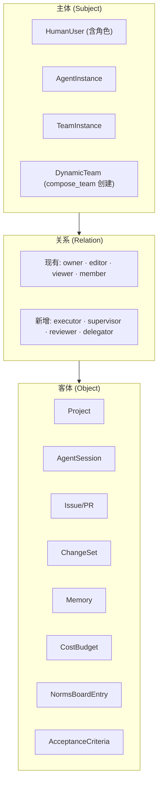

### 3.16 权限系统 (Permission & ReBAC)

> **与现有代码的关系 (v0.29)**: 现有 `@cat/permissions` 已实现完整的 ReBAC 引擎 (check/grant/revoke/listSubjects/listObjects)，支持关系层级 (superadmin > admin > owner > editor > viewer > member)、上溯规则 (element→document 权限继承)、内存缓存、AAL 强制、审计日志。
>
> **现有 vs 架构所需扩展**:
> | 维度 | 现有 | 架构新增 |
> | ---- | ---- | -------- |
> | Subject 类型 | `user`, `role`, `agent` | **`team`** (TeamInstance, DynamicTeam) |
> | Relation 类型 | superadmin, admin, owner, editor, viewer, member | **executor, supervisor, reviewer, delegator** |
> | Object 类型 | system, project, document, element, glossary, memory, term, translation, comment, plugin, setting, task, agent_definition, user (14 种) | **agent_session, issue, pull_request, changeset, cost_budget, norms_board_entry, acceptance_criteria** (7 种新增) |
>
> 实现时需在 `@cat/permissions` 的枚举/注册表中扩展上述类型，并新增对应的关系层级规则和上溯规则。现有 `PermissionTuple` 表结构 (subjectType/subjectId/relation/objectType/objectId) 无需修改——仅需注册新枚举值。

**权限传递规则**:

- Agent 继承创建者的受限权限子集
- 委派目标继承委派者 Agent 的权限（通过 `toolWhitelist` 进一步受限，D8, §3.11）
- Team 权限 = ∪ 成员权限（但每个 Agent 独立检查）
- **动态 Team 权限**: `compose_team` 创建的动态 Team 继承发起者 Agent 的项目级权限，成员 Agent 保留各自原始权限范围；TTL 到期后权限自动回收
- **委派链权限**: `delegate_task` 创建的子任务继承父任务的权限范围，但不能超越委派者自身权限（权限只减不增）
- **全链路 Agent 权限约束**: 当 Agent 执行术语维护、记忆管理、任务排布等全链路管理操作时，SecurityGuard 对每次操作执行额外权限验证 (§3.25)

#### 3.16.1 ReBAC 关系缺失时的默认行为

| 缺失关系                           | 默认行为                                                                       | 安全等级 |
| ---------------------------------- | ------------------------------------------------------------------------------ | -------- |
| Agent 无 `supervisor`              | 退化到 `creator`；若无 creator → Organization Admin                            | 严格     |
| Agent 无 `creator`（系统自动创建） | Organization Admin 自动成为隐式 supervisor                                     | 严格     |
| ChangeSet 无人类 `reviewer`        | Trust/Audit Mode: 自动应用；Isolation Mode: 必须有人类审核, 通知 Project Admin | 分模式   |
| Project 无 `admin`                 | Organization Admin 兜底                                                        | 严格     |
| Team 无 `coordinator` Agent        | 退化为 Expert Pool 模式（成员自主领取无协调）                                  | 宽松     |
| DynamicTeam 无 `coordinator`       | 由发起 compose_team 的 Agent 隐式担任 coordinator                              | 严格     |
| Issue 无 `allowedAssignees`         | 任何有项目访问权限的 Agent 均可领取（已有逻辑）                                | 正常     |
| 委派链跨 Team 访问                 | 委派通信走独立通道 (§3.9.3.1)，不经过邮件系统；安全边界仍由 SecurityGuard 强制 | 严格     |

**实现**: 责任链查询函数 `resolveResponsibleParty(relation, subjectId)` 在查询 ReBAC 关系无结果时，按上述规则逐级回退。回退过程产生 WARNING 级 OTel 日志。

**启动时检查**: SchedulerService 在创建 AgentSession 前执行 `validateRelationships(agentId)` 检查，若缺失关键关系产生 WARNING 但不阻止 Session 创建。
