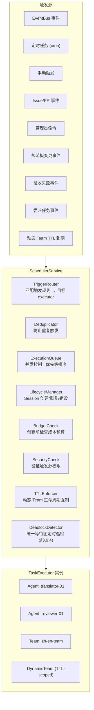

### 3.17 调度服务 (SchedulerService)

SchedulerService 是连接**触发源**与 **TaskExecutor**（Agent/Team）的中央调度组件：



**触发规则 (TriggerRule)**:

```
trigger_rule
  ├── id, name, enabled
  ├── triggerType: event | cron | manual | issue | admin_command | norms_change | acceptance_fail | delegation | dynamic_team_ttl | deadlock_scan
  ├── triggerConfig (jsonb):
  │     event:              { eventType: string, filter?: Record<string, unknown> }
  │     cron:               { expression: string, timezone?: string }
  │     manual:             { allowedByRoles: string[] }
  │     issue:              { projectId: string, onStatus?: string[] }
  │     admin_command:      { allowedCommands: string[], requiredSecurityLevel: string }
  │     norms_change:       { projectId: string, categories?: string[] }
  │     acceptance_fail:    { projectId: string, taskTypes?: string[], minRetries?: number }
  │     delegation:         { delegationChainId: string, mode: "WAIT" | "FIRE_AND_CHECK" }
  │     dynamic_team_ttl:   { teamId: string }
  │     deadlock_scan:      { intervalMs: number }   -- v0.20: 死锁巡检间隔
  ├── targetType: agent | team
  ├── targetId: string
  ├── targetConfig (jsonb): { skill?: string, inputTemplate?: Record }
  └── deduplication: { strategy: "none" | "skip_if_running" | "queue", windowMs?: number }
```

**去重策略**: `none` / `skip_if_running` / `queue`。

**TTL 强制执行**: SchedulerService 维护动态 Team 的 TTL 定时器。当 TTL 到期时触发 `dynamic_team_ttl` 事件，强制执行 Team 的 COMPLETING → DISSOLVED 生命周期（§3.9.2），未完成的子任务标记为 ESCALATE。

**与 EventBus 的关系**: SchedulerService 订阅 EventBus，根据 TriggerRule 筛选路由。事件触发是最常用模式；cron 触发由内部定时器驱动。

**死锁巡检** _(v0.20)_: SchedulerService 内置 `DeadlockDetector` 组件，定时调用 `WaitGraphService.detectCycles()` 执行全图环检测 (§3.9.4)。巡检频率默认 60s (可配置)。发现死锁时产生 `deadlock.detected` 事件，触发 HITL 通知和 OTel 告警。

