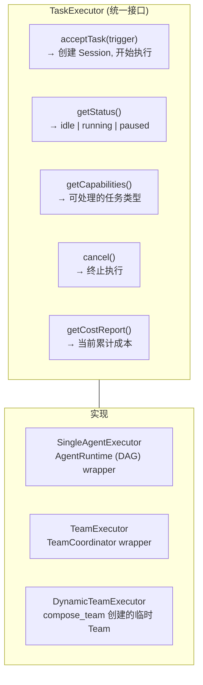

### 3.18 TaskExecutor 同构抽象

> 形式化**原则 2（Agent/Team 同构）**的接口设计 (D14 已决策: A — 显式 TypeScript 接口)。

**同构性保证**:

| 能力维度  | 单 Agent (SingleAgentExecutor)        | Team (TeamExecutor)                  | DynamicTeam (DynamicTeamExecutor)                  |
| --------- | ------------------------------------- | ------------------------------------ | -------------------------------------------------- |
| 任务接受  | 直接从 Issue 系统领取或被 Scheduler 触发 | Coordinator 从 Issue 系统领取后内部分发 | 由 compose_team 发起者分配                         |
| 结果输出  | ChangeSet + Issue/PR 状态更新           | 聚合 ChangeSet + Issue/PR 状态更新     | 聚合 ChangeSet，委派链合并                         |
| 人类交互  | 直接 request_human_input              | 成员 Agent 请求 → Team 级汇聚        | 成员请求 → 发起者 Agent 汇聚或升级到 HITL          |
| 可观测性  | Session Timeline + DAG 节点视图       | Team Dashboard + 成员 DAG 节点视图   | 委派链视图 + 成员 DAG 视图                         |
| 取消/暂停 | 直接暂停 DAG 执行                     | 暂停所有成员 DAG 执行                | 暂停所有成员 + TTL 到期自动解散                    |
| 成本报告  | 单 Session 成本                       | 聚合所有成员 Session 成本            | 按 delegationChainId 聚合成本                      |
| 生命周期  | Session 级                            | Team 配置级（持久）                  | TTL-scoped（CREATING→ACTIVE→COMPLETING→DISSOLVED） |

