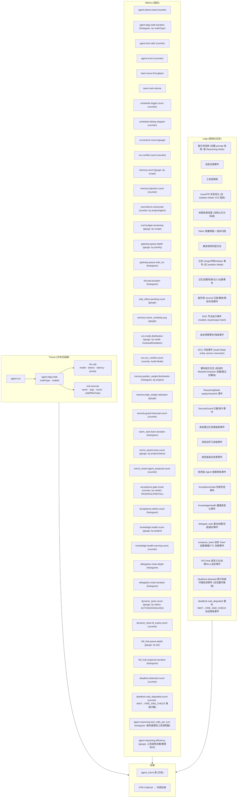

### 3.19 可观测性 & 日志系统

```mermaid
graph TB
    subgraph Traces["Traces (分布式追踪)"]
        AgentRun["agent.run"]
        DAGNode["agent.dag.node<br/>nodeType · nodeId"]
        LLMCall["llm.call<br/>model · tokens · latency · priority"]
        ToolExec["tool.execute<br/>name · args · result · sideEffectType"]
        AgentRun --> DAGNode
        DAGNode --> LLMCall
        DAGNode --> ToolExec
    end

    subgraph Metrics["Metrics (指标)"]
        M1["agent.tokens.total (counter)"]
        M2["agent.dag.node.duration (histogram, by nodeType)"]
        M3["agent.tool.calls (counter)"]
        M4["agent.errors (counter)"]
        M5["team.issue.throughput"]
        M6["team.mail.volume"]
        M7["scheduler.trigger.count (counter)"]
        M8["scheduler.dedup.skipped (counter)"]
        M9["vcs.branch.count (gauge)"]
        M10["vcs.conflict.count (counter)"]
        M11["memory.count (gauge, by scope)"]
        M12["memory.injection.count (counter)"]
        M13["cost.tokens.consumed (counter, by project/agent)"]
        M14["cost.budget.remaining (gauge, by scope)"]
        M15["gateway.queue.depth (gauge, by priority)"]
        M16["gateway.queue.wait_ms (histogram)"]
        M17["hitl.wait.duration (histogram)"]
        M18["side_effect.pending.count (gauge)"]
        M19["memory.vector_similarity.avg (gauge)"]
        M20["vcs.mode.distribution (gauge, by mode: trust/audit/isolation)"]
        M21["vcs.occ_conflict.count (counter, Audit Mode)"]
        M22["memory.golden_weight.distribution (histogram, by project)"]
        M23["memory.high_weight.utilization (gauge)"]
        M24["security.guard.intercept.count (counter)"]
        M25["warm_start.learn.duration (histogram)"]
        M26["norms_board.entry.count (gauge, by project/status)"]
        M27["norms_board.agent_proposal.count (counter)"]
        M28["acceptance.gate.result (counter, by verdict: PASS/FAIL/PARTIAL)"]
        M29["acceptance.retries.count (histogram)"]
        M30["knowledge.health.score (gauge, by project)"]
        M31["knowledge.health.warning.count (counter)"]
        M32["delegation.chain.depth (histogram)"]
        M33["delegation.chain.duration (histogram)"]
        M34["dynamic_team.count (gauge, by status: ACTIVE/DISSOLVED)"]
        M35["dynamic_team.ttl_expiry.count (counter)"]
        M36["hitl_hub.queue.depth (gauge, by tier)"]
        M37["hitl_hub.response.duration (histogram)"]
        M38["deadlock.detected.count (counter)"]
        M39["deadlock.wait_degraded.count (counter, WAIT→FIRE_AND_CHECK 降级次数)"]
        M40["agent.reasoning.tool_calls_per_turn (histogram, 每轮推理的工具调用数)"]
        M41["agent.reasoning.efficiency (gauge, 工具调用总数/推理轮次)"]
    end

    subgraph Logs["Logs (结构化日志)"]
        L1["提示词流转 (完整 prompt 快照, 每 Reasoning Node)"]
        L2["消息压缩事件"]
        L3["工具调用链"]
        L4["Issue/PR 状态变化 (含 Isolation Mode VCS 投影)"]
        L5["权限检查结果 (含默认行为回退)"]
        L6["Token 用量明细 + 成本归因"]
        L7["触发规则匹配日志"]
        L8["分支 merge/冲突/rebase 事件 (仅 Isolation Mode)"]
        L9["记忆创建/检索/注入/去重事件"]
        L10["副作用 Journal 记录/重放/取消/补偿事件"]
        L11["DAG 节点执行事件 (nodeId, input/output hash)"]
        L12["成本预算警告/降级事件"]
        L13["OCC 冲突事件 (Audit Mode entity version mismatch)"]
        L14["模块组合日志 (启动时 ModuleComposer 加载/跳过的模块)"]
        L15["ReasoningNode replay/retry/fork 事件"]
        L16["SecurityGuard 拦截/审计事件"]
        L17["高权重记忆变更级联事件"]
        L18["热启动学习进度事件"]
        L19["规范板条目变更事件"]
        L20["规范板 Agent 提案审批事件"]
        L21["AcceptanceGate 验收判定事件"]
        L22["KnowledgeHealth 健康度变化事件"]
        L23["delegate_task 委派创建/完成/超时事件"]
        L24["compose_team 动态 Team 创建/解散/TTL 到期事件"]
        L25["HITLHub 请求入队/处理/SLA 违反事件"]
        L26["deadlock.detected 跨子系统环路检测事件 (含完整环路径)"]
        L27["deadlock.wait_degraded 委派 WAIT→FIRE_AND_CHECK 自动降级事件"]
    end

    subgraph Storage["存储"]
        EventTable["agent_event 表 (已有)"]
        OTelCollector["OTel Collector → 外部后端"]
    end

    Traces --> Storage
    Metrics --> Storage
    Logs --> Storage
```

