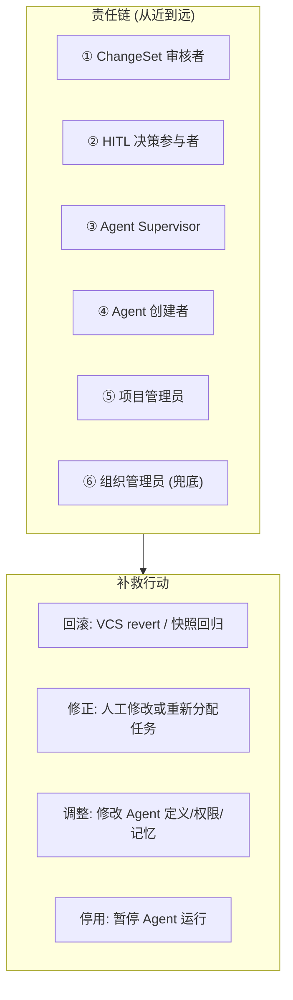

### 3.21 责任模型 (Responsibility Model)

> Agent 在现实和法律意义上并非责任实体。当 Agent 产出错误时，系统需要明确的责任链。

#### 3.21.1 责任链模型



**责任分配规则**:

| 错误类型                            | 主要责任方                     | 通知对象   | 可选补救                            |
| ----------------------------------- | ------------------------------ | ---------- | ----------------------------------- |
| Agent 翻译质量问题                  | ③ Supervisor                   | ③ + ⑤      | 回滚 + 重新翻译                     |
| Agent 越权操作 (被 dry-run 拦截)    | ④ Creator (配置错)             | ④ + ③      | 修正 Agent 权限配置                 |
| ChangeSet 中包含错误被审核者批准    | ① Reviewer                     | ① + ③      | 回滚该 ChangeSet                    |
| HITL 决策导致的下游错误             | ② HITL 参与者                  | ② + ③      | 从决策点回溯重做                    |
| Agent 系统性偏差 (记忆中的错误模式) | ③ Supervisor                   | ③ + ④      | 修正/删除相关记忆 + 重新训练        |
| 大范围问题 (需要项目级回退)         | ⑤ Project Admin                | 所有相关方 | 快照回归 + 任务重分配               |
| 所有责任方缺失（回退链耗尽）        | ⑥ Org Admin                    | ⑥          | 系统级干预                          |
| 安全事件 (prompt injection)         | ⑥ Org Admin                    | ④ + ⑤ + ⑥  | 隔离 Agent + 安全审计               |
| 规范板错误规范导致系统性偏差        | 规范条目作者                   | ③ + ⑤      | 归档错误规范 + 重新评估受影响翻译   |
| 验收标准配置不当导致误判            | ⑤ Project Admin                | ③ + ⑤      | 修正验收标准 + 重新执行受影响 Issue  |
| 委派链中子任务系统性失败            | 发起委派的 Agent 的 Supervisor | ③ + ⑤      | 回滚委派链 ChangeSet + 调整委派策略 |

- **✅ Decision D21: 责任分配默认策略** → 最近参与者优先 (B): 优先通知最近参与了 HITL 决策或 ChangeSet 审核的人。无参与者时退化为 Supervisor → Creator → Project Admin → Org Admin。

#### 3.21.2 通知升级机制

```
1. 首先通知直接责任方 (① 或 ②)
2. 若 N 小时内未响应 → 升级通知到 ③ Supervisor
3. 若仍未响应 → 升级到 ⑤ Project Admin
4. 若 Project Admin 缺失或未响应 → 升级到 ⑥ Org Admin
5. 每次升级附带完整追溯链 (triggerContext → Session → DAGNode → 具体错误)
```

**与现有系统的集成**:

- 责任方判定基于 ReBAC 关系（§3.16），缺失时按§3.16.1默认规则回退
- 追溯链基于任务追溯体系（§3.8），细化到 DAG 节点级
- 通知渠道复用 `packages/message`

