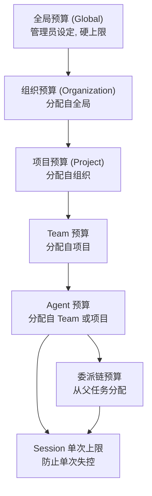

### 3.22 成本控制模型

> Agent 大规模运行时，LLM 调用成本是核心运营风险。成本控制系统提供**预算管理 → 实时计量 → 阈值告警 → 自动降级**的全链路治理。

#### 3.22.1 预算层级



**预算继承**: 下级预算之和不得超过上级。未显式设置预算的层级继承上级剩余额度。

**委派链预算**: `delegate_task` 创建子任务时，预算从父任务剩余额度中分配。子任务成本通过 `delegationChainId` 聚合归并到父任务的成本报告中。

#### 3.22.2 数据模型

```
cost_budget
  ├── id, scope: "global" | "organization" | "project" | "team" | "agent" | "delegation_chain"
  ├── scopeId: string (对应实体 ID 或 delegationChainId)
  ├── periodType: "monthly" | "weekly" | "daily" | "unlimited"
  ├── periodStart: timestamp
  ├── budgetTokens: bigint            -- 预算 token 总量 (标准化为 1K token 单位)
  ├── warningThreshold: float (0.7)   -- 70% 警告线
  ├── criticalThreshold: float (0.9)  -- 90% 严重警告线
  ├── hardLimit: boolean (true)       -- true = 到达 100% 强制停止; false = 仅告警
  ├── degradationPolicy: jsonb        -- 降级策略 (见下)
  └── createdAt, updatedAt

cost_ledger
  ├── id
  ├── budgetId: FK → cost_budget
  ├── sessionId: FK → agent_session
  ├── dagNodeId: string               -- DAG 节点 ID (精确归因)
  ├── delegationChainId: string?      -- 委派链归因
  ├── provider: string                -- LLM provider 标识
  ├── model: string                   -- 模型标识
  ├── inputTokens: int
  ├── outputTokens: int
  ├── imageTokens: int?               -- v0.18: 图片 token 消耗 (含在 inputTokens 中, 此字段用于细分归因)
  ├── fileUploadCount: int?           -- v0.19: file_id 模式下本次请求上传的文件数 (归因存储成本)
  ├── totalTokens: int                -- 标准化 token 数 (考虑不同模型的换算系数)
  ├── estimatedCostUsd: decimal?      -- 按模型定价估算 (可选)
  └── createdAt
```

**标准化**: 不同模型的 token 计量差异通过 `tokenNormalizationFactor` 配置映射，使预算在模型间可比较。

#### 3.22.3 CostController 服务

```
CostController
  ├── checkBudget(scope, scopeId): BudgetStatus
  │     → 沿层级向上检查: session → agent → team → project → org → global
  │     → 委派链场景: 额外检查 delegation_chain 预算
  │     → 返回: { allowed: boolean, level: "ok"|"warning"|"critical"|"exceeded", remaining }
  │     → 任一层级 exceeded 且 hardLimit = true → blocked
  │
  ├── recordUsage(sessionId, dagNodeId, usage: TokenUsage): void
  │     → 写入 cost_ledger (含 delegationChainId)
  │     → 更新 Redis 中的实时计数器 (cost:{scope}:{scopeId}:current)
  │     → 触发阈值检查
  │
  ├── onThresholdReached(scope, level): void
  │     → level = "warning": 发送通知给 Supervisor/Admin, prompt 注入成本警告
  │     → level = "critical": 执行降级策略, 发送紧急通知
  │     → level = "exceeded" + hardLimit: Gateway 拒绝后续 LLM 请求
  │
  └── getDashboardData(scope, scopeId): CostReport
        → 聚合查询: 按时间/Agent/模型/节点类型/委派链 多维度统计
```

#### 3.22.4 降级策略

当预算消耗达到 `criticalThreshold` 时，系统自动执行降级策略：

| 策略               | 说明                                                | 适用场景     |
| ------------------ | --------------------------------------------------- | ------------ |
| `model_downgrade`  | 自动降级到低成本模型 (如 GPT-4o → GPT-4o-mini)      | 通用         |
| `context_reduce`   | 压缩上下文窗口 (减少记忆注入、历史消息截断)         | 上下文过大时 |
| `batch_only`       | 暂停实时交互，只允许批处理（降低并发→降低峰值成本） | 非紧急任务   |
| `pause_and_notify` | 暂停所有 Agent 执行，等待管理员决策                 | 保守策略     |

降级策略通过 `degradationPolicy` 配置，可为每个预算层级独立设定：

```jsonc
{
  "onCritical": [
    { "action": "model_downgrade", "targetModel": "gpt-4o-mini" },
    {
      "action": "context_reduce",
      "maxHistoryMessages": 10,
      "maxMemoryEntries": 5,
    },
  ],
  "onExceeded": [
    {
      "action": "pause_and_notify",
      "notifyRoles": ["project_admin", "supervisor"],
    },
  ],
}
```

#### 3.22.5 与 Gateway 的集成

CostController 与 §3.1.1 的全局令牌桶/优先级队列紧密协作：

1. **请求入队前**: Gateway 调用 `CostController.checkBudget()` — 若 `exceeded` 且 `hardLimit`，直接拒绝
2. **请求完成后**: Gateway 调用 `CostController.recordUsage()` 写入 ledger
3. **降级生效时**: CostController 通知 Gateway 更新模型路由映射（model_downgrade）或队列配置（batch_only）
4. **Prompt 注入**: 预算状态通过 slot #13 注入（属于静态注入层，§3.2.5），ContextStore 调用 `fetchCostStatus()` 获取当前预算信息

#### 3.22.6 Prompt 中的成本感知

当预算进入 `warning` 或 `critical` 状态时，system prompt 注入预算信息让 LLM 自主优化行为：

```
[slot #13: cost_budget_status]
⚠️ 当前项目预算已使用 85%（剩余 15K tokens）。
请尽量精简回复和工具调用，优先完成最高优先级任务。
若非必要，避免重复查询或大范围检索。
```

这使 LLM 在预算压力下可自主精简操作，而非被硬性截断。

#### 3.22.7 微工作流与成本效率 _(v0.20 新增)_

微工作流引导 (§3.6.7) 直接降低推理 token 消耗：每轮 DAG 循环中 ReasoningNode 需加载完整上下文（静态注入层 + 历史消息 + 工具列表），成本约为 `contextSize × inputTokenPrice`。如果一轮循环仅执行 1 个简单工具调用（如 `pr_update`），则**推理开销/工具产出比**极低。当 LLM 被引导在单轮中批量输出 N 个工具调用时，推理开销平摊到 N 个操作上，边际成本大幅降低。

**可观测性支撑**: `agent.reasoning.efficiency` (M41) 指标帮助运维识别推理效率偏低的 Agent，优化方向包括：调整提示词中的微工作流引导措辞、优化 Skill 步骤中的批量调用建议、调整工具的 `batchHint.commonCompanions` 配置。

#### 3.22.8 异步依赖任务的成本追踪 _(v0.28 新增)_

实体异步依赖（§3.14.11）触发的外部 API 调用（如向量化、术语对齐等）会产生独立于 LLM 推理的成本。CostController 需要对此类成本进行**两阶段追踪**，避免预算出现实际超支或误报。

**cost_ledger 扩展**:

```
cost_ledger (扩展字段)
  ├── ledgerType: "llm" | "async_dep"         -- 成本类型区分（默认 "llm"）
  ├── asyncTaskId: string?                     -- 关联 §3.14.11 的异步任务 ID
  ├── costPhase: "tentative" | "finalized"     -- 两阶段标记
  └── changesetEntryId: string?                -- 关联 changeset_entry（精确归因到实体操作）
```

**两阶段成本核算流程**:

```
阶段 1 — 暂记 (Tentative):
  ApplicationMethodRegistry 触发异步任务时:
    → CostController.recordAsyncCost(sessionId, dagNodeId, {
        ledgerType: "async_dep",
        asyncTaskId,
        costPhase: "tentative",
        estimatedTokens,        -- 基于历史平均值估算
        provider: "openai-embedding" | "custom-vectorizer" | ...
      })
    → Redis 计数器按估算值预扣预算
    → 若预扣后预算 exceeded → 阻止触发异步任务（fail-fast）

阶段 2 — 核销 (Finalized):
  异步任务完成回调（§3.14.11.6a）时:
    → CostController.finalizeAsyncCost(asyncTaskId, {
        costPhase: "finalized",
        actualTokens,           -- 实际消耗（来自外部 API 响应）
        actualCostUsd?
      })
    → 差额 = actualTokens - estimatedTokens
    → 更新 Redis 计数器（回退估算 + 写入实际）
    → 差额过大时记录 anomaly 日志，用于校准估算模型
```

**预算检查集成**: `CostController.checkBudget()` 在计算已用额度时，将 `tentative` 条目按估算值计入。当所有异步任务 finalized 后，实际数字替代估算值。这确保预算检查在异步任务进行中仍然保守且安全。

**与 Hook 系统的集成**: CostController 订阅 `EntityAsyncDepCompleted` / `EntityAsyncDepFailed` 事件（§3.29.3）执行阶段 2 核销。任务失败时将 tentative 成本标记为 `finalized` 并记录实际消耗为 0（任务未产生有效输出但可能已消耗部分资源，具体视 provider 计费策略）。
