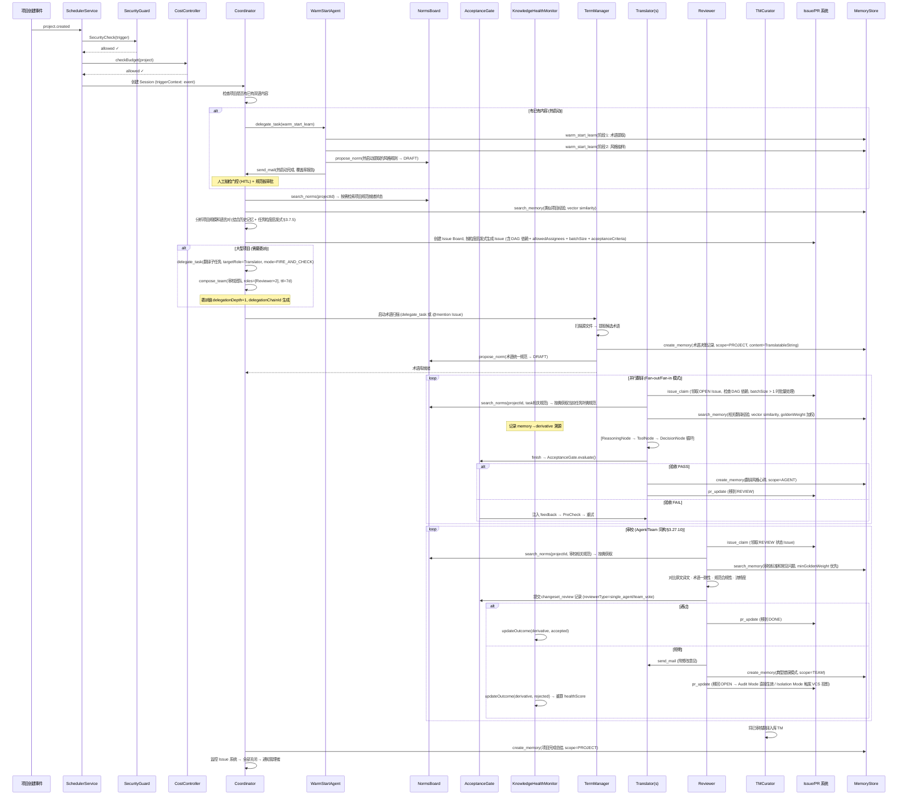

## 4. 翻译场景中的典型 Agent 角色

| Agent               | 触发方式                   | 核心工具                                                                                                                                    | agentSecurityLevel | 说明           |
| ------------------- | -------------------------- | ------------------------------------------------------------------------------------------------------------------------------------------- | ------------------ | -------------- |
| **Translator**      | Issue 任务 / 事件触发      | translate, search_tm, search_termbase, search_context, search_memory, search_norms, run_acceptance_check, issue_claim, create_memory       | restricted         | 主力翻译 agent |
| **Reviewer**        | Issue REVIEW 状态 / 事件   | review_translation, qa_check, search_termbase, search_memory, search_norms, run_acceptance_check, create_memory                             | restricted         | 译后审校       |
| **TermManager**     | 定时 + term.suggested 事件 | create_term, search_termbase, search_context, search_memory, search_norms, create_memory, propose_norm                                      | restricted         | 术语库长期维护 |
| **TMCurator**       | translation.approved 事件  | search_tm, batch操作                                                                                                                        | restricted         | 翻译记忆库维护 |
| **QAAnalyst**       | batch 完成事件             | qa_check, 统计工具, search_norms, create_memory                                                                                             | restricted         | 质量分析报告   |
| **Coordinator**     | project.created 事件       | issue_create, pr_update, send_mail, delegate_task, compose_team, create_memory, warm_start_status, list_norms, search_norms, propose_norm | trusted            | Team 编排者    |
| **WarmStartAgent**  | 项目初始化 / admin 触发    | warm_start_learn, warm_start_status, create_memory, search_memory, propose_norm                                                             | trusted            | 热启动知识学习 |
| **GovernanceAgent** | admin_command / 定时       | 跨项目统计、成本汇总、安全审计查询、send_mail                                                                                               | trusted            | 跨项目治理监控 |

> **v0.14 变更**: Coordinator 新增 `delegate_task` 和 `compose_team` 工具 (§3.9.2, §3.9.3.1)，使其能在运行时动态组建子团队和委派任务链。Coordinator 的 `agentSecurityLevel=trusted` 使其可获得 `canComposeTeam=true` 与 `maxDelegationDepth>0` 安全策略 (§3.25)。
> **v0.16 变更**: Coordinator 通过 `issue_create(parentIssueId)` (§3.9.3.2) 支持将 Issue 拆分为多个子 Issue。

**端到端翻译项目示例流程**:

